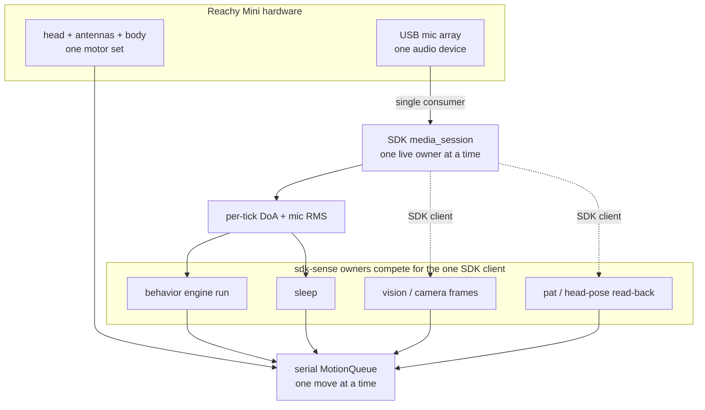
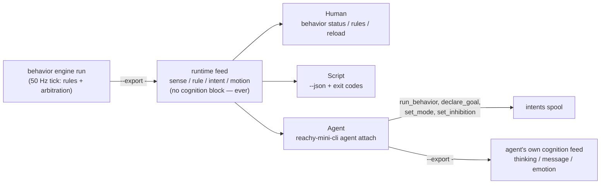
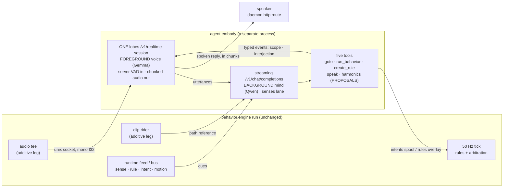

# Operating Reachy Mini

The coherent, end-to-end guide to running a **Reachy Mini** with
`reachy-mini-cli` — what it can do, the one model you must understand before you
compose behaviors (**the single-SDK-owner model**), how to bring the robot up
live, how to verify it, and how to get unstuck.

If you just want the copy-paste bring-up, run `reachy-mini-cli quickstart` (or jump to
[Bring Reachy up live](#bring-reachy-up-live)). If something is silently not
working, jump to [Troubleshooting](#troubleshooting) — the **`~/.asoundrc`
mic-array gotcha** is the most common silent failure.

> **Audience:** human operators bringing the robot up, AI agents driving the
> CLI, and contributors. Everything here is operator-facing; the implementation
> map for contributors is in [`CLAUDE.md`](../CLAUDE.md).

---

## What Reachy Mini can do

Reachy Mini is an expressive desk robot — a movable head (pitch/yaw + height),
two antennas, a rotating body, a USB **mic array** (with on-board direction-of-
arrival), a camera, and a speaker. `reachy-mini-cli` turns each capability into
a **noun** you run from the shell or an agent loop:

- **Hold a daemon** that owns the hardware (`daemon`), and run low-level
  device/app/motion ops against it (`device`, `app`, `move`).
- **Feel alive** when idle — gentle breathing, glances, antenna sway
  (`demo-mode`, `behavior`).
- **Compose every sense into one deterministic presence** — the symbolic
  runtime (`behavior engine run`): it hears words, feels pats, leans its
  antennas toward sound and answers out loud, all on one 50 Hz tick. An
  external AI agent attaches to it and can **export** a live feed of what
  *the agent* is thinking and proposing (`agent attach --export -`).
- **Orient to sight** — turn toward motion or light in the camera, no ML
  (`vision`).
- **Speak** — text-to-speech straight to the speaker (`say`).
- **Feel a head pat and lean into it** — proprioceptive touch, no touch sensor.
  Live, this is a runtime sense; `pat` is the standalone bench check.
- **Park itself when left alone and wake when addressed** (`sleep`).
- **Switch on a conversational mind** — the optional
  [embodiment layer](#the-embodiment-layer--agent-embody) (`agent embody`):
  ears, a voice and a cue-triggered mind running *beside* the runtime, so the
  robot answers out loud and reacts in voice when its own rules fire. It runs
  [two models at two tempos](#the-two-tempo-architecture--gemma-speaks-qwen-thinks)
  — a foreground voice that answers now, and a background mind that thinks
  longer and reaches the conversation only through typed events. Stop it and
  the robot is exactly the symbolic presence above.

See the [noun map in the README](../README.md#noun-map) for the one-line table,
and `reachy-mini-cli explain <noun>` for the full reference of any noun.

---

## The single-SDK-owner model

**This is the one concept to understand before you run more than one behavior at
a time.** It trips up humans and agents repeatedly, because the CLI happily lets
you launch any two nouns — but the hardware underneath has **two single
resources**, and only one owner each.

### Two single resources



1. **The SDK client — and its single-consumer media session.** On the `sdk`
   transport every noun runs against **one in-process `ReachyMini` client**, and
   the robot serves a single live SDK client at a time. The mic path is the
   strictest case: the `behavior` runtime and `sleep` read live
   direction-of-arrival and loudness through a media session that is
   **single-consumer** — *"obtained exclusively through
   `SdkTransport.media_session`"*, against the *one* `ReachyMini` media
   subsystem (`reachy/robot/sdk_transport.py`). `vision`
   reads camera frames (`transport.get_frame()` → `media.get_frame()`) and
   `pat` reads the head pose back — both through that same one SDK client (these
   two do *not* open a `media_session()`; they contend at the `ReachyMini`-client
   level, which serializes all SDK access). So **only one `sdk`-sense owner can
   own the robot at a time.**

2. **The head — motion.** Every move (idle wander, sound-orienting turn,
   expression, snuggle, sleep-breathe) flows through **one serial
   `MotionQueue`**, one move at a time, so motion is always smooth and never
   self-conflicts. Two independent motion drivers still *fight over the same
   head*.

> **How the runtime holds both halves.** `behavior engine run` owns exactly
> TWO SDK clients, on purpose. Its [pat sense](#the-pat-sense) reads the ACTUAL
> head pose back through a held `ReachyMini(media_backend='no_media')` client
> (`reachy/robot/state_reader.py`'s `HeldStateReader`) dedicated to state
> reads: it never calls `media_session()` and never touches the mic or camera,
> so it does not contend for the single-consumer media session. Its ears and
> eyes ride a second held client (`reachy/robot/media_client.py`) — the one
> media session in the process, shared by loudness, hearing and the face
> sense. Both are warmed *before* the first tick and re-warmed off-thread if
> the daemon goes away. That is still two live SDK connections from one
> process, so the "one `sdk` media owner per robot" rule of thumb below still
> governs composition — this note is narrowly about why the runtime's own two
> clients do not fight each other.

### What this means: the conflict matrix

Because both resources are single-owner, **you cannot run two `sdk`-sense
processes against one robot.** The second one contends for the
single-consumer SDK client and gets starved — historically, a separate `pat`
process running alongside a second sense loop was throttled to roughly
**1 Hz**, far too slow to feel a pat.

The `sdk`-sense owners are the `behavior` runtime, `sleep`, `vision`, and `pat`.

| Combination (both on `sdk`) | Works? | Why |
|---|---|---|
| `behavior engine run` + `sleep run` | 🚫 | Refused outright — `sleep run` exits with an error while an engine is live |
| `behavior engine run` + `pat run` | 🚫 | Refused outright — `pat run` exits with an error while an engine is live |
| `sleep` + `pat` (two processes) | ❌ | Contend for the one SDK client → the loser starves |
| `sleep`/`pat` + `vision` (two processes) | ❌ | `vision` rides the same one SDK client for camera frames → contend |
| one sense owner + `demo-mode` | ⚠️ | No SDK-client clash (motion-only), but both drive the head — run **one** motion owner |
| one sense owner (`sdk`) + another noun (`http`) | ✅ | The `http` noun polls the daemon's REST routes and opens **no** SDK client |

### How to compose behaviors anyway

You have two correct patterns, and one hard refusal:

- **Run the symbolic runtime.** `behavior engine run` composes every sense onto
  one 50 Hz tick in one process, holding one media client and one pose reader.
  Combining live senses on `sdk` is not something you assemble out of
  processes — it is this loop.
- **Put the secondary noun on `--transport http`.** An `http`-transport noun
  polls the daemon's REST routes instead of opening a media session, so it never
  competes for the SDK client. Use this for a remote control box, or to layer a
  second behavior onto the one local `sdk` owner.
- **The foreground sense verbs refuse to join a live engine.** `pat run` and
  `sleep run` check the engine's self-expiring `state.json` heartbeat at entry
  (`reachy/behavior/liveness.py`) and exit with a clean error naming the fix,
  rather than starting a process that would sense and never be able to react.
  Nothing arbitrates the head on a flag file: the `pat_active.flag` /
  `sleep_active.flag` files under the state dir are now **per-noun bookkeeping
  read only by the process that writes them** (see
  [the state dir](#the-state-dir-inert-leftovers-and-the-two-live-flags)), not
  a cross-process channel.

> **Rule of thumb:** one `sdk` media owner per robot. Everything else either
> lives inside that loop or runs on `http`.

---

## Install profiles

Two profiles, because the SDK's transitive stack (pycairo / gstreamer /
pyaudio) needs system libraries a bare box or CI lacks — so `reachy-mini` is an
**extra**, not a base dependency. There are exactly three base runtime deps, all
pure wheels: `numpy`, `harmonics-cli` (the offline harmonic voice, so even the
bare profile can speak) and `events-cli` (the nervous-system bus client, which
joined on 2026-07-24). Discovery added none — `reachy/discover/` is stdlib-only
and a test walks its AST to keep it that way.

| Profile | Install | Use it for |
|---|---|---|
| **Real mode (recommended)** | `uv tool install 'reachy-mini-cli[daemon]'` (or `pip install 'reachy-mini-cli[daemon]'`) | A local robot: pulls `reachy-mini`, so the `sdk` transport and `reachy-mini-cli daemon start` work out of the box. |
| **HTTP remote** | `pip install reachy-mini-cli` (no extra) | No local robot — base deps only; talk to a daemon elsewhere with `--transport http` + `REACHY_BASE_URL`. |

The installed command is **`reachy-mini-cli`** (short alias: `reachy`). Running
the `sdk` transport without the extra exits `2` with a hint to install `[sdk]` —
never a traceback. `reachy-cli` remains a transitional alias dist that just
pulls in `reachy-mini-cli`.

Four optional extras sit on top of those two profiles. Every one is
**lazy-imported**: absent, the feature it powers goes quiet after one named
warning rather than crashing anything.

| Extra | Pulls | Needed for | Absent means |
|---|---|---|---|
| `[daemon]` / `[sdk]` | `reachy-mini` (same 1.9.x wheel) | the daemon binary; the in-process SDK client | the `sdk` transport exits `2` with a hint |
| `[vision]` | `opencv-python-headless` | face recognition, scene description, the rolling video clip | the face sense and clip rider stay permanently quiet |
| `[cpu]` | (empty today) | on-box `openwakeword` for `sleep --wake-word` | the HTTP wake-word backend is used instead; Tier 1 wake is unaffected |
| `[bench]` | `sounddevice` | **only** the embodiment layer's `bench` media profile (dev-box mic + speakers) | the bench profile degrades to a named `bench-audio-extra-absent` drop |

`[bench]` is a development convenience, not part of the deployed path: the
layer's shipped `robot` profile hears through a unix socket and speaks through
`urllib`, both stdlib. (`[gpu]` exists as a generic compute-class pin for
future GPU features; it bundles no model.)

---

## Find the robot on the network — `wireless`

Every robot session starts with *where is it*. The `wireless` noun answers that
once, remembers the answer across DHCP moves, and hands you a shell — so the
address stops being something a human retypes.

```bash
reachy-mini-cli wireless find          # sweep the LAN, report + remember what answered
reachy-mini-cli wireless list          # what is remembered (registry only, no network)
reachy-mini-cli wireless ssh           # open a shell on it — no address typed
sudo reachy-mini-cli wireless pin      # pin its address to a stable /etc/hosts alias
reachy-mini-cli wireless authorize     # one-time SSH key install (asks first, always)
reachy-mini-cli wireless unpin         # remove that managed /etc/hosts block
reachy-mini-cli wireless forget        # drop a remembered unit
reachy-mini-cli wireless overview      # the whole surface, including the caveats below
```

Every verb takes `--json`, and every `find` result carries a ready-made
`base_url`, so an agent can pass it straight to `--base-url` /
`REACHY_BASE_URL` without reformatting anything. The noun needs **no extras**:
it speaks plain HTTP to a candidate daemon, plus `/etc/hosts` and `ssh` for the
two side-effecting verbs, so it works in full on the bare **HTTP remote**
profile — which is exactly its audience, someone driving a robot their box is
not hosting.

### Why pinning the alias is load-bearing, not a nicety

Pollen's own documentation tells you to run `ssh pollen@reachy-mini`. On the
development box this feature was built against, that command **fails** —
`reachy-mini` and `reachy-mini.local` both fail to resolve, and only
`reachy-mini-2.local` resolves, to `192.168.1.162`. So the documented command
dies with `Could not resolve hostname` before it ever reaches the robot.

The `-2` suffix is the reason. This box hosts a **Reachy Mini Lite** of its own,
and the Lite claimed the base mDNS name first — so avahi handed the Wireless
unit the collision suffix. That suffix is not the unit's property: it can
**move** if the Lite is powered off at boot, or if the claim order flips. A name
that can change hands is not an identity.

Two consequences run through the whole design:

- **Identity is the daemon-reported `hardware_id`**, never a name, never an IP,
  never a MAC. It arrives over plain HTTP, so it works off-subnet, through a
  router, and on a box with no ARP table at all. MAC is stored *alongside* as
  opportunistic enrichment when the unit shares an L2 segment (live, this box
  enriched the Wireless unit with `88:a2:9e:8c:fa:bf`) — a record is fully
  valid and fully identifiable without one.
- **The alias is operator-chosen, not harvested.** `wireless pin` writes
  `reachy-mini` (and `reachy-mini.local` as an extra convenience), which is the
  name Pollen's docs already tell you to type. It is deliberately *not* derived
  from the daemon's own `robot_name` field — that reports the underscore
  spelling `reachy_mini`, and munging it back into a hyphenated hostname would
  regenerate exactly the name the Lite already holds in mDNS.

Note that the plain `reachy-mini` is the primary name. The `.local` form is a
convenience only: `.local` is the mDNS domain, and some `nsswitch.conf`
configurations route it exclusively to mDNS, bypassing `/etc/hosts` entirely.
Never build anything that depends on the `.local` form resolving through files.

### What a find actually costs

Measured on that box, against the live unit, with its seven Docker bridge
networks present:

| Path | Measured |
|---|---|
| **Cold** — empty registry, full LAN sweep | **3.663 s** wall clock. The sweep itself reported `elapsed_s=3.395`, **254 hosts probed**, `deadline_reached=false`, and found one wireless unit |
| **Warm** — resolve from the registry | **0.225 s** wall clock: one bounded probe of the remembered address, no sweep at all |

The cold path's target was under 5 s and its hard bound is 10 s (`--deadline`);
when that deadline expires the sweep cancels what is outstanding, returns what
it has, and *says so* — `deadline_reached: true` in the payload plus a
diagnostic on stderr, never a quietly short list.

The warm path is genuinely the registry short-circuit and not a faster sweep:
the remembered `last_ip` is probed first, its `hardware_id` is checked against
the record, and only a match returns. A remembered address that now answers as a
**different** unit — DHCP handed it to someone else — is rejected, escalates to
the sweep, and the record is re-pinned to the new address. Staleness is
corrected, not tolerated.

### The sweep's edges — say what it actually does

- **IPv4, and the default daemon port only.** A unit reachable only over IPv6,
  on another subnet, or on a non-default port stays fully usable by explicit
  address: `wireless find --address <ip>` accepts an IPv6 literal, and `--port`
  moves the port.
- **`/24` or narrower, by construction.** Anything wider is refused before a
  single host is materialised — this box's seven Docker bridges are `/16`s, and
  naively expanding them is roughly 459 000 hosts and a CLI that appears to hang
  forever. Docker/bridge/veth interfaces are additionally excluded by name, and
  a `/31` or `/32` (Tailscale's interface is a `/32`) is excluded too: a
  point-to-point link and a host route have no other machines on them to find.
- **Loopback is excluded.** Be precise about what that means here: the
  co-resident **Lite answers on `127.0.0.1`**, so it is **not discoverable by
  sweeping at all**. It is reachable only by asking for it —
  `wireless find --address 127.0.0.1 --all`. The sweep does not distinguish the
  two robots; it simply never looks where the Lite lives.
- **`find` filters to `wireless_version=true` by default.** Ask for the Lite
  explicitly and the default filter refuses it, with a hint naming `--all` — a
  Lite tethered to *another* box on the LAN is genuinely discoverable and
  genuinely not wireless, so the noun's name describes the default, not a limit
  of the mechanism.
- **Two NICs on one subnet enumerate it once.** This box has two, and a unit
  answering on both folds to one record on `hardware_id`.

### Ambiguity is refused, never guessed

With both units remembered — the Wireless (`hardware_id=a89063c05ae79779`, at
`192.168.1.162`, daemon `1.9.0`) and the Lite (`hardware_id=37a38ce3a26e0727`,
at `127.0.0.1`) — a verb that acts on *one* unit refuses and names **both**
candidates rather than picking one. Both robots report `robot_name=reachy_mini`,
so "more than one match" is the normal case on this box, not a corner case.

Pick one with `--unit <hardware_id-or-alias>`, or set `REACHY_WIRELESS_UNIT` in
the environment for a box that always drives the same robot.

### Discovery is safe beside a live runtime

**The [single-SDK-owner model](#the-single-sdk-owner-model) does not apply to
this noun.** Discovery is a read-only `GET /api/daemon/status` — one request per
candidate host and nothing else. It arms no motors, claims no media session,
opens no `ReachyMini` client, and touches no motion queue. Running
`wireless find` beside a live `behavior engine run` is safe, and so is running
it beside `agent embody`, `demo-mode`, or anything else. The conflict matrix in
that section has no row for `wireless` because there is nothing to conflict
over.

### What needs sudo — and what emphatically does not

Exactly one verb needs privilege: **`wireless pin`** (and its `unpin`), because
it writes `/etc/hosts`. Everything else — `find`, `list`, `ssh`, `authorize`,
`forget`, `overview` — is fully unprivileged. A non-writable hosts file is a
clean exit-2 error naming `sudo`, never a traceback and never a silent no-op.

One wrinkle worth knowing before you type it: **`sudo` may not see the registry
you built.** The remembered units live under *your* state dir, and depending on
this box's `sudoers` settings a `sudo` invocation can run with root's `HOME` and
therefore root's (empty) registry — in which case `pin` re-sweeps and remembers
the unit as root instead of resolving yours. The deterministic form is to pass
the address `find` just printed:

```bash
sudo reachy-mini-cli wireless pin --address 192.168.1.162
```

`pin --address` skips unit resolution entirely, so it neither reads nor writes a
registry.

**Stable SSH host-key identity does not depend on the pin.** Every `ssh` this
noun builds passes `-o HostKeyAlias=reachy-mini` alongside the resolved IP, so
`known_hosts` keys on the stable alias whether or not `/etc/hosts` was ever
touched — a DHCP move never produces a host-key mismatch, with no privilege
involved. The pin is what makes *other* tools on the box (and Pollen's own
documented command) resolve the name; it is not what makes this noun's ssh work.

The write itself is recoverable rather than merely careful: only the block
between `# BEGIN reachy-mini-cli` and `# END reachy-mini-cli` is ever rewritten,
and every byte outside it is preserved verbatim — the sole exception being the
single line terminator an appended block needs on a file that did not end in
one, which `unpin` takes back, so `pin` followed by `unpin` leaves the file
byte-identical. A `.reachy-mini-cli.bak` backup holding the exact pre-write
bytes is taken before every modification, and the landed file is re-read and
re-verified afterwards — with an automatic restore if anything fails.

`pin` also refuses, before touching anything, any file that does not already
parse as a hosts document resolving `localhost`. Pointed at `/etc/shadow` or an
`authorized_keys`, it exits 2 and writes nothing — not even a backup — which is
what keeps `--hosts-path` an operator convenience rather than an arbitrary-write
primitive when the command is run under `sudo`. That care is proportionate: this box's entire
`/etc/hosts` is two lines, and losing the `localhost` line breaks name
resolution box-wide.

### The trusted-network assumption — and the password

State this plainly, because discovery makes it matter more:

- The daemon's `/api/daemon/status` route is **unauthenticated**. Anyone on the
  LAN can read a unit's full identity, and a sweep on a shared network — a lab,
  an office, a conference — will find, and offer to remember, pin and log into,
  a Reachy that is not yours. Nothing in the protocol distinguishes *my robot*
  from *a robot* on first contact.
- The unit ships with the **factory-default password `root`** for the `pollen`
  account. So the assumption is stronger than "the status endpoint is open":
  anyone who can reach the robot on the LAN can also *log into* it, with a
  published default credential.

**Changing that password is the operator's first move.** Discovery does not
create the exposure, but it does make the robot trivially easy to find — so run
`wireless find`, then `wireless ssh`, then `passwd`, in that order, before the
unit spends any time on a network you do not fully control.

Key install is kept deliberately separate for the same reason: `authorize` is
**never** a side effect of `find` or `ssh`. It names the resolved target and its
`hardware_id`, asks for an explicit confirmation (a non-interactive stdin counts
as a decline, never an accidental yes), and only then invokes `ssh-copy-id`,
which appends to `authorized_keys` and never truncates it. The first run hits
the unit's interactive password prompt — `ssh-copy-id` owns that prompt end to
end, so no typed secret ever passes through this CLI.

### A worked walkthrough

```bash
# 1. Cold. Nothing is remembered; sweep the local /24 and remember what answered.
reachy-mini-cli wireless find --json
# {"units": [{"hardware_id": "a89063c05ae79779", "robot_name": "reachy_mini",
#             "model": "Reachy Mini Wireless", "wireless": true, "version": "1.9.0",
#             "address": "192.168.1.162", "port": 8000,
#             "base_url": "http://192.168.1.162:8000"}],
#  "count": 1, "hosts_probed": 254, "deadline_reached": false, "elapsed_s": 3.395,
#  "remembered": ["a89063c05ae79779"]}

# 2. Warm. Same answer, from the registry, without touching the LAN.
reachy-mini-cli wireless list

# 3. Drive the robot's daemon from here — the base_url needs no reformatting.
REACHY_BASE_URL=http://192.168.1.162:8000 reachy-mini-cli device status --transport http

# 4. Make Pollen's documented command work on this box (the one sudo step).
#    Pass the address explicitly: under sudo the registry may be root's, not yours.
sudo reachy-mini-cli wireless pin --address 192.168.1.162
ssh pollen@reachy-mini          # resolves now; before the pin it did not

# 5. Log in without typing an address at all, then change the password.
reachy-mini-cli wireless ssh
#   pollen@reachy-mini:~$ passwd

# 6. One-time key install so later logins are passwordless. Asks first.
reachy-mini-cli wireless authorize

# 7. Ask about the Lite on loopback explicitly — the sweep never looks there,
#    and the default wireless-only filter refuses it with a hint naming --all.
reachy-mini-cli wireless find --address 127.0.0.1 --all
```

If a later session finds the unit has moved, just run `wireless find` again: the
record is re-pinned to the freshly-verified address, and `wireless pin` refreshes
the `/etc/hosts` block to match. `wireless forget --unit <id>` (or `--all`) drops
a unit you no longer want remembered; the registry itself lives under the state
dir as `units.json` and is never committed anywhere.

### For agents — the `find-reachy` skill

An agent that needs the robot's address before it can drive anything reaches the
same discovery through `.claude/skills/find-reachy/`. Invoked bare it runs
`wireless find --json`; any other argument is forwarded verbatim, so every verb
above is reachable. The script holds **no discovery logic of its own** — it
resolves the CLI (installed `reachy`, else `uv run reachy` inside a checkout,
else an install hint) and shells out. That is deliberate: discovery lives in one
place, so the skill cannot drift from the tool it wraps, and a test names each
forbidden mechanism (`ip`, `arp`, `avahi-browse`, `nmap`, raw sockets, a direct
`curl` of the daemon) so a breach says exactly which rule broke.

---

## Bring Reachy up live

The canonical sequence (also printed by `reachy-mini-cli quickstart`):

```bash
# 1. Install once (CLI + daemon binary + SDK)
uv tool install 'reachy-mini-cli[daemon]'

# 2. Start the daemon — wakes the robot on start
reachy-mini-cli daemon start

# 3. Verify it answers
reachy-mini-cli device status

# 4. Make it do something
reachy-mini-cli behavior engine run   # the presence runtime (Ctrl-C to stop)
#   or: reachy-mini-cli demo-mode start    # feel-alive idle loop (background)
#   or: reachy-mini-cli move goto --z 10 --pitch -5 --duration 2

# 5. Put it back down when you're done
reachy-mini-cli daemon stop
```

`reachy-mini-cli daemon start` spawns `reachy-mini-daemon` in the background and polls
its health route until ready (idempotent). It defaults to `--wake-up-on-start`,
so the robot wakes as part of step 2. Forward daemon args after `--`, e.g.
`reachy-mini-cli daemon start -- --sim --no-wake-up-on-start`. The daemon's PID + log
live under `$XDG_STATE_HOME/reachy` (`~/.local/state/reachy`).

### Transports — `sdk` vs `http`

Every robot noun talks to the hardware through a **transport**:

- **`sdk`** — the in-process `reachy_mini` client. The only transport that can
  open a media session (live mic DoA + RMS) or read the head pose back
  (`head_pose()`). **Default for the sense nouns** (`pat`, `sleep`, `vision`)
  and for `behavior engine run`. Needs the `[sdk]`/`[daemon]` extra.
- **`http`** — the daemon's REST API, pure stdlib. **Default for `device`,
  `app`, `move`** (and the base `transport.py` default). Point it with
  `--base-url` / `REACHY_BASE_URL` (default `http://localhost:8000`). It can
  poll the daemon's DoA route but cannot open a media session or read the head
  pose.

Select per command with `--transport {sdk,http}` or the `REACHY_TRANSPORT`
env var. If no daemon is reachable, the command exits `2` with a clean
`error:` / `hint:` pair.

> **Default differs by noun.** The sense nouns default to `sdk`; `device` /
> `app` / `move` default to `http`. `REACHY_TRANSPORT` overrides both.

---

## Boot persistence — one presence per reboot

By default nothing comes back after a reboot — you re-run `daemon start` and a
presence noun by hand. To make the robot a **self-healing, boot-surviving
presence**, use the `service` noun. It installs systemd `--user` units so the
robot boots into **exactly one** presence mode and auto-restarts on crash. This
is the single-SDK-owner model expressed across reboots: only one presence owns
the robot, so `service` lets you persist only one mode at a time.

### The presence modes

| Mode | What boots | Best for |
|---|---|---|
| `demo` | `reachy-mini-cli demo-mode run` — the idle feel-alive loop | A robot that just looks present (breathing, glances, sway) |
| `runtime` | `reachy-mini-cli behavior engine run` — the symbolic runtime | A robot that hears, sees, feels pats and speaks, deterministically and with no model in its decision loop; an AI agent attaches to it afterwards |

There are exactly two. The `runtime` mode is the [symbolic
runtime](#the-symbolic-runtime): **one** process composing every sense onto one
50 Hz tick over the **one** SDK media session — the supported way to run all
the senses at once.

> ⚠️ **Upgrading a box that ran the old `live` presence?** That mode is gone —
> `service enable` no longer offers it. `reachy-live.service` ran a command
> this release removed, and because every unit carries `Restart=on-failure` +
> `RestartSec=5`, a box that still carries it enabled is in a 5-second crash
> loop rather than a quiet no-op. So the next `service enable` / `install` /
> `uninstall` **purges** it: `disable --now`, unlink the unit file, remove its
> `.d/` drop-in directory. The names actually removed come back as
> `retired_removed` in every one of those verbs' output, and `service status`
> reports `mode=retired` with a warning (rather than the lie of `mode=null`)
> while such a unit is still enabled.
>
> **That purge is destructive and irreversible.** Hand-authored drop-ins under
> `reachy-live.service.d/` are not reproducible from this repo. Back up
> `~/.config/systemd/user/reachy-*.service*` **before** running any `service`
> verb. The same migration also purges `reachy-listen.service`, the
> hand-authored unit the CLI-generated one superseded.

### The workflow

```bash
reachy-mini-cli service install          # write the systemd --user units (enable nothing)
reachy-mini-cli service enable runtime   # boot-persist the symbolic runtime
#   or: reachy-mini-cli service enable demo   # boot-persist the idle demo loop instead

reachy-mini-cli service status           # which mode is enabled (or none) + daemon health
reachy-mini-cli service disable          # stop the enabled presence (the daemon stays up)
reachy-mini-cli service uninstall        # remove the unit files
```

- **Exactly one presence is boot-persistent.** Enabling one mode **disables
  every sibling** — `service enable demo` after `service enable runtime` flips
  the robot to the idle loop and turns the runtime off, and vice versa. You
  never end up with two presences fighting for the robot.
- **It auto-restarts.** Each unit is `Restart=on-failure` with a 5 s back-off, so
  a presence that crashes comes straight back.
- **The daemon is a boot dependency.** `service` writes a `reachy-daemon.service`
  unit and the presence units `Requires=` / `After=` it, so the daemon is always
  up first. `service disable` stops only the presence and **leaves the daemon
  enabled** (other clients of the robot depend on it) — reported as
  `daemon=left-enabled`.
- **`install` vs `enable`.** `install` writes all three unit files (daemon +
  the two presences) and reloads systemd **without enabling anything**, so you
  can stage the units and choose the mode separately; `enable {demo|runtime}`
  is the all-in-one: write, enable, and disable the sibling. Both also run the
  retired-unit purge described above. Every verb supports `--json`.
- **`runtime` boots the deterministic presence, voiced harmonically.** The
  rendered `runtime` unit's `ExecStart` is `behavior engine run`, with
  `REACHY_TTS_ROUTE` baked in as an `Environment=` directive (see
  [The harmonic voice](#the-harmonic-voice)) — a deliberate choice so the robot
  has its own voice at boot, independent of whether the TTS service is
  reachable. An AI agent attaches to the running unit afterwards with
  `reachy-mini-cli agent attach`; it is never wired into the unit.

> **Reboot at machine power-on needs linger.** A `systemctl --user` service
> normally starts at **first login**, not at machine boot. For a headless robot
> that should come up before anyone logs in, enable **linger** for the user:
> `loginctl enable-linger $USER`. A true machine-reboot check (power-cycle the
> robot, confirm the presence comes back on its own) is therefore a **manual
> on-robot step** — it is not something the CLI can self-verify.

Unit files live under `$XDG_CONFIG_HOME/systemd/user` (`~/.config/systemd/user`).
A missing `systemctl` on PATH exits `2` with a hint (this needs a Linux systemd
user session); an invalid mode is an exit-1 user error. Run
`reachy-mini-cli explain service` for the full reference.

---

## Verify it's working

A quick liveness checklist after `daemon start`:

```bash
reachy-mini-cli device status            # -> state, version, wireless/lite, sim, IP (exit 0)
reachy-mini-cli device state             # -> live head pose / antennas / body yaw
reachy-mini-cli say run "hello"          # you should hear it (checks TTS + speaker)
reachy-mini-cli move goto --z 10 --pitch -5 --duration 2   # head visibly moves
reachy-mini-cli behavior engine run      # make a noise near it — antennas lean; Ctrl-C
```

What "working" looks like:

- `device status` returns **exit 0** with real fields (not an exit-2 `hint:` to
  start the daemon).
- During `behavior engine run`, a sound above the room's own background logs
  `[SENSE stage=rule source=rms event=look-toward-sound] fired … run=orient-to-sound`
  followed by `[SENSE stage=orient source=doa event=tier] NONE->NOISE`, and the
  near-side **antenna** leans toward it. The head staying put is correct — see
  [Orienting](#orienting--orient-to-sound-turns-toward-what-it-hears). If there
  is no antenna response to clear sound at all, you are almost certainly hitting
  the [`~/.asoundrc` gotcha](#the-asoundrc-mic-array-gotcha) below — the SDK
  opened but found no live mic source.
- Say *"Reachy, are you there?"* **close to the robot** — with the lobes
  gateway's `/v1/realtime` route reachable, not just the daemon; see [Hearing
  over the lobes realtime session](#hearing-over-the-lobes-realtime-session)
  — and expect
  `[SENSE stage=realtime source=speech event=…] speech stopped (server vad) reason=…`
  followed by `[SENSE stage=transcript source=speech event=…] heard "…"`, then
  a `greet-when-addressed` fire and an audible chirp.
- `reachy-mini-cli <noun> status --json` (for `demo-mode` / `vision` / `sleep`,
  and `behavior engine status`) reports the background process + health.

### The monitor-speaker test vector — driving hearing without a human voice

The "say *'Reachy, are you there?'*" step above does not actually require a
person in the room. **The monitor speaker is exempt from Reachy's own AEC —
only the robot's OWN speaker channel is echo-cancelled**
(`reachy/robot/audio_shape.py` selects `AEC_CHANNEL = 0`, the channel the
robot's mic array attributes to its own output). Any OTHER speaker in the
room — a monitor, an HDMI output, a phone — is not cancelled at all, so
playing synthesized speech out of it is a valid, **automatable** way to speak
*to* Reachy: hearing tests (the `#122` verify session, full acceptance runs)
can drive the robot with TTS out the monitor instead of requiring a human
voice. Concrete hardware on the dev box: `card 0: NVIDIA HDMI` (the monitor)
vs `card 2: Reachy Mini Audio` (the robot) — pointing `aplay` (or any player)
at card 0 drives the robot's hearing exactly as a nearby human voice would.

> **The inverse does NOT work.** A speaker→mic loopback cannot validate the
> robot's OWN playback, precisely because AEC cancels it — that is the whole
> point of the channel selection above. A 2026-07-23 loopback measurement
> found `rms_ratio 0.92`: the mic went *quieter* during the robot's own
> playback, while the sound was plainly audible in the room to a human ear. A
> 2026-08-02 measurement put a number on the asymmetry: **2.06×** baseline for
> the robot's own voice (cancelled) against **4.72× peak** for anything else
> played into the same speaker (not cancelled) — Reachy's AEC is scoped to the
> daemon's own playback, not to the speaker as a device. So verify the robot's
> own voice with a **human ear** plus the runtime's own
> `[SENSE stage=speech source=say …] spoke` line — never with mic RMS. (On the
> `http` playback route the daemon additionally logs `Using ALSA device
> reachymini_audio_sink for playback`; the shipped `sdk` route pushes through
> the runtime's held client instead and produces no daemon line — see
> [Speech](#speech--the-say-field-gives-a-rule-a-voice).)

---

## The `~/.asoundrc` mic-array gotcha

**The single most common silent failure.** The Reachy Mini mic array enumerates
as a USB audio **card** in ALSA, but PulseAudio/PipeWire may not expose it as a
capture **source**. When that happens the SDK falls back to the default audio
device and the `behavior` runtime / `sleep` get **no real sound** — they run,
but the robot never reacts.

**Symptom** (in the daemon log):

```text
No Reachy Mini Audio Source card found / using default audio source
```

**Cause:** the host's PulseAudio/PipeWire has not surfaced the Reachy USB audio
card as an ALSA source, so the SDK cannot capture from the mic array.

**Fix:** the daemon is meant to auto-write an `~/.asoundrc` that pins the card
as `reachymini_audio_src` (its `write_asoundrc_to_home()` step) — but it does
not always fire on first bring-up. Ensure `~/.asoundrc` defines the
`reachymini_audio_src` ALSA device and restart the daemon:

```bash
reachy-mini-cli daemon stop
reachy-mini-cli daemon start
```

**Confirmation** — a healthy capture path logs:

```text
Using ALSA device reachymini_audio_src for capture
```

> The auto-write and the exact log strings live in the **daemon binary**
> (`reachy-mini`), not in `reachy-mini-cli`. The strings above were captured
> from a live bring-up; the exact `write_asoundrc_to_home()` behavior should be
> re-confirmed against the daemon during on-robot verification (see the
> [live-verify follow-up](#status--follow-ups)).

---

## Environment variables

Every variable the CLI reads, in one place. CLI flags override env vars; env
vars override the built-in default.

| Variable | Default | Meaning | Read by |
|---|---|---|---|
| `REACHY_TRANSPORT` | `sdk` for sense nouns; `http` for `device`/`app`/`move` | Selects the transport flavor | `robot/transport.py`, every sense noun |
| `REACHY_BASE_URL` | `http://localhost:8000` | Daemon REST base URL for the `http` transport | `robot/transport.py`, `daemon.py` |
| `REACHY_DAEMON_CMD` | (auto-resolved) | Override the `reachy-mini-daemon` binary/command `daemon start` spawns | `daemon.py` |
| `REACHY_STATE_DIR` | `$XDG_STATE_HOME/reachy` → `~/.local/state/reachy` | Where PID + log files for daemon/`demo-mode`/`vision`/`sleep`/`behavior` live (plus `rules.toml`, the intents spool, the stash and forge trees) | `daemon.py` |
| `XDG_STATE_HOME` | `~/.local/state` | Base for the state dir when `REACHY_STATE_DIR` is unset | `daemon.py` |
| `XDG_CONFIG_HOME` | `~/.config` | Base for config (`<…>/reachy/demo-mode.json`) | `demo_config.py` |
| `REACHY_WIRELESS_UNIT` | (unset) | Which remembered unit `wireless ssh`/`authorize`/`pin`/`forget` act on, by `hardware_id` or alias, on a box that always drives the same robot. `--unit` wins; with two units remembered and neither set, the verb refuses and names both | `cli/_commands/wireless.py` |
| `REACHY_WIRELESS_SSH_USER` | `pollen` | SSH login account for `wireless ssh` / `wireless authorize` (Pollen's own documented default). `--user` wins | `discover/ssh.py` |
| `REACHY_TTS_URL` | `http://localhost:9000` | Chatterbox-style TTS HTTP endpoint (the `chatterbox` route) | `speech/tts.py` (`say`, the runtime's voice) |
| `REACHY_TTS_VOICE` | `Magpie-Multilingual.EN-US.Mia.Calm` | TTS voice identifier | `speech/tts.py` |
| `REACHY_TTS_ROUTE` | `chatterbox` | Which TTS wire protocol to speak: `chatterbox` (`{REACHY_TTS_URL}/v1/audio/synthesize`) or `openai` (`{REACHY_OPENAI_URL_BASE}/v1/audio/speech`). The generated `runtime` unit bakes `openai` in as an `Environment=` directive | `speech/tts.py`, `service/units.py` |
| `REACHY_TTS_MODEL` | `ResembleAI/chatterbox` | Model id sent on the `openai` TTS route | `speech/tts.py` |
| `REACHY_VOICE_ENGINE` | `tts` for `say`; **`harmonic`** for the behavior runtime | Speech backend: `tts` or `harmonic`. The symbolic runtime defaults the other way on purpose — its voice must work with nothing reachable | `speech/voice.py`, `behavior/speech_act.py` |
| `REACHY_SPEECH_TRANSPORT` | `sdk` | How the behavior runtime's voice reaches the speaker: `sdk` (push PCM through the media session the runtime **already holds**) or `http` (upload + play via the daemon). Precedence is by presence: this variable, then `REACHY_TRANSPORT`, then `sdk`. The `sdk` default is safe precisely because it never opens a second `ReachyMini` — it fans out of the one held client — and `http` stays one variable away, and is the automatic fallback when no held session exists yet | `behavior/speech_act.py` |
| `REACHY_HARMONIC_IDENTITY` | `reachy` | Harmonic voice identity signature (root pitch + instrument) | `speech/harmonic.py` |
| `REACHY_HARMONIC_ARTICULATION` | `smooth` | Harmonic rendering style: `discrete` / `speechy` / `smooth` / `alien` | `speech/harmonic.py` |
| `REACHY_OPENAI_URL_BASE` | `http://localhost:8000` | OpenAI-compatible LLM base URL for `agent attach`'s cognition and the engagement classifier (legacy: `REACHY_LLM_BASE_URL`). **Also the runtime's HEARING endpoint fallback** since the realtime arc (issue #115): an `http(s)` value here is mapped to `ws(s)://…/v1/realtime` whenever `REACHY_REALTIME_URL` is unset. Pointing this at a chat-only gateway with no `/v1/realtime` route gets a refused handshake and a deaf robot — see [Hearing over the lobes realtime session](#hearing-over-the-lobes-realtime-session) | `speech/llm.py`, `speech/realtime.py` |
| `REACHY_OPENAI_MODEL_ID` | `default` | LLM model id for that cognition — must be a model the endpoint serves (legacy: `REACHY_LLM_MODEL`) | `speech/llm.py` |
| `REACHY_OPENAI_API_KEY` | (unset) | Bearer key for the LLM endpoint, only sent when present (legacy: `REACHY_LLM_API_KEY`). Also the hearing session's Bearer fallback — see `REACHY_REALTIME_API_KEY` below | `speech/llm.py`, `speech/realtime.py` |
| `REACHY_OPENAI_EMBED_MODEL_ID` | `Qwen/Qwen3-Embedding-0.6B` | Embedding model id the behavior stash uses for semantic search | `stash/embeddings.py` |
| `REACHY_REALTIME_URL` | (unset — derives from `REACHY_OPENAI_URL_BASE`) | Split-deployment override for the hearing session's endpoint: a `ws(s)://` URL is taken verbatim, an `http(s)://` value is mapped onto `/v1/realtime`. Wins over `REACHY_OPENAI_URL_BASE` whenever it is SET (even to a value that turns out unusable) | `speech/realtime.py` |
| `REACHY_REALTIME_API_KEY` | (unset — falls back to `REACHY_OPENAI_API_KEY`) | Split-deployment override for the hearing session's Bearer key. **Trap:** precedence is by PRESENCE, not truthiness — setting this to `""` means "this gateway needs no auth" and does **not** fall through to `REACHY_OPENAI_API_KEY`; only *leaving it unset* falls through | `speech/realtime.py` |
| `REACHY_ENGAGE_HEURISTIC` | (unset) | Truthy (`1`/`true`/`yes`/`on`) forces the pure-`difflib` engagement heuristic: **no LLM classifier is built at all**, giving a provably zero-LLM presence | `behavior/transcript_sense.py`, `cli/_commands/behavior.py` |
| `REACHY_STT_URL` | `http://localhost:9002` | OpenAI-compatible STT (Parakeet) — **`sleep`'s wake-word backend only.** Since the realtime arc (issue #115) this no longer affects the runtime's hearing at all; tuning it for `behavior engine run` is a dead knob | `speech/stt.py`, `sleep/wakeword.py` |
| `REACHY_STT_PHRASE` | one `hey <name>` per configured name except `robot` (shipped: `hey reachy`) | Wake phrase matched against the STT transcript; setting it selects exactly ONE phrase — see [the names table](#the-names-table--who-the-robot-answers-to) | `sleep/wakeword.py` |
| `REACHY_STT_LANGUAGE` | `en` | STT language hint | `speech/stt.py`, `sleep/wakeword.py` |
| `REACHY_STT_TIMEOUT` | `2.0` (seconds) | Per-request STT socket timeout (kept short so a transcription never stalls a loop) | `speech/stt.py`, `sleep/wakeword.py` |
| `REACHY_LOG_LEVEL` | `INFO` | Verbosity for every `reachy.*` module logger on `behavior engine run` / `sleep run` (a `--log-level` flag wins over this) | `cli/_logging.py` |
| `REACHY_VISION_MODEL_ID` | `coolthor/gemma-4-12B-it-NVFP4A16` | VLM model id for scene description (the `describe_scene` tool seam; no composition wires it today); same base URL family as `REACHY_OPENAI_URL_BASE`/`REACHY_OPENAI_API_KEY` | `vision/scene.py` |
| `FORGE_BASE_URL` | `http://localhost:8001/v1` | Coder-model endpoint the `forge` tool dispatches to (the lobes gateway's cortex route) | `forge/client.py` |
| `FORGE_MODEL` | `qwen3` | Coder-model id sent in the forge dispatch request | `forge/client.py` |
| `FORGE_API_KEY` | (unset) | Bearer key for the forge endpoint, sent only when present | `forge/client.py` |
| `REACHY_AUDIO_TEE` | (unset → **on**) | Kill switch for the runtime's audio tee (the additive leg the embodiment layer hears through). Falsey disables it; absent means enabled, because the deployed unit's `ExecStart` carries no flags | `behavior/audio_tee.py` |
| `REACHY_AUDIO_TEE_SOCKET` | `<state-dir>/audio_tee.sock` | Explicit tee socket path. Read by **both** ends, so one variable moves the pipe and neither half can move alone | `behavior/audio_tee.py`, `embody/media.py` |
| `REACHY_CLIP_SECONDS` | `6.0` | X — how many seconds of camera frames the rolling clip ring keeps before each re-encode | `behavior/clip_rider.py` |
| `REACHY_EMBODY_MEDIA_PROFILE` | `robot` | Embodiment-layer media profile: `robot` (tee socket in, daemon HTTP route out) or `bench` (dev-box mic + speakers). `--media-profile` wins | `embody/media.py` |
| `REACHY_EMBODY_WORKER_MODEL` | `worker` (the lobes ROLE name) | Model id for the layer's tool-bearing turns. Process env only — an `environment.d` drop-in would re-point the runtime's engagement classifier too | `embody/engine.py` |
| `REACHY_EMBODY_SENSES_MODEL` | `senses` (the lobes ROLE name) | Model id for the layer's tool-less perception questions. Pairs with the **realtime service's own** `OPENAI_MODEL` (the voice) — `doctor`'s `model_pair` check warns if the two explicitly name different models | `embody/engine.py` |
| `REACHY_EMBODY_ATTENTION_WINDOW` | `45` (seconds) | How long attention stays open after the last utterance heard or answer spoken; `0` means name-only forever. `--attention-window` wins. Process env only — and the flag/env reaches the child `embody start` spawns | `embody/engine.py` |
| `REACHY_EMBODY_VOICE_PROMPT` | (unset → the layer's own chunk-friendly default) | Connect-time `system_prompt` override for the realtime session: persona and reply-length conventions for the foreground voice. Blank or over 2000 chars is **refused, not truncated** — the session then connects with no override and names the degrade | `speech/realtime_duplex.py` |
| `REACHY_EMBODY_TARGET_SAMPLE_RATE` | `16000` | The one rate every layer audio read is normalised to — the runtime's measured mic rate, so the `robot` profile resamples nothing and only `bench` converts | `embody/media.py` |
| `REACHY_EMBODY_BENCH_INPUT_DEVICE` | (system default) | Bench capture device. Point it at the `module-echo-cancel` **source** for AEC | `embody/media.py` |
| `REACHY_EMBODY_BENCH_OUTPUT_DEVICE` | (system default) | Bench playback device. Point it at the paired echo-cancel **sink** — using only one half of the pair gets no cancellation | `embody/media.py` |
| `REACHY_EMBODY_BENCH_SAMPLE_RATE` | (device rate, else `48000`) | Native bench capture rate, when the device cannot be asked | `embody/media.py` |
| `REACHY_EMBODY_ROBOT_SAMPLE_RATE` | `16000` | Fallback native rate for the tee reader, used **only** when the tee header announces `samplerate: null` (a cold media holder). The header is authoritative whenever it carries a rate | `embody/media.py` |
| `REACHY_EMBODY_TEE_SOCKET` | (unset — uses `REACHY_AUDIO_TEE_SOCKET`) | Reader-side-only override, for deliberately pointing the layer at a different socket than the runtime writes | `embody/media.py` |

Legacy `REACHY_LLM_BASE_URL` / `REACHY_LLM_MODEL` / `REACHY_LLM_API_KEY` are
still honoured as a fallback for the three `REACHY_OPENAI_*` names above.

### Runtime tuning — the knobs a deployed box can turn without editing files

These are read at **composition time** by `behavior engine run`, so a systemd
drop-in can retune a robot with no code change and no rebuild. Every one of them
already has a measured shipped default; a `params` entry in `rules.toml` always
wins over the environment (a rules file is a version-controlled statement about
this robot, an exported variable is not). A malformed numeric value is a clean
exit-1 error naming the variable, never a silent fallback.

| Variable | Default | Meaning |
|---|---|---|
| `REACHY_PAT_SENSE` | on | Falsey (`0`/`false`/`no`/`off`/empty) composes the runtime with no pat sense at all |
| `REACHY_PAT_STILL_EPS_DEG_S` | `1.25` | Commanded-velocity tolerance (deg/s); cadence-invariant gate. See [stillness gate](#the-stillness-gate) and #168. Legacy `REACHY_PAT_STILL_EPS` ignored with `legacy-eps-ignored` journal line. |
| `REACHY_PAT_STILL_HOLD_S` | `1.0` | How long the commanded pose must stay below `REACHY_PAT_STILL_EPS_DEG_S` before sensing opens |
| `REACHY_PAT_PRESS_DEG` | `1.2` | Conditioned pitch deviation (deg) that counts as a press |
| `REACHY_PAT_YAW_PRESS_DEG` | `1.2` | Same, for a sideways yaw nudge |
| `REACHY_PAT_RELEASE_AFTER_S` | `2.5` | Quiet seconds before an interaction is declared released |
| `REACHY_PAT_HP_TAU` | `0.8` | Deviation high-pass **time constant** (s). **Never lower this on a deployed box** — a pet is a sustained ~0.5–2 s push, so a short constant silences the sense entirely (the journal then shows a bare `Pat level1!` with no rule fire) |
| `REACHY_ORIENT_RMS_RATIO` | `5.0` | Mic energy ÷ rolling room background that admits the antenna lean (tier 1) |
| `REACHY_ORIENT_RMS_RATIO_LOUD` | `15.0` | Ratio that promotes to a head/body turn (tier 2) on loudness alone |
| `REACHY_ORIENT_SUSTAIN_S` | `1.5` | Continuous seconds above `rms_ratio` that promote to tier 2 on persistence |
| `REACHY_RMS_BACKGROUND_S` | `10.0` | Rolling window the room-background estimate is taken over |
| `REACHY_RMS_SILENCE_FLOOR` | `1e-3` | Denominator clamp on that estimate — only ever bites on a muted mic |
| `REACHY_RMS_FLOOR_MOVING` | `inf` (never suppress) | Loudness floor applied only while the robot is commanding its own motion |
| `REACHY_SELF_MOVING_TAIL_S` | `0.25` | How long after a commanded move the `self_moving` latch stays up |
| `REACHY_SELF_MOVING_EPS_DEG` | `0.035` | Per-axis rotation delta that counts as "the engine is moving" |
| `REACHY_SELF_MOVING_EPS_MM` | `0.035` | Same, for the head's millimetre axes |

### The state dir: inert leftovers, and the two live flags

Three whole surfaces of the old AI-first flow are **removed**: the `think` noun
(the standalone LLM cognition loop, `think run` / `think start` /
`think expressions` / `think demo`), the folded `listen run --live` cognition
loop that briefly inherited it, and finally the `listen` noun itself. Their
capabilities did not disappear — they live on in `agent attach` and in the
symbolic runtime's own senses, orienting and voice — but the verbs and flags
are gone, along with `think`'s supervisor, its expression-catalog sub-noun (now
`behavior expressions`), `listen`'s background-process supervisor, and the
whole `--live` / `--transcribe` / `--cognition` / `--voice-engine` /
`--export` flag family that hung off `listen run`.

A box that ran the old flow will still have these files under the state dir
(`$REACHY_STATE_DIR`, or `$XDG_STATE_HOME/reachy` → `~/.local/state/reachy`).
**Nothing reads or writes them any more.** They are inert leftovers, safe to
delete and safe to leave:

| File | What it was | Status |
|---|---|---|
| `think.pid` | PID of the background `think start` loop | orphaned — no writer, no reader |
| `think.log` | that loop's captured stdout/stderr | orphaned — no writer, no reader |
| `think.voice` | sidecar naming the running loop's `--voice-engine`, read by `think status --json` | orphaned — no writer, no reader |
| `think_active.flag` | "cognition is thinking" signal the `listen` idle layer read to drop to a focused breathe | orphaned — writer and reader both retired with the folded `--live` loop |
| `listen.pid` | PID of the background `listen start` loop | orphaned — the supervisor that wrote it is gone |
| `listen.log` | that loop's captured stdout/stderr | orphaned — no writer, no reader |

A stale `think.pid` / `listen.pid` cannot resurrect anything: no code path
consults either, and no `reachy-mini-cli` verb spawns a `think` or `listen`
process. Clean them up whenever you like:

```bash
STATE="${REACHY_STATE_DIR:-${XDG_STATE_HOME:-$HOME/.local/state}/reachy}"
rm -f "$STATE"/think.pid "$STATE"/think.log "$STATE"/think.voice \
      "$STATE"/think_active.flag "$STATE"/listen.pid "$STATE"/listen.log
```

#### The two `*_active.flag` files are still written — but nothing else reads them

`pat_active.flag` and `sleep_active.flag` are **not** leftovers: each still has
a live writer. What they no longer have is a reader in any *other* process. The
one cross-process consumer was `listen`'s always-alive idle layer, which yielded
the motion channel by priority; that layer retired with the noun. Nothing in the
symbolic runtime ever read them, and nothing arbitrates the head on them now —
a foreground verb beside a live engine is **refused**, not accommodated
(`reachy/behavior/liveness.py`). The two are also not symmetric:

| Flag | Written by | Read by | So it is |
|---|---|---|---|
| `pat_active.flag` | `pat run`, while a snuggle reaction is enqueued | only `pat run` itself, to clear it idempotently | bench-local bookkeeping — `pat run` is an isolated bench check; live patting reaches the robot through the runtime's own pat sense |
| `sleep_active.flag` | `sleep run`, while the state machine is ASLEEP | `sleep status` — **across processes** | load-bearing: the sleep state machine lives inside the loop process, so this flag is the only way to observe a parked robot |

A flag file cannot expire, so a `SIGKILL`ed writer leaves one on disk forever.
That is survivable precisely because nothing arbitrates on them any more — but
it is why the engine's own liveness check uses a self-expiring `state.json`
heartbeat instead. Delete a stale one by hand if `sleep status` insists a robot
is asleep when it plainly is not.

### Agent cognition — tool use over the runtime feed

Cognition is **not** part of the presence loop any more. The deterministic
runtime (`behavior engine run`) senses, decides and moves on its own; an LLM
attaches to it from a *separate process* with `reachy-mini-cli agent attach`,
reads its published event feed, and acts by writing into the intents spool.
That client's engine is a **tool-use** engine
(`reachy.speech.agent_turn.AgentTurnEngine`): the LLM acts through explicit
tool calls instead of free-text parsing. Each `tool_calls` response is executed
and fed back as a tool result until the model returns plain text with no
further calls.

Two families of tool are published to the model as an OpenAI `tools=` array:

- **The four intent tools** — `run_behavior`, `declare_goal`, `set_mode`,
  `set_inhibition`. These are the ones that actually change the robot: each is
  validated against the live behavior/mode catalog and then written as an
  atomic command into the intents spool the running engine drains.
- **`speak` / `harmonics` / `apply_pose`, wired publish-only.** They emit
  `message` / `emotion` blocks onto the agent's own cognition feed but never
  touch the robot — the single-SDK-owner model, expressed across processes: the
  runtime loop owns the robot, the attached client owns cognition and intents.
  The `apply_pose` catalog is advertised to the model as an enum, and an unknown
  emoji comes back as an error naming the valid keys instead of silently doing
  nothing.

**The deployed boot unit runs the runtime, not an agent.** `reachy-mini-cli
service enable runtime` boots `behavior engine run` — deterministic, zero
tokens, no LLM endpoint required (see
[Boot persistence](#boot-persistence--one-presence-per-reboot)). Attaching an
agent is a separate, optional step.

**Voice-only usage story** — how an address near the robot becomes a reply,
end to end:

1. You say *"Reachy, …"* near the robot. The runtime's transcript sense
   (`reachy/behavior/transcript_sense.py`) accumulates the utterance off a
   background worker and transcribes it once it pauses.
2. The transcript passes the [layered engagement
   gate](#senses-one-sdk-media-owner-at-a-time): a fuzzy name match on
   "reachy"/"robot" (and common mishearings) engages immediately and opens the
   conversation; a nameless utterance is judged by a single LLM classifier
   ("is this addressed to me?") only while that conversation is still live, and
   only if it is more than a couple of words. Ambient chatter is dropped before
   it ever reaches a rule — saying the robot's name is what invites it in.
3. An ENGAGE verdict latches the words onto the tick's `transcript` sense
   field, where the rules see them: a `say:` rule answers **immediately, with
   no LLM in the path at all** (the runtime's own voice), and the same event is
   published on the runtime feed.
4. An attached `agent attach` client reads that feed line, maps it to a
   first-person cue (`heard someone say …`), and its next turn (on its own
   background worker) calls the LLM with the intent + publish-only tools. What
   the model decides becomes a spool command the engine admits on a later tick
   (see [Agent model choice](#agent-model-choice--cortex-or-muse) below for
   which model role this targets).
5. Idle presence never stops: the 50 Hz loop keeps breathing/glancing
   throughout, and the antenna-lean/turn/pat reactions keep running alongside.

Touch takes the same road, minus the gate: a head pat fires the reflex
lean/nuzzle instantly (no LLM in that path), and the detection *also* rides the
runtime feed, so an attached agent can answer being petted (a word of thanks,
the 😊 contentment pose). Pats skip the engagement gate entirely: touching the
robot is inherently addressed to it.

Try it: `reachy-mini-cli service enable runtime` (boots the deterministic
presence), then say *"Reachy, hello!"* near the robot and listen for a reply —
or iterate faster in the foreground, with an agent attached:

```bash
reachy-mini-cli behavior engine run --export - > runtime.jsonl &
reachy-mini-cli agent attach --feed runtime.jsonl --export -
# say "Reachy, ..." near the robot — expect a spoken/harmonic reply and/or a
# pose, while idle presence (breathing, glances) continues underneath
```

**The behavior stash** (`reachy/stash/` — not yet a CLI noun or an agent tool) is
a persistent, semantically searchable store of body behaviors for the agent to
fetch and adapt later. A stash record is **declarative data only, never code**:
it names an existing generator template from `reachy.behavior.library.LIBRARY`, a
typed parameter set, the channels it claims, a stop-class, a lifetime, and a
natural-language `explanation` — the text embedded (via the lobes gateway
`/v1/embeddings` route) for semantic search. Anything smelling of code (an extra
field, a non-JSON value, an unknown generator) is refused with a clean error. The
index (records + embedding vectors) persists as one JSON file under
`<state_dir>/stash/index.json` (the same state-dir family as the daemon PID file
and the `sleep_active`/`pat_active` flags).

Stash round-trip demo — add a record in one session, semantically fetch and apply
it in a later one, using the package's Python API directly (no stash CLI verb
exists yet):

```bash
# Session 1 — stash a record (embeds via the gateway, persists to disk)
python3 -c '
from reachy.stash.record import StashRecord
from reachy.stash.store import StashStore

record = StashRecord.from_dict({
    "name": "pondering-tilt",
    "explanation": "ease into a thoughtful tilted gaze while pondering a sound",
    "generator": "thoughtful",
    "params": {
        "pitch": {"default": 8.0, "unit": "deg", "help": "upward/forward tilt"},
        "yaw": {"default": 10.0, "unit": "deg", "help": "gaze-aside angle"},
        "roll": {"default": 5.0, "unit": "deg", "help": "head roll"},
        "rise": {"default": 0.6, "unit": "s", "help": "ease-in time"},
    },
    "channels": ["head"],
    "stop_class": "stoppable",
    "lifetime": {"looping": False, "duration": 3.0},
})
StashStore().add(record)
print("stashed:", record.name)
'
```

```bash
# Session 2 (later, a fresh process) — semantic fetch + apply
python3 -c '
from reachy.stash.store import StashStore
from reachy.stash.apply import apply_record
from reachy.motion.queue import MotionQueue

hit = StashStore().search("a gentle thoughtful head tilt", k=1)[0]
print("fetched:", hit.record.name, "score:", hit.score)

queue = MotionQueue()
actions = apply_record(hit, queue)
print(len(actions), "keyframes enqueued")
'
```

The second process never saw the first's in-memory record — it only reads the
persisted `<state_dir>/stash/index.json` and re-embeds the query text for the
cosine search, which is the round trip this demo verifies. On the running robot,
`apply_record` would instead take the live loop's own `MotionQueue` (the one
`ExpressionProducer` already drives) so the fetched gesture plays on the robot;
a throwaway `MotionQueue()` above is enough to verify fetch → plan → enqueue
without disturbing a running loop.

### Agent model choice — cortex or muse

The LLM endpoint behind `REACHY_OPENAI_*` is a **lobes** gateway that serves
several model **roles** at the same base URL — only `REACHY_OPENAI_MODEL_ID`
picks the role; `REACHY_OPENAI_URL_BASE` does not change. The box's boot config
lives in one file:

```text
~/.config/environment.d/10-reachy-llm.conf
```

The box is currently pinned to the **`senses`** role — a Gemma model
(`coolthor/gemma-4-12B-it-NVFP4A16`, proxied to a peer box) tuned for reacting
to raw perception. That is what the runtime's engagement classifier (a single
"is this addressed to me?" call per utterance) hits, and it is unaffected by
anything below.

**Agent tool-use** (an `agent attach` turn that calls the intent tools plus
`speak` / `harmonics` / `apply_pose`) has two verified model choices instead:

- **`cortex`** (`sakamakismile/Qwen3.6-27B-Text-NVFP4-MTP`) — served locally by
  the gateway, no proxy hop. The **default / verified fallback**: reliably
  returns `tool_calls` (parsed server-side by the `qwen3_coder` parser) and
  reliably follows up with real assistant text once tool results are appended.
- **`muse`** (`nvidia/Gemma-4-31B-IT-NVFP4`) — proxied to peer `thor`. As of
  agentculture/lobes-cli#139's partial fix it is also tool-capable (verified
  2026-07-17: a chat round trip returns `finish_reason=tool_calls`), so it is a
  genuine second option for agent tool-use. Its audio-in leg is still absent
  server-side (`400` "no audio tower", tracked in the same issue) — irrelevant
  to agent tool-use, which is a chat-only round trip (text sense cues in, tool
  calls out); only a future audio-native use of muse would need that issue
  resolved.

```bash
REACHY_OPENAI_URL_BASE=http://localhost:8001                         # unchanged — same gateway
REACHY_OPENAI_MODEL_ID=sakamakismile/Qwen3.6-27B-Text-NVFP4-MTP       # cortex — default/fallback
# or:
REACHY_OPENAI_MODEL_ID=nvidia/Gemma-4-31B-IT-NVFP4                    # muse — proxied from thor
```

Edit `10-reachy-llm.conf`'s `REACHY_OPENAI_MODEL_ID` line to switch (a
`loginctl` re-login or a reboot picks up `environment.d` changes); the URL base
line does not need to change either direction. **Switching is pure
environment.d config — no code change.** Whichever role is active, the client
always sends `chat_template_kwargs: {"enable_thinking": false}` on every
request (`speech/llm.py`'s `_build_request`) — thinking-mode output is never
requested from any role.

**This choice only matters for agent tool-use.** The runtime's engagement
classifier keeps using whatever role `REACHY_OPENAI_MODEL_ID` currently names
(`senses` today) — it is a single yes/no completion and has no opinion on which
role is configured, and the runtime itself needs no LLM at all. Nothing about
the runtime's or `say`'s defaults changes when you switch; only the agent
tool-use path cares which role is verified for `tool_calls`.

`tests/test_agent_turn_cortex_integration.py`'s gateway-gated integration test
runs the identical tool round trip against both `cortex` and `muse` live
(parametrized; each case skips independently when its model is unreachable) —
see that module's docstring for the live-verified behaviour difference between
the two at `temperature=0.0`.

---

## Event-based senses pipeline

Every perception the presence loop makes lands as a structured **event**:
touch already did (issues #66/67/68), and this pass added whole-sentence
hearing, sight, faces, and a scene description, with every pipeline stage
logged in one grep-able grammar. It also gives an attached agent a way to grow
its own reactions at runtime (the **forge** loop, below). None of this is a new
noun.

> **Where this lives now.** This pipeline was originally built inside the
> folded `listen run --live` loop. That composition root and the `listen` noun
> are both gone; the sense engines were ported onto the symbolic runtime's
> 50 Hz tick — hearing into `reachy/behavior/transcript_sense.py` (its capture
> half has since moved again, to the lobes `/v1/realtime` session — see
> [Hearing over the lobes realtime
> session](#hearing-over-the-lobes-realtime-session)), faces into
> `reachy/behavior/face_sense.py` — and the `[SENSE]` log grammar is
> unchanged. Two donors did **not** survive the move: the periodic VLM scene
> description (`SceneHook`) and the motion/light → cognition cue feed
> (`VisionHook`'s `feed_vision` call). The pixel `vision` noun itself is
> untouched, and `reachy.vision.scene.describe_frame` still backs the optional
> `describe_scene` agent tool seam — but nothing composes it today.

### What changed and why

| Sense / concern | Before | After |
|---|---|---|
| Speech capture | Accumulation began only on the tick the SDK's ~5 Hz DoA speech flag first read `True` — every word spoken before that tick was gone for good | A rolling ~10 s ring buffer is fed every non-muted tick, *before* the speech gate; on its rising edge the onset is *measured* (an RMS scan) and the emitted clip starts `pre_roll` (2.0 s default) before it |
| Vision → cognition | `EventBuffer.feed_vision` existed (since the body-expression work) but had **zero production callers** — cognition never heard what the robot saw ([issue #32](https://github.com/agentculture/reachy-mini-cli/issues/32)) | The folded `VisionHook` called it on every motion/light decision, coalesced to one cue per episode. That hook retired with the `--live` root; the runtime does not feed vision cues today |
| Faces | No face detection/recognition code existed anywhere in the repo (a genuine port, not a wiring job) | `reachy/vision/face.py` (OpenCV YuNet + SFace) behind `reachy/behavior/face_sense.py`'s background worker, feeding the tick's `face` sense field |
| Pipeline observability | No `logging.basicConfig`/handler existed anywhere in the codebase — every `logger.info` trace (engagement decisions, pat autopsy, dispatch traces) was silently dropped by Python's WARNING-only "last resort" handler, so a live session was undebuggable from the journal | `reachy/cli/_logging.py` attaches one stderr handler at `behavior engine run` / `sleep run` entry; the `[SENSE …]` grammar below makes every stage — and every drop — checkable in the journal |
| Behavior stash | Built (`reachy/stash/`) but wired to nothing — no CLI verb, no agent tool | **Unchanged by this pipeline.** It stays a separate, declarative-only self-extension path (see [the behavior stash](#agent-cognition--tool-use-over-the-runtime-feed) above); the `forge` tool below is a deliberately different, generated-code path — the two philosophies are not merged |

The camera path itself needed a separate repair before any of the vision/face/
scene work could ship — see [the camera-path repair](#the-camera-path-repair-sdk--19)
below.

> **Speech capture has moved again since the table above.** The pre-roll ring
> described there was itself retired by the realtime arc (issue #115):
> utterance endpointing is no longer decided on the robot at all. See [Hearing
> over the lobes realtime session](#hearing-over-the-lobes-realtime-session)
> immediately below for the current design, and [Hearing — server-side VAD
> replaces local
> endpointing](#hearing--server-side-vad-replaces-local-endpointing) later in
> this guide for the before/after evidence.

### Hearing over the lobes realtime session

`TranscriptSenseDriver` (`reachy/behavior/transcript_sense.py`) no longer
decides *when* an utterance starts or stops. It streams **every** mic chunk —
in order, exactly once, whether or not anyone is speaking — to ONE long-lived
WebSocket session against the lobes `/v1/realtime` route
(`reachy/speech/realtime.py`'s `RealtimeTranscriber`), and the *server's*
`server_vad` (Silero) decides where a sentence begins and ends:

```text
tick: chunk = media.audio()            -> realtime.submit_audio(chunk)
tick: utterance = realtime.take_utterance()   (or None)
```

Each chunk goes out as an OpenAI-shaped JSON **TEXT** frame —
`{"type": "input_audio_buffer.append", "audio": "<base64 PCM16 mono LE>"}` —
never a binary frame (hand-rolled RFC 6455 in `reachy/speech/realtime_wire.py`,
cited from lobes-cli's `scripts/realtime-smoke.py`; no new dependency —
`pyproject.toml` stays `numpy` + `harmonics-cli` only). The session consumes
`session.created`, `input_audio_buffer.speech_started` /
`...speech_stopped`, `conversation.item.input_audio_transcription.completed`,
and named `error` events (`vad_unavailable`, `stt_forward_failed`); it never
sends `response.create` and ignores any `response.*` event that arrives —
this wire is a **microphone, not a conversation** (the runtime's voice stays
`reachy/behavior/speech_act.py`).

**Endpointing tuning moved off the box.** The whole local-tuning family this
section used to describe — `speech_rms`, `speech_ratio`, `silence_hold_s`,
`min_utterance_s`, `ring_seconds`, `pre_roll_s`, `onset_window_s` — is **gone,
not defaulted**. `TranscriptTuning` today carries only the two knobs the
*engagement* gate needs (`min_words`, `engage_window_s`; see [the engagement
gate](#senses-one-sdk-media-owner-at-a-time) below) — there is nothing left
to tune about *when an utterance opens*. A box that wants different sentence
boundaries tunes the **server's** `turn_detection` config; there is no local
knob for it any more.

**Configuration** — the endpoint and auth derive from what the box already
exports, by presence, not by truthiness:

```text
url      explicit arg  >  REACHY_REALTIME_URL  >  REACHY_OPENAI_URL_BASE
                                                   (http(s) mapped to ws(s) + /v1/realtime)
                                               >  ws://localhost:8001/v1/realtime
api key  explicit arg  >  REACHY_REALTIME_API_KEY  >  REACHY_OPENAI_API_KEY
```

> **The trap.** A set-but-**empty** `REACHY_REALTIME_API_KEY` means "this
> gateway needs no auth" and does **not** fall through to
> `REACHY_OPENAI_API_KEY` — only *leaving it unset* falls through. The same
> rule holds for the URL pair. This mirrors `reachy/speech/llm.py`'s own
> precedence for the same reason: an explicitly-set empty value is a decision,
> not an accident.
>
> **`REACHY_OPENAI_URL_BASE` is now a hearing endpoint too.** Before this arc
> it was read only for `agent attach`'s cognition and the engagement
> classifier; the realtime client falls back to it whenever
> `REACHY_REALTIME_URL` is unset. An operator who points it at a chat-only
> gateway with no `/v1/realtime` route gets a refused handshake and a deaf
> robot — a plausible-looking config that silently breaks hearing while
> cognition keeps working.
>
> **`REACHY_STT_URL` no longer does anything here.** It used to be the
> runtime's STT endpoint; since this arc it is read only by `sleep`'s
> wake-word backend (`reachy/sleep/wakeword.py`). Tuning it for
> `behavior engine run` is a dead knob.

**The mic-rate line at boot.** The session's `input_sample_rate` query param
carries the mic's REAL rate — a hard-coded guess would mis-time every
server-side VAD decision on a mic that is not actually 16 kHz. Composition
reports which rate it used:

```text
[SENSE stage=warmup source=realtime event=setup] mic rate 16000 Hz
[SENSE stage=warmup source=realtime event=setup] dropped reason=mic-rate-unknown; session assumes 16000 Hz until the first read
```

The second line is **normal**, not a fault, when the daemon is not up yet at
composition time (a cold media holder reports no rate rather than blocking
setup to find out). The session starts at the announced 16 kHz guess and
self-corrects the moment the first real mic chunk is read, via one silent,
intentional reconnect (`RealtimeTranscriber.set_sample_rate`) — no
session-down drop, because nothing failed.

**Failure modes and their journal signature.** Every session fault resolves
to a NAMED, LATCHED drop on `stage=realtime source=speech` — the cause, then
the latched state, exactly once per episode (the #99 journal-flood
discipline: audio arrives 50×/s, so a line per chunk would flood the log):

```text
[SENSE stage=realtime source=speech event=sess1] dropped reason=handshake-refused (HTTP 401)
[SENSE stage=realtime source=speech event=sess1] dropped reason=session-down
[SENSE stage=realtime source=speech event=sess2] session up url=ws://localhost:8001/v1/realtime?input_sample_rate=16000 (recovered)
```

`handshake-refused (HTTP …)`, `connect-failed (…)` and `stream-closed (…)`
are the three causes; recovery is always exactly ONE `session up url=…` line.
**Read the latch correctly: "no more `session-down` lines" does NOT mean the
session recovered** — every further failed attempt *while already down* is
silent by design, so an operator has to grep for the *recovery* line, not the
absence of the drop, to know hearing is back:

```bash
# hearing session lifecycle: connects, drops, recoveries
journalctl --user -u reachy-runtime.service -f | grep 'stage=realtime'

# has it EVER recovered since the last drop? (absence of this ≠ still down)
journalctl --user -u reachy-runtime.service --since "10 min ago" | grep 'session up url='

# the mic rate the session negotiated at boot
journalctl --user -u reachy-runtime.service -b | grep 'stage=warmup source=realtime'

# every utterance the server endpointed, before the engagement gate judges it
journalctl --user -u reachy-runtime.service -f | grep 'stage=capture source=speech'
```

**No fallback, by deliberate operator decision.** When the session is down —
the gateway is not up yet, mid-run disconnect, an un-adapted client against a
post-cutover fleet — the runtime hears **nothing** at all. There is no local
endpointer standing by to take over; that path was removed, not kept as a
degrade target (spec claim c17). The client reconnects on its own bounded
exponential backoff in the background, so recovery needs no restart, but
between the drop and the recovery there is a real silent window, not a
degraded one.

**Two dependencies, not one.** Hearing now needs BOTH the daemon (mic audio
still arrives through the one held `HeldMediaClient`, unchanged) AND the
lobes gateway answering `/v1/realtime`. The boot unit
(`reachy-runtime.service`) `Requires=`/`After=` the daemon unit but does
**not** order against the gateway — a gateway that comes up later (or never)
is exactly the "normal, not a fault" case above, not a boot failure.

> **Deployment trip hazard.** `reachy-runtime.service`'s generated unit gets
> **no new `Environment=` directive** for the realtime endpoint. A
> boot-persistent robot that needs a non-default gateway must add
> `REACHY_REALTIME_URL` (or `REACHY_OPENAI_URL_BASE`) — and, if the gateway is
> not the default `localhost:8001`, `REACHY_REALTIME_API_KEY` /
> `REACHY_OPENAI_API_KEY` — via a systemd `environment.d` drop-in, the SAME
> mechanism already used for the LLM pair (`~/.config/environment.d/10-reachy-llm.conf`;
> see [Agent model choice](#agent-model-choice--cortex-or-muse) for the shape
> of that file and how a `loginctl` re-login or reboot picks it up). This is
> the single most likely thing to bite a deployment: the box runs, breathes,
> feels pats and speaks — and simply never hears anything, with the only clue
> a `session-down` line naming a refused or unreachable connection.

### The `[SENSE]` log grammar — and how to grep it

Every stage of the sense pipeline — capture, onset, a cue landing in the
`EventBuffer`, a cognition turn, a tool dispatch, a face re-announce, a scene
describe, a forge lifecycle transition — now emits exactly one fixed,
parseable line on a dedicated `reachy.sense` logger (`reachy/senselog.py`):

```text
[SENSE stage=<stage> source=<source> event=<event>] <detail>
```

For example:

```text
[SENSE stage=capture source=speech event=3f2a9c1e] utterance chars=23 (server vad)
[SENSE stage=cue source=vision event=9b1e2a04] motion on the right
[SENSE stage=turn source=agent event=7c4410aa] cue_count=2
[SENSE stage=action source=speak event=1a90ffcc] tool call dispatched
[SENSE stage=reannounce source=face event=44dd21b0] dropped reason=cooldown
[SENSE stage=forge source=wave-hello event=2e771f9c] staged
```

A **dropped** event uses the same shape via `senselog.drop(...)` and always
names the reason — it is never a silent no-op. Reasons seen in this codebase
today include `self-mute`, `session-down` (the hearing session — see [Hearing
over the lobes realtime session](#hearing-over-the-lobes-realtime-session)),
`cooldown` (face re-announce), `vlm-unreachable` (scene), `audio-muted` (a
muted TTS/harmonic tool call), and `tool-error`, plus a forge validator's own
joined rejection reasons.

**Turning the logging on** is a separate fix in its own right: before this
pass, nothing in the codebase ever called `logging.basicConfig` or attached a
handler, so every `logger.info` trace — including the `[SENSE]` lines above —
was silently swallowed by Python's WARNING-only default. `reachy/cli/_logging.py`'s
`install_logging` now attaches exactly **one** `stderr` `StreamHandler` to the
`"reachy"` logger (the common ancestor every `reachy.*` module logger
propagates to) at `behavior engine run` / `sleep run` entry:

- **`--log-level LEVEL`** (on any of those verbs) or the **`REACHY_LOG_LEVEL`**
  env var selects the verbosity; the flag wins over the env var, which wins
  over the built-in default (`INFO`).
- The handler always targets **stderr**, never stdout, so `behavior engine run
  --export -`'s stdout stays a pure JSONL feed — logs and the export feed can
  never mix, in either direction.
- Calling `install_logging` more than once (e.g. a defensive call at more than
  one entry point) reuses the same handler — never a duplicate line.

Grep the pipeline live, on the deployed `reachy-runtime.service`:

```bash
# tail every sense-pipeline line as it happens
journalctl --user -u reachy-runtime.service -f | grep -F '[SENSE'

# just the last 10 minutes' worth of cues reaching the rules
journalctl --user -u reachy-runtime.service --since "10 min ago" | grep 'stage=cue'

# every drop, with its reason, since boot
journalctl --user -u reachy-runtime.service -b | grep -F '[SENSE' | grep 'dropped reason='

# run it in the foreground with more (DEBUG) verbosity instead of the journal
reachy-mini-cli behavior engine run --log-level DEBUG
```

### Vision, faces, and scene become events

Three folded hooks originally turned what the camera sees into cues. **One
survived the `--live` retirement**; the other two are recorded here for the
history, and because their engines are still in the tree:

- **Faces — now `reachy/behavior/face_sense.py` (YuNet + SFace).** Face
  recognition needs the `[vision]` extra (below). It runs detection on a
  background worker (bounded to `detect_interval`, default 0.5 s) off the
  runtime's ONE held media client — it never opens a second camera grabber
  thread — and publishes the recognised name onto the tick's `face` sense
  field (plus `frame_available`, so a rule can tell "no camera" from "nobody
  there"). A permanent-tier match to a *named* face is re-announced at most
  once per **30 s** per name (`DEFAULT_REANNOUNCE_COOLDOWN`), so a face that
  lingers in frame doesn't spam "saw Ada" every detection cycle.
  Unknown/unnamed faces never produce a name cue.
  - **Enrolling a face:** there is deliberately no `reachy face` CLI noun.
    `uv run python scripts/face_enroll.py --name Ada` opens the one live media
    session, watches for up to `--duration` seconds (default 15) for a face,
    embeds it, and enrolls it into the `FaceStore`'s permanent tier — after
    which the runtime recognizes that person live. On first run the ~37 MB
    YuNet+SFace model pair auto-downloads under `state_dir()/models/` (a
    one-time, network-needing cost).
- **`VisionHook` (motion + light → `feed_vision`) — retired.** The folded
  motion/light orienting hook also called `EventBuffer.feed_vision(direction,
  brightness_delta)` on every decision, coalesced to at most one cue per
  episode. The standalone [`vision` noun](#senses-one-sdk-media-owner-at-a-time)
  still does the pixel orienting; the cue feed into cognition went with the
  `--live` root and has no runtime equivalent today.
- **`SceneHook` (periodic VLM describe → `feed_scene`) — retired.** A
  background worker captured the shared frame on a 30 s cadence and asked a
  vision-language model to describe it. The describe path itself
  (`reachy.vision.scene.describe_frame`, model id `REACHY_VISION_MODEL_ID`,
  default the lobes gateway's `senses` role model
  `coolthor/gemma-4-12B-it-NVFP4A16`) is untouched and still backs the optional
  `describe_scene` agent-tool seam in `reachy/speech/tools.py` — but no
  composition wires that seam today, so scene description is currently
  unreachable from the CLI.

### Still-only detection

Face detection (YuNet + SFace) is the most expensive leg on the tick thread's
behalf, and running it while the head is slewing was both wasteful and wrong:
measured on the CM4, the runtime's tick rate fell from **~50 Hz to ~7 Hz**
while the detector ran continuously, and a mid-slew frame is motion-blurred
*and* stamped in a head frame the robot has already left by the time detection
finishes. So the face worker now detects **only while the commanded head pose
is still**:

- Submission stops the moment the head starts moving (a peek at the same
  self-motion latch `rms_sense`'s moving floor already consumes — no new
  sensor), and stays stopped until `DEFAULT_STILL_SETTLE_S` (0.5 s) of
  stillness has passed after the slew ends. That settle time is an
  **unmeasured, defensible default** — one 30 fps camera frame's worth of
  buffer plus margin — not yet checked against the real optics on a box.
- One consumer moves the head *in order to see*: a held [face
  lock](#looking-at-a-face--the-face-lock). So a second peek — whether a lock
  is currently held — degrades the gate to a slow
  `DEFAULT_HELD_DETECT_INTERVAL` cadence (1.5 s) instead of to silence while
  the lock's own gaze is slewing. A blinded lock chasing a face across the
  frame would otherwise report `face-lost` on someone it is looking straight
  at.
- The transition is observable exactly twice per episode — never once per
  tick — as a named senselog line:

  ```text
  [SENSE stage=gate source=face event=self-moving] opened reason=self-moving lock_held=false
  [SENSE stage=gate source=face event=self-moving] closed ...
  ```

A raising or missing self-motion peek degrades to "not moving" — exactly the
behaviour before this gate existed, never a crash.

Two throughput knobs tune the detector independently of the gate above, both
env-driven and both defaulting to unchanged behaviour: `REACHY_FACE_DETECT_INTERVAL`
(seconds between detections while running, default 0.5 s) and
`REACHY_FACE_DETECT_MAX_WIDTH` (downscale a wide frame before detection; `0` —
the default — means no downscaling). Both fall back to their default on a
missing, non-numeric, zero, or negative value.

A face **position** (`face_bbox`/`face_age_s`) is a held level, not a one-tick
pulse, and it expires after `DEFAULT_FACE_BBOX_TTL_S` (1.5 s) so the robot
never keeps aiming at where a face used to be. That TTL was re-derived, not
changed, against the wider gaps this gate introduces: a detection right after
a slew ends can land up to `DEFAULT_STILL_SETTLE_S` + `DEFAULT_DETECT_INTERVAL`
(1.0 s) later, and a held lock's own slow cadence is exactly
`DEFAULT_HELD_DETECT_INTERVAL` (1.5 s) — both stay inside the 1.5 s TTL, so
neither widened gap ever blanks a position a gaze one-shot or the lock still
needs.

### Installing the `[vision]` extra

Face recognition and scene description need OpenCV; the pixel-only `vision`
noun (motion/light orienting) does not:

```bash
pip install 'reachy-mini-cli[vision]'      # pulls opencv-python-headless
# or, from a checkout:
uv sync --extra vision
```

Without it, `behavior engine run` still comes up and runs everything else —
the face sense is simply **skipped**, with one logged warning naming the fix,
and its `face` / `frame_available` sense fields stay permanently quiet.

`[vision]` is not a base dependency — the same lazy-extra pattern as
`[sdk]`/`[daemon]`/`[cpu]`/`[gpu]` (see [Install profiles](#install-profiles)):
a bare `pip install reachy-mini-cli` never pulls in OpenCV, and the bare-HTTP
remote profile has no camera to run it against anyway.

### The camera-path repair (SDK ≥ 1.9)

None of the vision/face/scene work above could ship until the camera frame
path itself was fixed. The daemon **always** owns the physical camera
(`reachy-mini`'s `GstMediaServer`); on the installed SDK (≥1.9) the in-process
client's LOCAL backend (`GStreamerCamera`) reads frames over **the daemon's
local IPC endpoint** — it does not open `/dev/video0` itself. So **the daemon
must be running** for any vision, face, or scene sense to see anything;
`media.camera` gates availability and `media.get_frame()` returns the frame
(or `None` when none is ready this instant).

Two things were wrong before the repair, both now fixed:

- **A version skew silently broke the media path.** `reachy-mini` (SDK) and
  `reachy-mini-daemon` are now both pinned to `>=1.9.0,<1.10` in the
  `[sdk]`/`[daemon]` extras. A mismatched pair (e.g. SDK 1.7.3 against a
  1.9.0 daemon) warns at client open and then serves camera frames as `None`
  forever, while everything else (motion, DoA) keeps working — exactly what
  made this bug hard to spot without a targeted live probe.
- **The repo's camera seam was a guess that didn't match the SDK.** An earlier
  `is_local_camera_available()` / `media_manager.camera` seam named APIs that
  never existed on the installed SDK. `reachy/robot/sdk_transport.py` now
  uses only the surface that is really there: `media.camera is not None` for
  availability, `media.get_frame()` for the read, and `acquire_media()` to
  re-acquire the pipeline if the daemon had released it for direct access.

Verify the repaired path live with a bounded soak (never runs away even on a
hung `get_frame()` — a `SIGALRM` hard-caps it):

```bash
uv run python scripts/camera_soak.py                  # 30 s soak, ~30 Hz poll
uv run python scripts/camera_soak.py --duration 10 --json
```

It reports frames-total / frames-`None` / frame shapes+dtypes / effective FPS
through the **same** one held `MediaSession` the runtime uses (not the
throwaway per-frame path); a `frames_ok == 0` result prints a targeted
hint (daemon running? SDK/daemon versions aligned? `connection_mode
localhost_only`?).

#### The WirePlumber boot race (Wireless, imx708)

On the Wireless unit the camera path above can lose the race at boot: the
user-session **PipeWire**/**WirePlumber** stack (WirePlumber 0.5.8 +
`libspa-0.2-libcamera` 1.4.2, both from the OS image) also starts at boot and
its `libcamera`/`v4l2` monitors enumerate the same `imx708` pipeline the
daemon needs. Whichever side gets there first keeps it — this is a **boot
race, not a regression**. When WirePlumber wins, `fuser /dev/video0` shows
`pipewire`/`wireplumber` holding `/dev/media0`, `/dev/media1`,
`/dev/video0`, `/dev/video1` and `/dev/video13`-`16`, and the daemon's
libcamera source fails at acquisition with:

```text
GStreamer error: state change failed and some element failed to post a proper error
```

The runtime's receive side then simply has no video track — `frame_available`
stays false with nothing louder in the daemon log.

**The fix** is a WirePlumber drop-in that disables its camera monitors so it
never contests the device:

```text
~/.config/wireplumber/wireplumber.conf.d/99-reachy-no-camera.conf
```

```conf
wireplumber.profiles.main = {
  monitor.libcamera = disabled
  monitor.v4l2 = disabled
}
```

Apply it, then restart in this order — WirePlumber first, then whichever
process actually opens the camera:

```bash
systemctl --user restart wireplumber
systemctl --user restart reachy-runtime   # re-acquire media
# if the camera is opened once at daemon start, also:
systemctl --user restart reachy-daemon
```

After the fix, the daemon's own log names the camera and its negotiated
stream, e.g. `Adding camera '/base/soc/i2c0mux/i2c@0/imx708@1a'` and
`configuring streams: (0) 1280x720-YUYV/Rec709`.

**Side effect — this is session-wide, not device-scoped.** The drop-in
disables the `libcamera` and `v4l2` monitors for the **whole user session**,
so every camera disappears from that session's PipeWire graph, not only the
one the daemon wants: a browser or any other PipeWire-based tool running on
the same box loses camera access too. Treat this as a per-box operator
change, not something to apply blindly on a shared or multi-purpose machine.
**Reversal:** delete the drop-in file and `systemctl --user restart
wireplumber`.

A second, unrelated cause produces the same symptom: a **foreign SDK client**
connecting to the daemon's `/ws/sdk` with a media profile releases the
daemon's media hardware on every connection (the daemon logs `Releasing media
hardware for direct access... Media hardware released`), which kills the
runtime's receive pipeline with `Internal data stream error` / `End-of-stream`.
If frames stop while `state.json` still reports availability, look for such a
client first and stop it.

**Recovery is usually just the runtime, not the daemon.** When frames go
silent with no configuration change (the foreign-client case above, or a
transient pipeline drop), `systemctl --user restart reachy-runtime` alone
brought frames back within 35 s on the Wireless — a daemon restart was not
needed.

> A durable fix belongs upstream of this repo — in the OS image (ship the
> drop-in, or a monitor priority that always favors the daemon), or in a
> future `service` drop-in writer here. Neither exists today; this section
> documents the manual operator repair.

### The eyes' liveness — senses.live

`state.json`'s `senses` block (above) answers one question — is this sense
composed and is its software installed — and answers it once, for the life of
the process. That is deliberately **structural**, and it stays that way:
`available` never flaps because the camera happened to miss a frame this
instant. Issue #176 adds a **second, orthogonal** fact beside it, for the two
senses derived from the camera stream (`frame_available` / `face`) — a
**reading**, not composition:

```json
{
  "senses": {
    "frame_available": {"available": true, "reason": null, "live": true,  "last_frame_at": 1234.5},
    "face":            {"available": true, "reason": null, "live": true,  "last_frame_at": 1234.5},
    "rms":             {"available": true, "reason": null, "live": null,  "last_frame_at": null}
  }
}
```

- **`live`** is `true` when a usable frame arrived within
  `DEFAULT_STREAM_STALE_S` (10 s — the same threshold that already latches the
  `camera-stream-ended` drop below, imported rather than restated so the two
  can never disagree), `false` when the camera has gone quiet past it, and
  `null` for any sense with no liveness provider wired (every sense except the
  two camera-derived ones today).
- **`last_frame_at`** is a stable timestamp — when the last usable frame
  arrived, `null` if one never has — not a per-tick age. A live camera would
  otherwise make this block, and the senselog line reporting it, rewrite every
  single tick; keying the change gate on `(available, reason, live)` only means
  a live camera for 60 s costs **zero** further `state.json` writes and exactly
  **one** senselog line, whichever way `live` flips:

  ```text
  [SENSE stage=availability source=face event=senses] dropped reason=no-frames
  [SENSE stage=availability source=face event=senses] frames live
  ```

**The value is also what the runtime acts on.** Before this arc, only a
reported GStreamer pipeline error triggered a re-acquire — a pipeline that
died *silently* (frames simply stop, with no error at all) left the camera
"available" for as long as **1h45m** on the deployed robot before an operator
noticed by eye. Now: when `live` reads false for `DEFAULT_STREAM_STALE_S`
(10 s) while the held media client still claims to be connected, the face
sense's own staleness latch (already the one thing watching this, for the
`camera-stream-ended` drop) asks the held client to **drop itself**
(`HeldMediaClient.drop(reason)`) — from the tick thread, the only thread
allowed to touch a client the keeper still believes is connected. The
background `_HolderKeeper` then re-warms it the moment its own unchanged
`connected == False` poll notices, exactly as it does after any other
connection loss — **no process restart**. The one measured cost is to the mic:
the warm-up that re-acquires the camera also re-acquires the shared media
session, so hearing goes quiet for the ~1 s the warm-up takes. Exactly one
named senselog drop line records the whole episode
(`reason=camera-stream-ended`); a robot with **no** camera, or one that has
never produced a single frame yet (`last_frame_at` still `null`), is never
touched by this path — there is no "stream" to have ended.

`docs/export-schema.md` documents `live` / `last_frame_at` on the `senses`
key of the [`reachy/state/{key}` MQTT
mirror](export-schema.md#reachystatekey--retained-standing-state) too.

### The forge loop — the robot writes its own reaction seams

An attached `agent attach` client can hand a natural-language goal to a coder
model and — if what comes back is safe — gain a new callable tool with **no
restart**:

1. The agent calls the `forge` tool with a `goal` (and, to refine an existing
   forged skill, its `name` as `improve`). The tool call returns immediately;
   the whole round trip runs on a background thread.
2. `ForgeClient.dispatch` POSTs an OpenAI-compatible chat-completions request
   to `FORGE_BASE_URL` / `FORGE_MODEL` (default: the lobes gateway's cortex
   route, `http://localhost:8001/v1`, model `qwen3`; `FORGE_API_KEY` if the
   endpoint needs one) asking for exactly two fenced blocks — ```SKILL.md```
   (YAML frontmatter `name:`/`description:`) and ```executor.py``` (a single
   `def execute(params, ctx):`).
3. The reply is parsed and written to `<state_dir>/forge/staged/<name>/`,
   then run through an **AST-only, fail-closed validator**
   (`reachy/forge/validator.py`) that never imports or executes a byte of the
   generated code: an import allow-list (`numpy`, `math`, `time`, `typing`,
   `dataclasses`), a forbidden-name list (`exec`, `eval`, `os`, `subprocess`,
   `open`, `__import__`, …), no dunder attribute access, `ctx.<attr>`
   restricted to `speak` / `harmonics` / `express` / `state_get` /
   `state_update`, a 200-line cap, and a required top-level
   `execute(params, ctx)`.
4. On a pass, `forge/staged` fires — the **only** point that ever happens, and
   strictly after validation. With **no human gate** (a deliberate product
   decision, matching `reachy_nova`), the artifact **auto-activates**: it
   re-validates, is imported via `importlib.util.spec_from_file_location`
   (never registered in `sys.modules`, so one forged skill can never shadow
   another), is wrapped in a crash-catching handler, and is **hot-registered**
   into the live `ToolRegistry`. Because the agent engine reads its tool list
   fresh on every round of every turn (never snapshotted per session), the
   new tool is callable on the **next turn** — no restart, no deferred-until-
   restart caveat.
5. The `ctx` a forged `execute(params, ctx)` receives is deliberately narrow —
   `speak`, `harmonics`, `express`, `state_get`, `state_update`, each a thin
   delegation to the *same* seams the built-in `speak`/`harmonics`/`apply_pose`
   tools use. No engine, buffer, or transport object is ever reachable from
   generated code.
6. Any failure — an unreachable endpoint, a timeout, a missing/empty fence, an
   invalid name, a failed stage write, a validator rejection, or the
   validator itself being unavailable — resolves to a **loud** rejection: a
   `logging.warning`, a `forge/rejected` `[SENSE]` line naming the reason(s),
   and the artifact quarantined under
   `<state_dir>/forge/staged/.rejected/<name>/`. It never raises out to the
   caller and never silently drops.
7. At process start, `reload_active()` re-registers everything already under
   `<state_dir>/forge/active/`, so a forged skill survives an `agent attach`
   restart.

```bash
FORGE_BASE_URL=http://localhost:8001/v1 FORGE_MODEL=qwen3 \
  reachy-mini-cli agent attach --feed runtime.jsonl --export -
# ask the robot (through the runtime's transcript sense, or an agent script
# driving cognition) to forge a new skill; a validated skill is usable on the
# agent's very next turn — grep the attach process's stderr for stage=forge
# to watch the staged -> activated lifecycle, or `dropped reason=` for a
# rejection
```

---

## The symbolic runtime

Every noun covered so far either needs a human at the keyboard or an LLM
endpoint to feel alive. The **symbolic runtime** is the third option: a
deterministic, rules-driven presence whose **decision loop contains no model
at all** — and that an external AI agent can *attach to* rather than replace.
It is built from three pieces already in this repo: the `behavior` engine (the
50 Hz tick loop), a declarative `rules.toml` (react/inhibit rules + modes),
and the `agent` noun (an external attach client acting through an intents
spool). This chapter walks all three end to end, for the three kinds of
client that read this repo: a **human** at the shell, a **script** driving
`--json` + exit codes, and an **AI agent** attached over the runtime's own
event feed.

### What it is — the deterministic, AI-agnostic presence

`reachy-mini-cli behavior engine run` (see the `behavior` noun above) already
drives a persistent 50 Hz loop: every tick it drains a command spool, decides
one **owner per channel** (`head` / `antennas` / `body_yaw`) by the
passive/stoppable/unstoppable/stopping contention model (`reachy-mini-cli
explain behavior` has the full class-priority table), composes a complete
pose, and streams it. `feel-alive` seeds the loop as a passive base layer, so
an idle robot keeps breathing on any channel nothing else claims.

The **tick seam** (`reachy.behavior.engine.TickContext`, handed to
`engine.run(tick_seam=...)`) is the one integration point every rider shares —
the rules evaluator, the intents driver, the goto lane, and the export feed
all hook in here without the engine importing any of them. Each tick a rider
gets: `ctx.now`/`ctx.tick` (the injected clock + counter), `ctx.sense` (this
tick's perception snapshot), `ctx.ownership` (who currently owns each
channel), `ctx.emit(event)` (publish a structured event — the same events the
runtime feed below serializes), and `ctx.admit(behavior)` /
`ctx.evict(name)` (add/remove from the active set). `TickBus` composes
several riders (drivers that act, consumers that observe) onto that one seam;
`reachy.behavior.rule_engine.compose_rule_seam` is the constructor `behavior
engine run` uses to wire a loaded `RulesConfig` in.

Two more things worth naming:

- **Arbitration** (`reachy.behavior.arbitration.arbitrate`) runs every tick,
  independent of rules: given the live behaviors in admission order, it picks
  one owner per channel by `(class priority, recency)`. Rules don't bypass
  this — a react rule's admitted behavior still has to win arbitration like
  anything else; an `unstoppable` incumbent still beats it.
- **The heartbeat** is the engine's own periodic `state.json` publish — every
  tick the active set changes, or otherwise every `compose_hz / 2` ticks
  (roughly twice a second at the default 50 Hz) — which is what
  `reachy-mini-cli behavior status` reads. It is a *publish* cadence, not a
  perception cadence: the tick loop itself still runs at the full
  `--compose-hz`.

None of this needs a network call or an LLM. `RulesConfig`, the rule
evaluator, and the arbitration core are pure, stdlib-only functions of
(rules, perception, clock) — that is the whole basis for the [zero-token
rationale](#the-zero-token-rationale) below. An AI agent is optional and
external: `reachy-mini-cli agent attach` (the `agent` noun) reads the
runtime's own event feed and acts through the SAME command spool
`behavior run`/`stop` already use (a separate, namespaced corner of it — see
[the agent walkthrough](#agent--attach-over-the-runtime-feed-and-the-intent-spool)
below) — it never edits a unit file, never restarts the loop, and never opens
the robot's SDK itself. Detaching the agent changes nothing about the loop:
ticks and rules keep running either way.

### The rules.toml walkthrough

`behavior engine run` optionally loads a declarative rules file **once at
boot** — `reachy.behavior.rules.load_rules` / `RulesConfig.from_dict` is the
single validation gate (mirrors `reachy.stash.record.StashRecord.from_dict`):
every field is checked against a fixed declarative schema, and anything
smelling of code (an unknown field, a non-JSON value, an unknown
behavior/mode name) is refused with a specific, actionable message — there is
no `fn`/`code`/`exec` escape hatch anywhere in this file format.

**Where it lives — two layers.** Rules are read from a shipped layer and from
your own overlay, and the overlay **overrides** the shipped layer rather than
replacing it:

| Layer | Location | Who owns it |
|---|---|---|
| shipped defaults | `reachy/behavior/default_rules.toml`, inside the installed package | the release — read-only, replaced on every upgrade |
| box-local overlay | `<state_dir>/behavior/rules.toml` (`reachy.behavior.rules.default_rules_path()`) — `$XDG_STATE_HOME/reachy/behavior/rules.toml`, i.e. `~/.local/state/reachy/behavior/rules.toml` by default, or under `$REACHY_STATE_DIR` if set | you — never written by an install or an upgrade |

That split is what makes an upgrade safe in both directions: your tuned
overlay is never overwritten, and rules newly shipped in a release still reach
an already-deployed robot. Precedence is per rule `id`:

- an `id` in **both** layers → your entry wins **wholesale** (never a
  field-by-field blend), keeping the shipped rule's ordering position;
- an `id` only in the **shipped** layer → in force, so an upgrade adds it;
- an `id` only in **your overlay** → in force, untouched;
- an entry carrying **`enabled = false`** → a tombstone: it disables the
  shipped rule of that `id`. `id` is the only field it needs, so you can copy
  a shipped stanza and flip one line. A tombstone naming an `id` that no
  longer exists is inert, not an error.

A MISSING overlay is not an error: it resolves to the shipped layer alone ("no
local rules configured yet") — which is how a robot with no config of yours at
all still reacts to being touched, to sound, and to being spoken to. See
[what the release ships](#what-the-release-ships-by-default) below for the
three rules that gives you.

#### What the release ships by default

`reachy/behavior/default_rules.toml` carries **three** react rules. They run on
every robot with no configuration from you, so they are deliberately few and
calm rather than a demo reel:

| id | fires on | does | bounded by |
|---|---|---|---|
| `pat-acknowledge` | `pat` — a proprioceptive touch | `pet-reaction` — settle into the petting, then signal release | self-completing, finite backstop |
| `look-toward-sound` | `rms_ratio >= 5` — mic energy 5x the room's own rolling background | `orient-to-sound` — the graded antenna/head/body ladder | `duration_s = 12`, `cooldown_s = 2` |
| `greet-when-addressed` | `transcript` — an utterance that cleared the engagement gate | `speak` head-bob, and says *"I'm here."* | `duration_s = 1.6`, `cooldown_s = 12` |

Three things worth knowing about that set:

- **None of them keys on bare `speech`** — that flag reads true 45.8 % of the
  time in a quiet room with nobody speaking. `pat` is a physical measurement,
  `rms_ratio` is measured energy handed to a behavior that corroborates it
  *again* with its own dwell and latch guards, and `transcript` has already
  cleared the layered engagement gate. A rule carries exactly one predicate, so
  the corroboration has to live inside the field it keys on.
- **Loudness is measured against the room, not against a number.** `rms_ratio`
  is this tick's mic energy divided by a rolling median of the room's own
  background. It has to be: measured over 24 h on one deployed robot, the still-
  room background drifts **~25x** — p50 `0.004` by day, `0.0207` at night,
  `0.034` with the runtime streaming — so the old absolute `rms >= 0.02` sat
  *under* the night background (99.1 % of empty-room samples cleared it) while
  any value above the night state would have deafened the daytime robot. A
  ratio means the same thing in every room.
- **The antenna lean is cheap; the head turn is earned.** Clearing `rms_ratio`
  buys **tier 1**, an antenna lean, with the head untouched. **Tier 2** — the
  head/body turn — additionally needs sound that is LOUD relative to the room
  (`rms_ratio_loud`, 15x) or ONGOING (`sustain_s`, 1.5 s). That split is not
  taste: in an ordinary room the old rule fired 203 times in 8 minutes, and in
  the same session the pat sense recorded **zero** detections in 5 minutes,
  because the pat sense suspends while another behavior owns the head. A head
  that keeps turning cannot feel a pat.

  A tier-2 promotion names which criterion earned it, so the journal answers
  *why* the robot turned:

  ```bash
  journalctl --user -u reachy-runtime -f | grep 'event=tier2'
  # [SENSE stage=orient source=doa event=tier2] promoted reason=sustained ratio=8.1x sustained=1.52s loud_at=15.0x
  ```

- **Hearing no longer has a local capture threshold of its own.** This bullet
  used to describe a separate, looser RMS ratio (3x the rolling background,
  against `look-toward-sound`'s 5x) that decided when an utterance started.
  That threshold is **retired**, not lowered further: the realtime arc
  (issue #115) moved utterance endpointing to the lobes gateway's own
  `server_vad`, so the robot streams mic audio continuously and the *server*
  decides when a sentence starts and stops — see [Hearing over the lobes
  realtime session](#hearing-over-the-lobes-realtime-session) and [Hearing —
  server-side VAD replaces local
  endpointing](#hearing--server-side-vad-replaces-local-endpointing). The
  `rms_ratio` thresholds above (5x / 15x) are for `orient-to-sound` alone; they
  have no hearing-side counterpart to compare against any more.
- **`look-toward-sound` admits far more often than the robot actually moves.**
  With no credible bearing `orient-to-sound` abstains, so `feel-alive` keeps
  breathing through it and the head stays put. Admission is cheap; turning is
  what is gated.
- **They are yours to override.** Each `id` above is the handle: put an entry
  of the same `id` in your overlay to replace it wholesale, or `enabled = false`
  to tombstone it. `greet-when-addressed` is a separate rule from the other two
  precisely so you can mute the robot without losing its pat reaction:

  ```toml
  [[react]]
  id = "greet-when-addressed"
  enabled = false
  ```

Each shipped rule announces itself in the journal, so confirming one on a real
robot is a grep:

```bash
journalctl --user -u reachy-runtime -f | grep 'stage=rule'
# [SENSE stage=rule source=pat event=pat-acknowledge] fired kind=react run=pet-reaction
# [SENSE stage=rule source=rms event=look-toward-sound] fired kind=react run=orient-to-sound
# [SENSE stage=rule source=transcript event=greet-when-addressed] fired kind=react run=speak say="I'm here."
```

**A complete example** — react rules keyed on speech, on loudness, and on
"quiet since boot"; one inhibit rule; and two named modes (the sense fields
are exactly `doa`/`speech`/`rms`/`pat`/`face` — the live perception surface;
there is deliberately no battery/power field anywhere in this schema, because
the robot's state surface is joints + pose only):

```toml
active_mode = "calm"

[[react]]
id = "orient-to-speech"
# NOT `speech` — that flag reads true 45.8% of the time in a quiet room with
# nobody speaking, so a rule on it fires on a coin flip. `transcript` is an
# utterance that already cleared the engagement gate. `behavior rules check`
# warns on the bare-`speech` form.
when = { field = "transcript", op = "is_true" }
run = "gaze-hold"
params = { yaw = 20.0, pitch = 5.0 }
cooldown_s = 3.0
hysteresis = 0.5

[[react]]
id = "loud-nod"
when = { field = "rms", op = "gt", value = 0.05 }
run = "nod"

[[react]]
id = "wake-sway"
when = { field = "doa", op = "absent_for", value = 0 }
run = "antenna-sway"
cooldown_s = 30.0

[[inhibit]]
id = "quiet-while-patted"
when = { field = "pat", op = "is_true" }
disable = ["feel-alive", "antenna-sway"]
cooldown_s = 2.0

[modes.calm]
energy = 0.5

[modes.playful]
energy = 1.5
```

Every rule (react or inhibit) carries `cooldown_s` (minimum seconds between
two firings, default 5.0) and `hysteresis` (an anti-flap re-arm guard: after a
rule fires, its predicate must read `False` continuously for at least
`hysteresis` seconds before it may fire again; `0.0` means cooldown alone
governs). A predicate's `op` is one of the ordered comparators
(`lt`/`gt`/`ge`/`le`, numeric `value` required), equality (`eq`/`ne`, any
scalar `value`), boolean presence (`is_true`/`is_false`, no `value`), or
`absent_for` (a non-negative seconds `value`: "this field has read
absent/`None` continuously for at least this long"). `[modes.<name>]` is a
flat, purely declarative `name -> number` bag; `active_mode` selects which one
applies (defining modes with no `active_mode` set, or naming an undefined
mode, are both schema errors).

**Reload semantics.** `reachy-mini-cli behavior reload` drops a command into a
*separate* reload spool (`reload_dir()`, distinct from the engine's main
`add`/`stop` command spool — `engine.py` itself is never taught a new op) that
the running engine's `ReloadDriver` drains at a deterministic point **between
ticks**, never mid-composition. `RulesLoader.reload()` keeps the **last-good**
config on any failure: a candidate that fails to parse or validate never
clobbers a previously-good running config — it only records why the candidate
was rejected. A successful reload swaps in immediately, with no restart, and
reports `{"ok": true, "path": ..., "react": <n>, "inhibit": <m>}`.

**Boot resilience.** A PRESENT but malformed overlay at boot is rejected
*without crashing the process*. It logs exactly one
`[SENSE stage=rule source=rules event=boot] dropped reason=...` line (via
`reachy.senselog`) naming every problem the validator found, plus a
WARNING-level line from the loader itself — and then **degrades only as far as
it must**. You broke your file; the shipped rules are still perfectly valid, so
taking those away too would punish one typo twice:

- **the shipped rules stay in force** — the loader's fallback floor is the
  shipped layer, so a robot with a fumbled overlay still acknowledges a pat,
  still turns toward sound, and still answers when addressed. Only your own
  edits are lost;
- **bare base presence** (`feel-alive` only, no rule seam at all) is the floor
  of *last* resort — reached only when there is genuinely nothing else to run.

This holds for every way an overlay can be malformed: unparseable TOML, an
unknown field, an unknown behavior name, or a react rule that would admit an
unbounded looping behavior. Pointing `behavior engine run` at a rules file that
names an unknown behavior prints, with no logging configuration at all:

```text
rules reload: keeping last-good config for <state_dir>/behavior/rules.toml (react[0].run: unknown behavior 'not-a-real-behavior')
[behavior] engine live: 50 Hz via http + base layer + shipped rules (your overlay was rejected); Ctrl-C to stop
```

The banner names the rejection rather than saying a plain `+ rules`, because
"the shipped rules are running" and "your file loaded" are different facts and
you are the one person who needs to know which happened. Only when there is
nothing left at all does it read `(rules rejected — base presence only)`.

The process keeps running (exit 0 on a clean stop) — an operator's typo in
`rules.toml` can never trip a systemd `Restart=on-failure` crash loop. Like
`sleep run`, `behavior engine run` calls
`reachy.cli._logging.install_logging` at entry (level from `--log-level` /
`REACHY_LOG_LEVEL`, default `INFO`), so the underlying
`[SENSE stage=rule source=rules event=boot]` line — and every per-tick rule
fire/suppress line — is visible on stderr by default.

> **Status — which predicates fire live.** The rule evaluator is tested
> against every `SENSE_FIELDS` predicate (`reachy.behavior.rule_engine`,
> `tests/test_behavior_rule_engine.py`), and `behavior engine run` feeds it a
> live sense source: a `DoaPoller` over this transport's daemon DoA route, so
> `doa` and `speech` predicates react to the real robot (proven end-to-end in
> `tests/test_behavior_engine_composition.py`), and `absent_for` works from
> tick one. `pat` is live too now (see [the pat sense](#the-pat-sense)
> below): a held, media-free SDK client reads the actual head pose back every
> tick and feeds `Sense.pat_event` directly in this standalone process. The
> `rms`, `rms_ratio`, `transcript`, `face`, `frame_available` and `self_moving`
> fields are live too — all fed by
> `reachy.behavior.sense.SenseProviders` from the runtime's own held media
> client (`reachy/behavior/{rms_sense,transcript_sense,face_sense}.py`), so
> this one process is the single SDK owner rather than deferring to another.
> `face` needs the `[vision]` extra; without it the field stays permanently
> quiet rather than crashing the loop.

#### The names table — who the robot answers to

The same file carries the **names the robot answers to**. The shipped pair,
`reachy` and `robot`, is spelled exactly once in code
(`reachy.speech.name_match.SHIPPED_NAMES`); the overlay's top-level `names`
table lists **additions** — it extends the pair, never replaces it:

```toml
# ~/.local/state/reachy/behavior/rules.toml
names = ["nova"]          # the robot now also answers to "nova"
```

Then `reachy-mini-cli behavior reload`. From the next tick the transcript
gate's name fast-path, its fallback heuristic and the single-shot classifier's
prompt all answer to the added name — no restart, exactly the path a rule edit
takes. `behavior rules list` and `behavior rules check` print the merged
names, and `behavior engine status` reports the names the running engine
answers to (`names_source: engine`; before the first reload of an edited table
it reports the file's names as `names_source: disk` with a note), so a reload
that did not take is visible rather than guessed.

The table is validated **fail-closed** with the rest of the file: every entry
must be a single lower-case word of letters only, at least three characters,
and the table holds at most eight entries. A bad entry refuses the whole file
— `RulesLoader` keeps the last-good names in force and `behavior reload`
returns the reason — so a typo can never take the robot's names away. Why
three letters: a name is matched **exactly**, whole-word, before any fuzzy
guard runs, and a one- or two-letter "name" would engage the robot on ordinary
speech. What validation cannot judge is *which* word is safe: a configured
name that is also a common word in the room's language will engage the robot
whenever someone says it. That is the operator's call, deliberately.

**Being named is a sense event.** When the gate admits an utterance *by
name* (as opposed to a `context` admission — someone continuing an open
conversation), the runtime latches `name_mentioned` for that one tick, so a
rule can react to *"someone said my name"* without re-deriving the gate's
decision from the transcript text:

```toml
[[react]]
id = "look-up-when-named"
when = { field = "name_mentioned", op = "is_true" }
run = "nod"
duration_s = 1.2
cooldown_s = 8.0
```

The field reaches the snapshot export (`behavior engine run --export -`) and
the embodiment layer's cue vocabulary (*"someone said my name"*) alongside
`transcript`.

**Two other roots read the same table, at start.** `agent embody`'s attention
gate and `sleep`'s wake-word phrases (one `hey <name>` per configured name
except the generic `robot`, unless `--wake-phrase` / `REACHY_STT_PHRASE`
selects exactly one) load it when they start; they do not hot-reload — restart
them after editing the table. A refused overlay is one named
`names-overlay-refused` drop and the shipped pair.

**If the reachy_nova harness runs on the box, land its side first.** The
harness edits this same overlay through a managed block and validates the
*whole* file against its own copy of the schema; until
[OriNachum/reachy-nova#27](https://github.com/OriNachum/reachy-nova/issues/27)
lands, a `names` table (or a rule keyed on `name_mentioned`) makes every
harness write fail. This repo never learns a peer's name — `nova` above is an
example of a *configured* value, and a test greps the source to keep it that
way.

### Hearing — server-side VAD replaces local endpointing

The robot's hearing carries two fixed defects in its history, and the second
one changed *where* endpointing happens at all — worth reading in order,
because the fix that landed is not "retune the threshold again."

**Round one (issue #108): the capture threshold was filtering content, not
just locating it.** The runtime used to build each utterance out of only the
mic chunks that individually cleared an RMS threshold; a quieter chunk was
buffered and then thrown away. So the clip that reached STT was the loud
frames butt-spliced together, with every unvoiced consonant, stop closure and
inter-word gap *inside the sentence* cut out:

| what was sent | frames kept | transcript |
|---|---|---|
| the contiguous recording | 100 % | `Richie, are you there?` |
| spliced, room background 0.020 | 42 % | `Reaching there.` |
| spliced, room background 0.034 | 27 % | `Return.` |
| spliced, normal voice across the room | 12 % | `Yeah.` |

The fix at the time: stop filtering, and submit one unbroken slice from a
measured onset through everything captured since — a threshold may say *when*
to start listening, never *which audio is worth keeping*.

**Round two (issue #111): the fixed threshold was still too high to open at
all.** With the splice gone, the *relative* start threshold `#102` had chosen
— `speech_ratio = 3.0 × the rolling background` — was re-measured end to end
against the live Parakeet and turned out to sit **above a normal voice from
across the room**:

| scenario | speaker RMS | background | start threshold | result |
|---|---|---|---|---|
| at the robot | — | 0.020 | 0.060 | `'Ricci, are you there?'` heard |
| at the robot | — | 0.034 | 0.102 | `'Ricci, are you there?'` heard |
| normal voice, across the room | 0.05 | 0.034 | **0.102** | **no utterance at all** — 2 of 92 chunks cleared the gate, span below the minimum floor |

From the operator's side, a threshold that never opens is indistinguishable
from a deaf robot: there is nothing in the journal but silence, because
nothing was ever submitted.

**The fix this time is not a third threshold value — it is removing the
decision from the robot.** Issue #111's own options list named the eventual
answer directly: *"defer to server-side VAD when lobes#149 lands, and stop
making this decision locally at all."* That shipped alongside a second,
independently forcing event: lobes#151 migrated the `/v1/realtime` audio-in
wire from raw binary frames to OpenAI-shaped base64 `input_audio_buffer.append`
JSON events, and the operator accepted this as a **strict, coordinated
cutover — "no dual-format grace window on the server, by decision"**
(issue #115). An un-adapted client cannot stream to a post-cutover fleet at
all, so the wire break and the deafness defect were fixed by the same piece of
work: the client now streams continuously and lets the gateway's own
`server_vad` decide sentence boundaries, which structurally removes the local
threshold that #111 measured as too high — see [Hearing over the lobes
realtime session](#hearing-over-the-lobes-realtime-session) above for exactly
how.

**What the #149 comparison actually shows.** The five-word question that a
client-side threshold once shattered into `"Ready, she"` was re-run against
the new wire and round-tripped as ONE whole utterance server-side —
transcribed as `"Ricci, are you there?"` (the `"Ricci"` vs `"Reachy"` gap is
Parakeet mishearing a proper noun in synthesized audio, an ASR vocabulary
miss, not an endpointing failure — a materially different problem from the
one this arc fixes).

> **What is actually evidenced here, stated precisely (the #108 evidence
> rule).** The 7/7-passing runs above (`lobes-cli`
> `docs/evidence/2026-07-21-accept-realtime-spark.txt`, at reachy's native
> 16 kHz mic rate, and `2026-07-22-accept-realtime-voice-to-voice-spark.txt`'s
> ears-only section, 7/7 on the NEW base64 wire) validate the **lobes gateway
> and its own smoke script** — the server's 101-upgrade, its `server_vad`
> segmentation by the real Silero model, and the full event sequence over one
> connection. They do **not** exercise `reachy-mini-cli`'s own
> `RealtimeTranscriber` client, and every run used synthesized Chatterbox
> audio, never a real microphone. This repo's client is proven today only by
> its own offline tests against a scripted fake server
> (`tests/fake_realtime_server.py`, `tests/test_realtime_client.py`,
> `tests/test_behavior_realtime_composition.py`) and the composition tests.
> The live, on-robot, spoken-across-the-room acceptance run — issue #115's own
> acceptance criteria — has **not happened**: it is blocked on issue #94 (the
> daemon's media/`webrtcsink` signalling path), tracked in issue #116, and it
> will land as a dated, versioned transcript under `docs/verification/`
> before this surface is described as validated anywhere in this repo. See
> [Status & follow-ups](#status--follow-ups) for the current honest state.

### The pat sense

The boot presence (`reachy-runtime.service`, the 50 Hz behavior engine) now
**feels pats**. There is no touch sensor: the engine compares the head pose it
**commanded** this tick against the **actual** pose read back through a held,
media-free SDK client (`reachy/robot/state_reader.py`), feeds the deviation to
a `PatDetector` (`reachy/motion/pat.py` — scratch = downward pitch press,
side_pat = sideways yaw nudge, two levels), and publishes the detection as the
`pat` sense field rules can test:

```toml
when = { field = "pat", op = "is_true" }
```

Key operator facts:

- **Before-state evidence (`6eab58e`).** The symbolic runtime exposed only the
  one-tick legacy `pat` tuple, the deployed box-local `pat-acknowledge` rule ran
  bounded `thoughtful`. The old pure `feel-alive` emitted a continuously changing
  command. It detected pats only during rare still moments, then played a
  fixed direction-blind gesture. The rollback fixture below intentionally
  restores that prior rule while leaving the corrected detector/runtime code in
  place.
- **Pettable cadence.** The stateful `feel-alive` base now moves for a jittered
  8–12 seconds, settles smoothly, and holds the complete commanded pose exactly
  constant for four seconds. The existing half-second gate therefore leaves at
  least 3.5 seconds in each hold where Reachy is both alive and honestly
  pettable; no separate attention shortcut is inferred.
- **Complete-pose sensing boundary.** Movement on any of the six head axes,
  `body_yaw`, or either antenna blocks sampling before actual pose is read.
  Every motion or ownership edge clears stale press pairing and re-seeds the
  conditioning filters; any owner becomes sense-safe only after its complete
  commanded pose has stayed constant for 0.5 seconds. The runtime
  does not infer contact during arbitrary motion.
- **Persistent, compatible state.** The runtime feed keeps legacy `pat` exactly
  `[touch_type, level]` and adds event-stable `pat_state` beside it. That object
  carries availability, contact, touch type, discrete level, signed robot-frame
  yaw, lifecycle phase, phase-start time, and last-fresh-press time. It has no
  per-tick derived age, so a stable hold does not flood the feed. Older raw
  sense events without the key still parse, and unknown state keys are ignored.
- **Direction and intensity are deliberately narrow.** Signed yaw produces
  opposite bounded head/body leans for labelled side pats only. A scratch gets
  a distinct non-directional pitch pose. Intensity means discrete level plus
  fresh-press recency, not calibrated force. There is no front/back directional
  claim.
- **Dog-like lifecycle.** `pet-reaction` is one stoppable engine behavior owning
  head, antennas, and body yaw together. It settles into the hand, holds its
  chosen complete pose so sensing can reopen, reaches contentment after four
  seconds of credible contact, warns by eight, and performs one coordinated
  done gesture (head/body wiggle plus antenna reorientation) no later than 12
  seconds. Observed release begins within one second of the last fresh press;
  the behavior self-completes, releases every channel, and observes the
  persistent five-second cooldown. An independent finite lifetime is the final
  safety backstop.
- **Unavailable is not release.** Command blocking, a reader returning `None`,
  and a reader failure publish blocked/unavailable state rather than observed
  no-contact. They never advance contentment or enough and get only bounded
  reacquisition grace before safe completion. Without the `[sdk]` extra, the
  runtime remains healthy and DoA-capable while `pat_state` reports unavailable.
- **One motion owner and scoped composition.** This symbolic reaction streams
  through normal engine arbitration; it does not start a second `MotionQueue`
  or enqueue the legacy pat planner. This change
  does not add RMS or face providers, does not add issue #78 transport work,
  and makes no arbitrary-motion sensing promise.

The rule remains box-local data. Neither fixture below is installed as a
repository default. Each is a minimal complete `rules.toml`; if the box carries
other rules, merge the shown `pat-acknowledge` stanza into that file instead of
replacing unrelated entries. In either case, validate before the single live
reload.

#### Activate pet reaction

From a repository checkout, copy the validated candidate to the resolved
box-local path, check it, then apply exactly one reload between engine ticks:

```bash
RULES_PATH="$(reachy-mini-cli behavior rules --json | python3 -c 'import json,sys;print(json.load(sys.stdin)["path"])')"
install -d "$(dirname "$RULES_PATH")"
install -m 0644 docs/fixtures/behavior-rules/pat-pet-reaction.toml "$RULES_PATH"
reachy-mini-cli behavior rules check --json
reachy-mini-cli behavior reload --json
```

The successful result names one react rule. Confirm `behavior status --json`
and the runtime feed show rule `pat-acknowledge`, behavior `pet-reaction`, and
the parallel `pat_state` transitions before treating activation as complete.

#### Roll back to thoughtful

Restore the prior bounded response with the same validate-then-one-reload path;
the engine process is not restarted:

```bash
RULES_PATH="$(reachy-mini-cli behavior rules --json | python3 -c 'import json,sys;print(json.load(sys.stdin)["path"])')"
install -d "$(dirname "$RULES_PATH")"
install -m 0644 docs/fixtures/behavior-rules/pat-thoughtful-rollback.toml "$RULES_PATH"
reachy-mini-cli behavior rules check --json
reachy-mini-cli behavior reload --json
```

Confirm the result names one react rule and the rendered rule now maps
`pat-acknowledge` to `thoughtful`. A rejected candidate keeps the last-good live
configuration; correct the file and submit a new reload rather than restarting.

#### The stillness gate

Detection is only safe while the **commanded pose has been moving slowly**. The
gate measures commanded-pose VELOCITY (max per-axis change rate) and holds the
sense closed until it stays below `REACHY_PAT_STILL_EPS_DEG_S` (1.25 deg/s by
default) for `REACHY_PAT_STILL_HOLD_S` (1.0 s by default). This is a
**structural requirement**, not a tuning knob: the plant is quiet only while it
is not tracking a moving target, so gating on this makes the wander ghost-class
(false pats during idle motion) impossible by design rather than by threshold.

**Why dt-normalized (issue #168).** The tolerance was originally per-tick (0.035
deg/tick at 50 Hz design cadence), which made the gate's open-fraction
depend on tick rate. On Reachy Wireless, whose runtime ticks at ~6.8 Hz due to
CPU saturation, per-tick deltas run ~7x design — the old gate never opened at
all. The gate is now specified in deg/s (velocity), so it opens consistently
regardless of cadence; 1.25 deg/s was chosen to preserve the original ghost-free
and still-pettable properties across tick rates. **This fixes pattability on
Wireless units; it does NOT fix issue #97** (the cadence itself), which remains
open for systems where the runtime cannot keep 50 Hz.

Both tuning knobs move **TOGETHER or not at all**. The press threshold (1.2 deg)
was paired with this gate in live measurement: a tighter gate only opens at a
dead stop (0.07-0.11 deg untouched residual), which pairs with the sensitive
0.5 deg press from the original tuning; the shipped looser gate senses inside
the swing's decelerate window (0.70 deg untouched residual), which pairs with
the blunter 1.2 deg press. Mixing them — loose gate with sensitive press, or
vice versa — re-admits phantom pats or deadens the sense respectively.

**The legacy `REACHY_PAT_STILL_EPS` variable is ignored.** If it is set in the
environment, the operator's journal receives a `[SENSE stage=pat source=config
event=REACHY_PAT_STILL_EPS] legacy-eps-ignored` line and the value is not read
— because unit names must never be silently reinterpreted across variable names.
Use `REACHY_PAT_STILL_EPS_DEG_S` instead.

### Bounded reactions: no more permanent holds

Background incident: a react rule `speech → nod` once admitted the looping
`nod` behavior with library defaults, and the head oscillated until manually
stopped. That class of failure is now structurally impossible.

**React rules.** A rule targeting a looping-default library entry
(`nod`, `shake`, `speak`, `antenna-sway`, `feel-alive`, `orient-to-sound`)
**must** carry `duration_s = <seconds>`. A rules file without it is refused at load/reload
with a clear error naming the rule and the fix. Bounded one-shot targets
(`gaze-hold` 5 s, `thoughtful` 3 s, `body-turn-hold` 5 s, and the self-completing
`pet-reaction` with its finite outer backstop) need nothing — they already have
a fixed lifetime.

```toml
[[react]]
id = "speech-nod"
when = { field = "speech", op = "is_true" }
run = "nod"
duration_s = 8
cooldown_s = 3.0
```

**Agent intents.** The same guard covers agent-submitted `run_behavior` intents
through the spool: a payload naming a looping-default entry without an
explicit bounded lifetime (`"duration": N`) is refused with an error result.
Standing `declare_goal` intents are intentionally exempt — they are the
documented indefinite-intent surface.

```json
{"type": "run_behavior", "behavior": "nod", "duration": 8}
```

A bounded looping admission (e.g. `duration_s = 8` on `nod`) loops for 8
seconds then releases its channel automatically.

### Orienting — `orient-to-sound` turns toward what it hears

The runtime has always *sensed* sound direction (`doa`, `speech`) and could
*react* to it discretely with a rule. `orient-to-sound` is the missing other
half: a behavior that turns a live bearing into a **sustained** gaze target and
keeps it there, updating as the sound moves.

It is a standing goal, so the way to switch it on is the standing-intent
surface:

```json
{"op": "declare_goal", "goal": "orient-to-sound"}
```

or, bounded, from a rule (it is a looping-default entry, so `duration_s` is
required — see [bounded reactions](#bounded-reactions-no-more-permanent-holds)):

```toml
[[react]]
id = "look-at-the-voice"
when = { field = "transcript", op = "is_true" }
run = "orient-to-sound"
duration_s = 12
cooldown_s = 2.0
```

**The reaction is graded, not a switch.** Four tiers, strongest last:

| Tier | It hears | It does |
|---|---|---|
| `NONE` | nothing credible | abstains — `feel-alive` keeps breathing through it |
| `NOISE` | sound standing at `rms_ratio` (5x) above the room's rolling background | the **near-side antenna** leans toward it; **the head does not move** |
| `SPEECH` | all of the above, plus `speech_detected`, plus a bearing that held still for `dwell_s` — **and** a promotion: either LOUD (`rms_ratio_loud`, 15x) or ONGOING (`sustain_s`, 1.5 s) | a **bounded head-only nudge** (max 20°), never a body rotation |
| `ENGAGED` | an utterance addressed to the robot (`transcript`) — the strongest corroboration the runtime has, so it keeps an immediate fast-path | a **deliberate head turn**, escalating to a body rotation past 30° with the head re-centring onto the residual |

> **In practice the shipped robot is antenna-only, and that is the decision.**
> Live on the deployed robot, 8 sound admissions — including 3 s of deliberate
> continuous speech — produced **zero** tier-2 promotions: the NOISE envelope
> reopens and closes rather than holding, so `sustain_s` never accumulates, and
> ordinary speech does not reach 15x the room. Rather than ship a promotion
> path that exists on paper and never fires, the boundary is stated: the
> shipped reaction to bare sound is the antenna lean. The turn path is fully
> implemented, tested, and reachable — retune `rms_ratio_loud` / `sustain_s`
> from a rule's `params` or the `REACHY_ORIENT_*` variables — it is simply not
> defaulted on. The successor is corroboration rather than tuning: spend a head
> turn only when **vision and the mic agree on a bearing**, which loudness alone
> never provided.

**It will not swivel at nothing.** This is the load-bearing design constraint,
and it comes from measurement rather than taste: on the deployed robot, 120
samples over a minute in a *quiet room with nobody speaking* read
`speech_detected` true 46 % of the time, with the bearing wandering across
essentially the full 0–3.12 rad range. A goal keyed on that bare flag would
turn the robot at nothing about half the time, in an uncorrelated direction.
So the head only moves when the flag is corroborated by **sound energy** (a
ratio over the room's own rolling background) **and** a bearing that has held
still for `dwell_s`, **and** the loud-or-ongoing promotion above; the
deliberate turn additionally requires *words* that already cleared the
engagement gate.

There is a second reason to make the head rare, and it is not aesthetic: the
pat sense is stillness-gated, so **a head that keeps turning is a head that can
never feel a pat**. In one live session the old absolute-threshold rule fired
203 times in 8 minutes while the pat sense recorded zero detections in 5
minutes. Those are one finding, not two.

The same measurement is enforced on the rules side: `behavior rules check`
**warns** on any rule keyed on bare `speech` and names the 45.8 % figure plus
the fields that do corroborate (`transcript`, `rms`, `pat`, `face`). It stays a
warning rather than a refusal on purpose — rules are loaded by the
boot-persistent runtime, so refusing one would turn an upgrade into a robot
whose presence will not start. No *shipped* rule may key on it, and a test
enforces that.

**And a frozen bearing is refused outright.** "Steady" and "frozen" are
different questions, and the dwell test above only answers the first — a wedged
DoA feed is *maximally* steady, so dwell would vote yes because of the fault and
park the robot in a stuck stare pointed at a bearing that stopped meaning
anything. (`rms` comes from the mic, `doa` from the daemon's HTTP route, so one
genuinely can wedge while the other stays live.) So a bearing that is
bit-identical for `latch_after_s` (default 8 s) vetoes every tier until it moves
again. Two caveats worth stating plainly: on the daemon build actually measured,
the angle changes constantly (35 distinct values in a minute), so this guard
**never fires there** — it defends a wedged pipeline, not a quiet room, and
`rms` is what keeps a quiet room still. And because the guard needs time to
observe "no change", a wedged feed can still hold the head for up to
`latch_after_s` before the veto engages; the default is biased that way
deliberately, since a false latch would silence a working sense.

Both edges are greppable in the journal:

```bash
journalctl --user -u reachy-runtime -f | grep 'stage=orient'
# [SENSE stage=orient source=doa event=tier] NONE->SPEECH bearing=1.082rad
# [SENSE stage=orient source=doa event=latch] dropped reason=latched-doa bearing=1.082rad frozen_for=8.0s
```

**It yields like anything else.** `orient-to-sound` is an ordinary `stoppable`
channel owner: a pat reaction admitted while it is turning takes the head,
antennas and body immediately, and any `stopping`/`unstoppable` behavior
outranks it outright. With no sound it **abstains** rather than freezing, so
`feel-alive` keeps breathing through it, and after `recenter_after` seconds of
silence the committed heading eases back to front before it lets go.

Every knob (`gain`, `max_yaw`, `deadband`, `hold`, `head_only_band`,
`rms_ratio`, `rms_ratio_loud`, `sustain_s`, `dwell_s`, …) is a behavior
parameter — retune it from the rule or the goal payload, no code change:

```bash
reachy-mini-cli behavior list --json   # every orient-to-sound param, unit and default
```

The three sound-admission knobs are additionally settable from the environment,
for a box you tune without editing files (a systemd drop-in, the way the pat
sense is already tuned): `REACHY_ORIENT_RMS_RATIO`,
`REACHY_ORIENT_RMS_RATIO_LOUD`, `REACHY_ORIENT_SUSTAIN_S`. A `params` entry in a
rules file always wins over the environment — a rules file is a version-
controlled statement about this robot, an exported variable is not. The
estimator behind them has two knobs of its own, both composition-time:
`REACHY_RMS_BACKGROUND_S` (the rolling window, default 10 s) and
`REACHY_RMS_SILENCE_FLOOR` (a denominator clamp that only ever bites on a muted
mic).

### Looking at a face — the face lock

`lock_face` / `release_face` are a dedicated intent pair (reached over the
[spool](#agent--attach-over-the-runtime-feed-and-the-intent-spool), not a
rule): "hold the gaze on the face the robot sees right now" is a STANDING
claim, so the lock state has to have exactly one answer no matter which agent
turn asked, and `release_face` is one call that undoes everything the lock
did.

```json
{"op": "lock_face"}
```

refuses fail-closed (`{"ok": false, "error": "no face known"}`) unless
`Sense.face_bbox` is fresh (no older than `max_age`, 1.5 s below); otherwise it
admits one looping `face-lock` behavior that maps the bbox centre to a head
yaw/pitch target every tick.

```json
{"op": "release_face"}
```

ends it — or one of three self-protecting endings does it for you (see
below).

**The aim is incremental, and it centres in one or two detection cycles.**
Before this arc, the mapping from a face's position in frame to a head angle
was an ABSOLUTE target — a fixed gain divided by the camera's real field of
view — so on the Wireless camera's own optics it settled at roughly **0.31**
of the true bearing and never arrived; a face 30° off-axis left the head
parked about 9° off, indefinitely. The lock now closes a *measured* angular
error instead of guessing a gain:

```text
target_yaw   = base_yaw   - (cx - 0.5) * fov_h * damping
target_pitch = base_pitch - (cy - 0.5) * fov_v * damping
```

where `base_yaw`/`base_pitch` is the angle the gaze was **commanding at the
moment the frame was captured** (a small ring of recent commanded angles,
looked up by the reading's `face_age_s`) — not the angle it commands now,
which would double-count whatever the previous correction already moved. Each
detection closes `damping` of the remaining error, so a face held 30° off-axis
lands within 2° of the true bearing within **two** detection cycles and cannot
overshoot for any `0 < damping <= 1` — every step is a fraction of an error the
robot just measured, and the error can never change sign.

| Param | Code constant | Default | Meaning |
|---|---|---|---|
| `fov_h` | `HFOV_DEG` | 87.0° | Camera horizontal field of view — turns a normalised bbox x-offset into a real angle |
| `fov_v` | `VFOV_DEG` | 57.0° | Camera vertical field of view, same idea for pitch |
| `damping` | `DAMPING` | 0.7 | Fraction of the measured error one detection closes (0..1); 1.0 aims exactly at the face and is the twitchy end |
| `max_yaw` | `MAX_YAW_DEG` | 20.0° | Head yaw clamp |
| `max_pitch` | `MAX_PITCH_DEG` | 12.0° | Head pitch clamp |
| `slew` | `SLEW_DEG_S` | 120.0 deg/s | How fast the commanded angle chases its target |
| `max_age` | `MAX_FACE_AGE_S` | 1.5 s | Ignore a face position older than this |

`fov_h` (87°) / `fov_v` (57°) are the Wireless camera's own optics, derived
from its published intrinsics (`GET /api/camera/specs`, `2*atan(cx/fx)`) —
**not measured on a live box in this arc**; the acceptance numbers above are
defaults exercised by the unit suite's simulated camera model. A different
camera is a different pair of numbers — override them per lock. Live
before/after numbers, when taken, land under `docs/evidence/`.

`face_age_s` — the freshness the lock and `max_age` both key on — now measures
from the moment the frame was **captured** (`captured_at`, the detection
worker's own clock read *before* running the detector), not from the moment
the detection was *published*. YuNet+SFace takes real, non-trivial time on a
640 px frame, and a face lock that measured age from publish would apply its
correction against a stale `base_yaw` reading — the capture-time anchor is
what lets a lock still converge in two cycles even with a slow detection
pass.

> **Payload compatibility.** `yaw_gain` / `pitch_gain` are **gone** — the
> library entry no longer has params by those names. A caller with an old
> `lock_face` payload naming them gets a clean "unknown field" refusal, not a
> silent no-op; drop them (or don't pass them) and use `fov_h` / `fov_v` /
> `damping` instead.

**The antennas keep swaying under a lock.** Before this arc, taking a lock
also *inhibited* `feel-alive` — the base idle layer is one behavior for
breathing, gaze wander AND antenna sway together, so silencing it to protect
the head stilled the antennas for the whole hold. The lock now **claims**
`head` **and** `body_yaw` as channels instead (arbitration is per-channel, and
the lock outranks the passive base layer on any channel it claims, with no
eviction needed), and holds `body_yaw` at whatever the engine was already
streaming the tick before the lock was taken — because `feel-alive`'s own slow
body wander rotates the whole head assembly, camera included, off the face.
`antennas` is left unclaimed, so the base layer keeps that one channel and the
antennas go on swaying for the life of the lock. `orient-to-sound` is the only
name still inhibited (`LOCK_INHIBITS`) — it is the lock's own contention
class for the `head` channel, so a same-priority admission could otherwise win
the recency tie-break and drag the head off the face; arbitration alone
cannot stop that, only the inhibition can.

`behavior status` shows the split directly during a lock:

```json
{
  "ownership": {"head": "face-lock:lock:1", "body_yaw": "face-lock:lock:1", "antennas": "feel-alive:base:1"}
}
```

**Losing the face is a report, not an ending.** A face gone (or stale) for
`FACE_LOST_AFTER_S` (3.0 s) emits one `motion.face-lost` and the lock
**persists**, still holding its last target — vision drops frames, and someone
stepping briefly out of frame has not asked to be unlocked. That 3.0 s figure
has a derivation, not just a number: one detect interval (up to 1.0 s deployed),
plus the post-motion settle the still-only gate adds (≤0.5 s), plus the worst
in-clamp slew the incremental aim can command (0.33 s) — 1.83 s — plus one
whole missed cycle on top — 2.83 s — inside 3.0 s with margin in the worst
case.

Three endings run through one release path and each names its `reason` on the
`motion.lock-released` event:

- `requested` — an explicit `release_face`.
- `mind-offline` — the mind (`mind_online()`, MQTT-derived) has read `false`
  continuously for 10 s: nobody is left to release it, so it releases itself.
- `max-hold` — 30 minutes have passed regardless. Not a safety bound (the
  behavior's own clamp is that); a liveness bound, so a forgotten lock cannot
  outlive its usefulness.
- `evicted` — the behavior left the active set some other way (`behavior stop
  face-lock`, or `stop all`) without `release_face` being called; the lock
  state follows it rather than holding inhibitions for a head it no longer
  drives.

```json
{"t":"motion","ts":1718362804.4,"tick":210,"action":"lock-released","behavior":"face-lock","channels":["body_yaw","head"],"detail":{"id":"face-lock:lock:1","reason":"mind-offline"}}
```

### The base layer: stopped on purpose vs. inhibited

`feel-alive` — the idle base layer (breathing, gaze wander, antenna sway) —
used to have exactly one way to be gone: an inhibition naming it (a mind's
`set_inhibition`, or the face lock's own former inhibition — see above) evicted
it for the rest of the process, with no way back short of a restart. That was
one bug wearing two faces, and this arc fixes both:

- **Eviction-by-inhibition is now self-healing.** The base layer re-seeds
  itself, automatically, on the exact edge where an inhibition **naming
  `feel-alive` clears** — never on any other edge, and never for a by-name
  stop (below). After `lock_face` then `release_face` (the lock no longer
  inhibits `feel-alive` at all, so this path is now mostly theoretical for the
  lock specifically), or after any `set_inhibition` that named `feel-alive` and
  then cleared it, `feel-alive` comes back with `is_base=True` within one tick
  — `stop all` still keeps it, exactly as if it had never left. One senselog
  line marks a real re-seed:

  ```text
  [SENSE stage=engine source=base-layer event=re-seed] re-seeded feel-alive id=... energy=1.0 after=inhibition
  [SENSE stage=intent source=set_inhibition event=feel-alive] re-seeded (inhibition cleared)
  ```

- **A by-name stop is intentional stillness, and it holds.** `behavior stop
  feel-alive` is an operator (or a rule) asking for a genuinely still robot —
  that is NOT the same fact as an inhibition eviction, and the re-seed above
  must never undo it — a would-be re-seed while stopped by name is refused
  once per stop episode, named:

  ```text
  [SENSE stage=engine source=base-layer event=re-seed] dropped reason=base-layer-stopped: feel-alive was stopped by name; re-seed refused until an unbounded add of feel-alive
  ```

  It holds until the un-stop verb or a restart. The un-stop verb is an
  **unbounded** `run feel-alive` — no `--duration` / `--once` / `--loop` flag:

  ```bash
  reachy-mini-cli behavior run feel-alive       # re-seeds the base layer proper
  ```

  This re-seeds the base layer proper (`is_base=True`, recorded so `stop all`
  keeps it too) using the engine's own `--energy`, ignoring any `--set` params
  passed alongside it — the same call over the intent spool (`run_behavior`
  naming `feel-alive` with no lifetime) does the same thing. Every *other*
  looping-default library entry is still refused unbounded (see [bounded
  reactions](#bounded-reactions-no-more-permanent-holds)) — this carve-out is
  `feel-alive`-only.

`behavior status --json` reports which state the base layer is in:

```json
{"base_layer": {"seeded": true, "active": false, "stopped_by": "stop"}}
```

`stopped_by` is `null` while active, `"stop"` after a by-name stop, or
`"inhibition"` for the transient window between an inhibition taking
`feel-alive` and the clearing edge re-seeding it. `docs/export-schema.md`
documents the same key on the `reachy/state/base_layer` MQTT topic (mirrored
1:1 from `state.json`, [as every top-level key
is](export-schema.md#reachystatekey--retained-standing-state)).

### Speech — the `say` field gives a rule a voice

A react rule can also **speak**. Add `say = "..."` and the robot says those
words aloud when the rule fires:

```toml
[[react]]
id = "greet-on-name"
when = { field = "transcript", op = "is_true" }
run = "speak"
duration_s = 2.0
cooldown_s = 6.0
say = "hello, I'm right here"
```

`run` is what the robot **does**; `say` is what it **says**. They are the two
halves of one reaction, and the library's `speak` entry is the natural partner
— `speak` has always been a head *bob* with no sound (the mouth-movement
analogue), so pairing it with `say` is what "the robot is talking" looks like.
Either half works alone: `run = "nod"` with a `say` nods while it talks, and a
rule with no `say` is silent exactly as before.

Rules of thumb:

- `say` is **react-only** (an inhibit rule has nothing to speak) and is plain
  data — a string in a TOML file, never a template or a path to code.
- It is capped at **500 characters**, refused fail-closed rather than
  truncated, the same posture as `goto`'s axis bounds.
- Give a speaking rule a real `cooldown_s`. Speech occupies the room for
  seconds; the default 5.0 s is a sensible floor.

**The voice is offline by default.** Speech is synthesized in-process by the
harmonic voice (`reachy.speech.harmonic`, backed by the base dependency
`harmonics-cli`) — no TTS container, no network hop, no model download. A
robot with a dead LAN, or a fresh box that has never reached anything, still
has a voice. Set `REACHY_VOICE_ENGINE=tts` to use the external Chatterbox
endpoint instead (see [the harmonic voice](#the-harmonic-voice) for the
identity and articulation knobs, which apply here unchanged).

**Playback goes through the media session the runtime already holds.** The
shipped default is `REACHY_SPEECH_TRANSPORT=sdk`, and resolution is by
presence: `REACHY_SPEECH_TRANSPORT`, then `REACHY_TRANSPORT`, then `sdk`.

Read that default carefully, because "sdk" here does **not** mean "open the
SDK". The runtime's voice pushes PCM into `HeldMediaClient` — the *one* media
session the loop already owns for its ears and eyes — handed to
`SpeechActuator` as an injected `media_session_provider`. Speech is a fan-**out**
leg of that single client exactly as loudness and hearing are fan-**in** legs
of it. Without the provider the same `sdk` path would call
`playback._open_sdk_media()` and construct a **second** `ReachyMini`, which is
the one move [the single-SDK-owner model](#the-single-sdk-owner-model) forbids;
the provider is what makes the default legal, not the word `sdk`.

Two measurements put it there, and neither is the retired issue #94 premise.
Issue #94 (a media-profile SDK client failing to construct) is **closed** — measured
2026-07-23, `HeldMediaClient` warms in 1032 ms and delivers 9/10 camera frames
plus live mic audio, unprompted, on every boot — so the older `http` default
lost its justification. And the push tolerates the speech worker thread (live
probe 2026-07-24): a clip pushed from the worker while a reader thread drained
`client.audio()` gave 198 clean reads, zero read errors and no reader stall;
`push_audio_sample` buffers and returns in ~8 ms for a 5.76 s clip. Using the
held client also removes the voice's dependence on **daemon media state**
entirely, which is the durable fix beneath #122's quick `http` re-enable.

**`http` is still first-class — one variable away, and the automatic
fallback.** `REACHY_SPEECH_TRANSPORT=http` uploads to the daemon and plays
there, and the runtime falls back to that route *by itself* whenever the
provider yields no session: a holder that has not warmed yet, or a box with no
`[sdk]` extra at all. Falling back to `http` rather than to
`_open_sdk_media()` is the deliberate part — opening a second client is the
defect being avoided, and the daemon route reaches the same physical speaker
anyway. It was never in contention with the held client: the daemon and the
runtime hold `/dev/snd/pcmC2D0p` *simultaneously* through the
`reachymini_audio_sink` plugin device defined in `~/.asoundrc`, because the
single-SDK-owner model constrains the *media session*, not the *ALSA sink*.
Verified 2026-07-23 with the runtime live and holding media: `POST
/api/media/sounds/upload` → 200, `POST /api/media/play_sound` → 200, the daemon
logged `Using ALSA device reachymini_audio_sink for playback`, and a human in
the room confirmed the clip was audible. The route is pure `urllib` and needs
no extra, which is why a bare `pip install reachy-mini-cli` box still has a
voice.

**Nothing slow happens on the engine tick.** Synthesis and playback both run
on a background worker; the tick thread only hands over the text. A wedged or
unreachable backend therefore costs you silence, never a stalled loop — the
utterance is dropped with a named reason, and a persistently dead sink latches
off for 30 s before retrying rather than being re-dialled every utterance.

**The robot does not answer itself.** While a clip is playing (plus a short
margin) the transcript sense is muted, so the robot never hears its own voice,
transcribes it, and replies to it.

Grep what the voice did:

```bash
journalctl --user -u reachy-runtime -f | grep 'stage=speech'
# [SENSE stage=speech source=say event=utt7] spoke voice=harmonic chars=24 duration_s=1.31
# [SENSE stage=speech source=say event=utt8] dropped reason=queue-full
```

### The `goto` verb — a spool-submitted, engine-arbitrated move

`reachy-mini-cli behavior goto` drives the same smooth minjerk `goto`
planner `move goto` uses, but as a **one-shot behavior the engine
arbitrates** instead of a direct daemon call — it composes cleanly with
rules and anything else running instead of fighting them for a channel:

```bash
reachy-mini-cli behavior goto --yaw 10 --pitch -5 --duration 2 --label look-left
```

Only the channel flags you pass end up in the payload
(`--x`/`--y`/`--z`/`--roll`/`--pitch`/`--yaw` for the head,
`--antennas RIGHT LEFT`, `--body-yaw`) — a bare `behavior goto` naming none
of them is refused client-side, before ever touching the spool.
`--duration` defaults to 1 s and is capped at 10 s; `--interpolation`
defaults to `minjerk` (also `linear`/`ease`/`cartoon`).

**Submit → confirm/degrade** — the same async contract every `behavior`
verb that talks to the running engine uses: the CLI writes the goto into
the **intents spool**, the exact path a live tool-use agent's
`run_behavior` would write into, and waits up to `--await-timeout` (default
1.0 s) for the engine's next tick to confirm:

- **admitted** — reports the goto's id, the channels it claimed, and its
  duration;
- **rejected** — the engine's own fail-closed validation (`reachy.behavior.
  goto_intent`) refuses an out-of-range axis, an unknown field, a runaway
  duration, or a goto naming no channel at all — **refuses, never clamps**,
  so a wild value is a bug to surface, not silently correct — reported as a
  clean exit-1, the same as any other CLI validation error;
- **no confirmation in time** — reports `submitted: <id>` and exits 0; the
  command is still on disk, so a later-started engine still applies it.

A submitted goto interpolates from the robot's LIVE composed pose (whatever
channel some other behavior already holds off-neutral), not from neutral —
the engine now carries its own composed pose on the tick seam
(`reachy.behavior.pose_feed.LastPoseHolder`), so the goto's minjerk start
point is always live instead of snapping to zero at `t=0`.

### Human — behavior verbs end to end

```bash
reachy-mini-cli daemon start                              # something for the engine to drive

# find + populate the rules file the engine will load at boot (the example above)
RULES_PATH=$(reachy-mini-cli behavior rules --json | python3 -c 'import json,sys;print(json.load(sys.stdin)["path"])')
mkdir -p "$(dirname "$RULES_PATH")"
cat > "$RULES_PATH" <<'EOF'
active_mode = "calm"

[[react]]
id = "orient-to-speech"
# NOT `speech` — that flag reads true 45.8% of the time in a quiet room with
# nobody speaking, so a rule on it fires on a coin flip. `transcript` is an
# utterance that already cleared the engagement gate. `behavior rules check`
# warns on the bare-`speech` form.
when = { field = "transcript", op = "is_true" }
run = "gaze-hold"
params = { yaw = 20.0, pitch = 5.0 }
cooldown_s = 3.0
hysteresis = 0.5

[[react]]
id = "loud-nod"
when = { field = "rms", op = "gt", value = 0.05 }
run = "nod"

[[react]]
id = "wake-sway"
when = { field = "doa", op = "absent_for", value = 0 }
run = "antenna-sway"
cooldown_s = 30.0

[[inhibit]]
id = "quiet-while-patted"
when = { field = "pat", op = "is_true" }
disable = ["feel-alive", "antenna-sway"]
cooldown_s = 2.0

[modes.calm]
energy = 0.5

[modes.playful]
energy = 1.5
EOF

reachy-mini-cli behavior rules check                       # lint it (never a hard error on content)
reachy-mini-cli behavior rules                              # render the loaded react/inhibit/modes

reachy-mini-cli behavior engine start                       # bring the 50 Hz loop up (background)
reachy-mini-cli behavior status                              # active behaviors + ownership + rules health

# edit the file (e.g. bump loud-nod's threshold), then push it into the
# ALREADY-RUNNING engine — no restart:
reachy-mini-cli behavior reload

reachy-mini-cli behavior run gaze-hold --set yaw=15 --once   # a one-off, alongside the rules
reachy-mini-cli behavior stop all                            # stop everything but the idle base
reachy-mini-cli behavior engine stop                          # eases the robot to neutral
```

`behavior status`'s `rules` block reports the file's health without touching
a running engine (`{"path", "exists", "ok", "react", "inhibit", "modes"}`, and
`"error"` when the last load was rejected) — an operator can always tell
whether the presence they're watching is running with rules or on bare
`feel-alive`.

### Script — `--json`, exit codes, and the runtime feed

A script cares about two things beyond what the human sees above: a
machine-readable result on every verb, and a way to *observe* the runtime
without polling. Both are already wired.

```bash
#!/usr/bin/env bash
set -euo pipefail

reachy-mini-cli daemon start --json >/dev/null

# rules check never fails on a CONTENT problem (only an unreadable path is a
# hard exit-2) — read its "ok" field explicitly instead of trusting $?.
ok=$(reachy-mini-cli behavior rules check --json | python3 -c 'import json,sys;print(json.load(sys.stdin)["ok"])')
if [ "$ok" != "True" ]; then
  echo "rules.toml rejected — see 'reachy-mini-cli behavior rules check' for reasons" >&2
  exit 1
fi

# an ACTUAL user error does exit non-zero, with a JSON {code,message,remediation}
# object on stderr (never stdout — results and errors never mix). Capture $? right
# after the command, not inside a '! cmd; then' branch (that would report the
# NEGATED status instead):
set +e
reachy-mini-cli behavior run not-a-real-behavior --json 2>err.json
code=$?
set -e
echo "exit=$code"; cat err.json
# exit=1
# {"code": 1, "message": "unknown behavior 'not-a-real-behavior'", "remediation": "list them with 'reachy behavior list' (have: feel-alive, gaze-hold, nod, shake, speak, thoughtful, antenna-sway, body-turn-hold)"}

# bring the engine up in the FOREGROUND, tapping its own runtime feed to a file
# ('engine start' is the tracked background form and has no --export; only the
# foreground 'engine run' streams the feed).
reachy-mini-cli behavior engine run --export - > runtime.jsonl &
engine_pid=$!
sleep 1   # let tick 1 land

# drive the SAME running engine through the spool — pass --no-ensure-engine,
# since this process was started directly (no supervisor PID file) rather than
# via 'behavior engine start', which is what auto-start normally checks for.
reachy-mini-cli behavior run gaze-hold --set yaw=15 --once --no-ensure-engine --json
reachy-mini-cli behavior status --json

kill "$engine_pid"; wait "$engine_pid" 2>/dev/null || true
```

A captured `runtime.jsonl` line looks like this (one compact JSON object per
line, `t`/`ts`/`tick` always first — see
[the wire format](export-schema.md#wire-format-1)):

```json
{"t":"rule","ts":1752345678.9,"tick":1,"action":"fire","rule":"wake-sway","kind":"react","field":"doa","op":"absent_for","reason":"fired","behavior":"antenna-sway","disable":[]}
{"t":"sense","ts":1752345678.9,"tick":1,"doa":null,"speech":false,"rms":null,"pat":null,"face":null,"frame_available":false,"pat_state":{"availability":"unavailable","contact":false,"touch_type":null,"level":null,"yaw_deg":null,"phase":"idle","phase_started_at":null,"last_press_at":null}}
```

**A `sense` line means at least one EMITTED field genuinely changed — never a
clock tick.** Before this arc, `SenseSnapshotDriver` compared the raw `Sense`
snapshot for equality, and two of its fields advance every tick with nothing
else moving: `face_age_s`/`doa_age_s` (continuous ages, while a face or a DoA
reading is held) and, on `pat_sense.py`'s side, `pat_state.phase_started_at` /
`last_press_at`, which several code paths rewrite to "now" with no touch-phase
transition at all. Neither reaches the wire payload, so comparing the raw
dataclass emitted a line every tick regardless — a face held in view or a
steady DoA reading turned the feed into a 50 Hz heartbeat. The driver now
compares a scrubbed view of the payload it is *about* to emit (those clock
fields nulled) against the last one it actually sent, so a held face or a live
DoA for 100 ticks in a row now produces exactly **one** `sense` line, not 100 —
and the payload it does emit is unchanged shape; only the decision of whether
to emit at all changed. For a consumer: expect far fewer `sense` lines than
before, and never rely on one arriving at a fixed cadence — it is not a
heartbeat.

### Agent — attach over the runtime feed and the intent spool

`reachy-mini-cli agent attach` is the external AI-agent client. It never
spawns the runtime and never opens the robot's SDK — it only reads the
runtime's own event feed and writes into the intents spool the same way
`behavior run`/`stop` write into the main one:

```bash
reachy-mini-cli behavior engine run --export - > runtime.jsonl &   # the runtime (terminal 1)
reachy-mini-cli agent attach --feed runtime.jsonl --export -       # the agent  (terminal 2)
```

Three seams, all real and independently useful:

- **INPUT** — `--feed <path|->` tails the runtime's JSONL feed (a
  `sense`/`rule`/`intent`/`motion` line). Each event is mapped to a short
  first-person perception cue (`"speech from the left"`,
  `"a behavior rule fired (wake-sway): now doing antenna-sway"`,
  `"felt a gentle scratch on the head"`, ...) and buffered for the agent's
  next turn — the same cue vocabulary `reachy.speech.events` has always used.
- **COGNITION** — a tool-use engine (`AgentTurnEngine`) wired with the **four
  intent tools** (`reachy.speech.intent_tools.register_intent_tools`):
  `run_behavior` (one-time admission), `declare_goal` (a STANDING goal the
  engine keeps re-admitting every tick with no further call),
  `set_mode` (swap the active rules mode), and `set_inhibition` (block a set
  of behaviors from admission). Each call is validated against the real
  behavior/mode catalog *before* anything is written (an unknown name comes
  back as an error tool-result naming the valid keys), then submitted as an
  atomic, durable command into the intents spool
  (`<state_dir>/behavior/intents/commands/`) and awaited up to
  `--await-timeout` seconds (default 1.0) for the engine's confirmation. The
  built-in `speak`/`harmonics`/`apply_pose` tools are present too, but wired
  **publish-only** — they still emit `message`/`emotion` blocks to the
  agent's own feed, but never touch the robot, matching the single-SDK-owner
  rule that the *runtime* loop is the only thing that owns the robot.
- **OUTPUT** — `--export -` / `--export-blocks` publish the agent's **own**
  `thinking`/`message`/`emotion` feed, through the shared
  `reachy.cli._export.build_export_hook` builder (see [the two-feed
  contract](#the-two-feed-contract) below).

```bash
reachy-mini-cli agent attach \
  --feed runtime.jsonl \
  --await-timeout 1.0 \
  --max-turns 5 --max-events 200 \
  --export -
```

(`--spool-dir DIR` overrides the intents-spool root, mainly for test
isolation — the default already resolves to the same state dir every other
bookkeeping file lives under, so a normal attach needs no override.)

> **Status — the loop closes into live admission.** The whole chain is wired:
> `reachy.behavior.intents.IntentDriver` rides `behavior engine run`'s own
> `TickBus` (see `reachy/cli/_commands/behavior.py::cmd_engine_run`), so an
> intent tool call written to the spool is drained by the running engine,
> applied against the live rule engine (mode intents included), and answered
> with an applied result — `{"ok": true, ...}` — rather than a timeout
> (proven end-to-end in `tests/test_behavior_engine_composition.py`, with the
> per-piece behavior in `tests/test_behavior_intents.py` and
> `tests/test_agent.py`). With no engine running, the same call still degrades
> gracefully to `{"ok": null, "submitted": "<id>", "note": "engine did not
> confirm in time — is the behavior engine running?"}` — never a crash or a
> hang.

### The two-feed contract

Two separate, non-overlapping JSONL contracts describe the SAME robot from
two angles, and they are never mixed on one stream (full wire format:
[`docs/export-schema.md`](export-schema.md)):



- **The runtime feed** (`behavior engine run --export -`) is the
  deterministic loop's OWN events: [perception snapshots
  (`sense`)](export-schema.md#sense--perception-snapshot), [rule
  fire/suppress decisions
  (`rule`)](export-schema.md#rule--a-rule-engine-decision), [sustained
  intents (`intent`)](export-schema.md#intent--a-sustained-symbolic-goal),
  and [motion admissions/evictions
  (`motion`)](export-schema.md#motion--a-behavior-admissioneviction-or-goto).
  **No block type in this schema can represent an LLM call** — there is no
  `thinking`/`message`/`emotion` type here at all.
- **The cognition feed** (`agent attach --export -`) is an LLM turn's
  own `thinking`/`message`/`emotion` stream (full contract:
  [Block Types](export-schema.md#block-types)). An attached agent publishes
  its cognition through **this** family, never the runtime one — it does not
  write into the runtime feed, and the runtime feed never carries a cognition
  block (this is the `symbolic-runtime-70` spec's decision c27, and it is
  also what makes the [zero-token rationale](#the-zero-token-rationale)
  below directly provable from the wire format rather than from log-reading).

A human, a script, and an attached AI agent can therefore all observe the
same robot at the same time, from two angles that never collide: "what did
the deterministic runtime do" (the runtime feed) versus "what is the agent
thinking" (the cognition feed) — see also [`docs/export-schema.md`'s Runtime
Event Feed
section](export-schema.md#runtime-event-feed-behavior-engine-run---export--)
for the field-by-field contract every consumer (this repo's `agent` noun, or
a wholly external one) can build against with no Python import required.

### External AI legs stay optional plug-ins

The runtime's **decisions** need no network call. `behavior`, `rules`,
`reload`, and the rule evaluator are pure stdlib (`tomllib` + dataclasses);
the `agent` noun's runtime-feed reading and intent-tool spool writes are pure
stdlib too — only its COGNITION step (the LLM turn) reaches out. Two of the
lobes/model-gear legs are genuinely *inside* the runtime, because hearing and
speaking were deliberately ported into it: STT (`REACHY_STT_URL`) for the
transcript sense, and TTS (`REACHY_TTS_URL`) for a rule's `say` — and both
degrade to "no words" / silence rather than stalling the loop, which is why the
runtime still works with nothing reachable (the voice defaults to the offline
harmonic engine for exactly this reason). The rest — the LLM
(`REACHY_OPENAI_*`), scene embeddings, the VLM (`REACHY_VISION_MODEL_ID`) and
the `forge` self-extension loop (`FORGE_BASE_URL`) — remain available but are
reached only by an attached agent, layered *on top of* a presence that already
works without them.

This is proven, not asserted: `tests/test_offline_lane.py` is a dedicated
"success list" that exercises **boot** (`behavior engine run` composing with
a rules file), **breathe** (the `feel-alive` base layer), **orient-to-sound**
(the ported ladder and its `ListenProducer` donor), **pat** (detect → react),
**sleep/wake**, **speak** (a `say` rule rendering and playing), **hear** (an
unreachable STT yields no words, and the name fast-path still admits an
addressed utterance with zero classifier calls) and **rules** (a rule flipping
channel ownership) end to end with **every** service endpoint pointed at an
unreachable address:

```bash
uv run pytest -m offline -v
```

The module's own `_offline_guard` fixture (`tests/conftest.py`) additionally
patches `socket.create_connection`/`socket.socket().connect` to hard-fail with
`AssertionError: offline lane: network call attempted` for the duration of any
`@pytest.mark.offline` test — so a hidden network dependency introduced later
in one of these paths is a loud CI failure, never a silent pass or a hang.

### The zero-token rationale

Sustained presence — the robot breathing, orienting, reacting to a rule,
feeling a pat, answering out loud — spends **zero LLM tokens**. The whole
decision loop is symbolic and model-free, and **CI enforces it**: an AST
import-boundary suite (`tests/test_zero_llm_boundary.py`) proves the engine,
rule engine, rules, intents, arbitration, goto lane and pat sense reach nothing
in the speech, vision or forge stacks. The runtime does own a voice and ears —
deliberately ported capabilities — so it imports speech *synthesis*,
*playback* and *transcription*, none of which is a language model; the
allow-list that permits them is part of the test and each entry states why.
Even `_build_parser()` no longer imports a cognition module, so `say run`,
`daemon status` and `--help` never load an LLM client — pinned by equality in
the same suite.

**Exactly one language-model call survives inside the runtime, and it is
reported rather than hidden:** the [engagement gate](#senses-one-sdk-media-owner-at-a-time)'s
optional single-shot "is this addressed to me?" classifier. It is bounded in
four ways, each asserted by a test — it runs on the transcript worker thread
rather than the 20 ms tick; it decides only whether heard words enter the sense
snapshot, never a motion, rule, arbitration or pose; it fails open to a
pure-`difflib` heuristic when the endpoint is unreachable or slow; and
**`REACHY_ENGAGE_HEURISTIC=1` removes it entirely**, so a box that wants a
provably zero-LLM presence sets one variable and the runtime never constructs
anything that could call a model.

Everything else is an agent-initiated turn: an attached `agent attach` process
calling the LLM to reason about what it perceived. **That** half is a
structural property of the wire format rather than a behavioral promise that
could quietly regress: [the runtime feed's schema has no block type that can
represent an LLM call](#the-two-feed-contract) — so "no cognition ran in this
process" is provable by inspecting the feed's `t` values alone, with no
log-grepping and no trust required in what the process "claims" to be doing.
The check below proves exactly that, and no more: the engagement classifier
emits no block of its own, so set `REACHY_ENGAGE_HEURISTIC=1` if you need the
stronger "this process made *no* model call at all".

**Verification recipe** — run the engine with a rules file, capture its
runtime feed, and prove both halves at once (no LLM calls made, and the rules
did something):

```bash
reachy-mini-cli daemon start
RULES_PATH=$(reachy-mini-cli behavior rules --json | python3 -c 'import json,sys;print(json.load(sys.stdin)["path"])')
mkdir -p "$(dirname "$RULES_PATH")"
cat > "$RULES_PATH" <<'EOF'
[[react]]
id = "wake-sway"
when = { field = "doa", op = "absent_for", value = 0 }
run = "antenna-sway"
cooldown_s = 30.0
EOF

reachy-mini-cli behavior engine run --export - --max-ticks 50 > runtime.jsonl
```

```bash
python3 -c '
import json
types = set()
with open("runtime.jsonl") as f:
    for line in f:
        line = line.strip()
        if not line:
            continue
        types.add(json.loads(line)["t"])
assert types <= {"sense", "rule", "intent", "motion"}, f"an LLM-shaped block leaked in: {types}"
assert "rule" in types, "the rules file never fired"
print("zero-token proof holds — block types seen:", sorted(types))
'
```

The journal says the same thing in prose: `reachy.senselog` emits one
INFO-level `[SENSE stage=rule ...]` line per fire — and, since #99, per
suppression *episode* (a gated streak logs one entry line, one line per
mid-streak reason change, and one `suppressed N ticks` summary at release,
instead of one line per gated tick at the tick rate) — in the same grep-able
grammar `sleep run` uses, and `behavior engine run` wires a stderr handler at
entry (level from `--log-level` / `REACHY_LOG_LEVEL`), so those lines are
visible by default. The runtime feed's type-set check above needs even less: it
is the CLI's actual documented output, always there regardless of logging
configuration, and already sufficient on its own. The moment an attached agent
calls the LLM to decide what to say, that is where cognition tokens start being
spent — a `thinking` block lands on the agent's *own* cognition feed, never on
the runtime feed the rules-only proof above just checked.

---

## The embodiment layer — `agent embody`

Everything above describes a robot whose presence is **symbolic and mute in
conversation**. `reachy-mini-cli agent embody` is the optional other half: a
detachable realtime harness that gives Reachy ears, a voice and a
cue-triggered mind — running *beside* the runtime, never inside it.

**Before.** A conversational mind existed only behind `agent attach`, and
`attach` is turn-based, text-cue-driven, and **publish-only**: its
`speak`/`harmonics`/`apply_pose` tools emit feed blocks and touch nothing, and
it has no transcript cue at all — no external surface carries the words the
robot heard (issue #93, still open). So the robot could react to a rule firing
in *motion*, and could publish what an agent *proposed* saying, but nothing in
that process ever made a sound and nothing outside the runtime ever heard a
word.

**After.** With the layer running, Reachy holds an out-loud conversation over
one duplex realtime session, reacts **in voice** when its own rules fire (a
scratch can draw a spoken response), and takes direct-operation commands —
move the head/antennas/body, make a sound, run a set of movements, author a
new rule-triggered reaction. With the layer stopped, the robot is exactly the
symbolic presence the rest of this guide describes.

**It really is a peripheral.** That is the arc's central promise, and it was
checked rather than asserted ([the equivalence proof](evidence/2026-08-02-runtime-equivalence.md)):
the entire footprint inside `reachy/behavior/` is **3 files, 6 diff hunks,
1486 inserted lines and 0 deleted lines**, and every hunk classifies as one of
the two additive export legs below. Nothing in the decision loop was rewired,
nothing was removed, and the layer is a separate process you start and stop.
Swapping the mind is configuration too, not code: the models are chosen
**per request** from `REACHY_EMBODY_WORKER_MODEL` / `REACHY_EMBODY_SENSES_MODEL`
(process env only — an `environment.d` drop-in would silently re-point the
runtime's own engagement classifier as well).

`agent embody --help` and `reachy-mini-cli explain agent embody` are the flag
reference; this section is the operator's picture.

### The four channels



- **EARS + MOUTH — one duplex session, and the ONLY thing that speaks.** The
  layer holds exactly **one** lobes `/v1/realtime` WebSocket. The server's own
  VAD decides where a sentence ended; the session is armed with
  `response.create`, and the spoken reply comes back as audio deltas that are
  played out **in chunks** (see [the two-tempo
  architecture](#the-two-tempo-architecture--gemma-speaks-qwen-thinks) for why
  that matters). **Four** frame kinds ever leave the socket — session config,
  audio append, `response.create`, and `conversation.item.create` — no
  tool call rides it, because lobes parks socket tool-calling upstream. The
  fourth arrived deliberately, once, to let the layer put what it knows in
  front of the voice; against a gateway that does not announce item support it
  is declined with one named drop and never sent.
  **Hearing here is UNGATED**: unlike the runtime's transcript sense the
  session runs no engagement gate and no name match, so it hears every voice in
  the room, including utterances the runtime would drop as ambient. That is
  structural, not a setting — nothing in the module's import closure reaches
  either gate. What the layer *does* with what it heard is a separate decision
  taken one level up: since issue #148, only an utterance naming the robot
  wakes a turn from cold — see [saying its
  name](#saying-its-name--the-attention-window).
- **PERCEPTION — the runtime's own events, as cues.** The layer reads the same
  `sense`/`rule`/`intent`/`motion` lines `agent attach` reads and maps them to
  short first-person cues. **A rule firing is the headline input**, not an
  afterthought: it is what lets the robot answer out loud about its own
  reflexes — and since issue #143 it is also, together with a heard utterance,
  the *only* thing that starts a turn (see [what is worth a
  turn](#what-is-worth-a-turn--the-three-input-classes) below). The MQTT bus is
  the intended primary route; `events-cli` is publish-only today (it ships no
  `subscribe` surface at all), so intake degrades — with one named drop, never
  silently — to tailing the NDJSON feed from `--feed <path|->`.
- **COGNITION — every call streams.** Turns go over
  `/v1/chat/completions` with `stream=true`, model per request. Streaming is
  not a style choice: with thinking enabled the deployed gateway took **9–18 s**
  to the first content delta while the largest gap *between* deltas anywhere
  was **0.275 s**
  ([the thinking-deltas probe](evidence/2026-08-02-probe-thinking-vs-reasoning-deltas.md)).
  So the stall detector is armed on **inter-chunk idle**, never on
  total elapsed — a deadline long enough to survive a real think is useless for
  catching a real stall. For the same reason `enable_thinking` stays **off**:
  9–18 s before the robot says or does anything is disqualifying for a
  conversational harness. The consequence is honest and visible — the exported
  `thinking` block carries cues, reply text, tool calls and tool results, but
  **no model reasoning**. The seam is dormant, not broken; one flag fills it.
- **ACTION — a closed five-tool set.** `goto`, `run_behavior`, `speak`,
  `harmonics`, `create_rule`. There is no shell, no filesystem tool, no network
  tool, and no way to register a sixth. Three of them act on the robot.
  **`speak` and `harmonics` no longer do**: since the two-tempo split they are
  *proposals* — the background mind asks for something to be said, the
  interjection policy decides whether the ask may travel at all, and the
  foreground voice keeps the wording and the decision to speak. Nothing in the
  layer's tool path can open a speaker.

### The two-tempo architecture — Gemma speaks, Qwen thinks

The layer runs **two models at two tempos over one conversation**, and one of
them owns the mouth. That is the whole design, and every rule below follows
from it:

| | **Foreground** | **Background** |
|---|---|---|
| Who | **Gemma**, the lobes realtime floor | **Qwen**, the layer's worker lane |
| Tempo | one utterance, one reply — realtime | seconds to minutes, multi-round, tool-using |
| Job | hear, answer, hold the turn, keep the wording | follow along, reason, operate the robot, notice things |
| Reaches the room | **directly — it is the voice** | **only through typed events** |

**The invariant: Qwen never generates realtime speech.** It can propose a
sentence; it cannot say one. The event is Qwen's output, the speech stays
Gemma's — which is what keeps the robot sounding like one presence instead of
two arguing scripts. This is not a convention: the layer's tool registry
contains no audio seam at all, imports no synthesis and no playback, and there
is no code path — authorized or not — from a tool call to a speaker.

Why bother with two: a realtime voice has to answer *now*, which rules out the
long, tool-using, multi-round thinking that actually operates a robot; and a
thinking loop that owned the mouth would leave people waiting mid-sentence
while it worked. Splitting them buys both, at the cost of having to be
explicit about how the slow one influences the fast one. The rest of this
section is that explicitness.

#### One conversation, two windows onto it

There is **one** history, not one per model. Qwen replays its full window of
**60** turns; Gemma replays the last **20**, which are a strict *suffix* of
Qwen's — the same stored turns, never a second independently-maintained copy,
because two histories are two accounts of one conversation and the robot would
eventually disagree with itself about what was said.

Everything older than Gemma's 20 turns is covered by **one rolling summary,
maintained by Qwen**. That is the background mind doing something the
foreground cannot: compacting an hour of conversation into the paragraph the
voice needs.

If the summary cannot be refreshed — the worker gateway is down, the answer
came back empty or over-length — the layer does **not** quietly narrow Gemma's
memory to the last 20 turns. It keeps the last good summary, marks it, and
names the failure:

```bash
tail -f "$STATE/embody.log" | grep summary-stale
```

Gemma's context then carries a visible "this summary could not be refreshed
and may be out of date" line until a pass succeeds, at which point the marker
clears on its own. A silently shortened memory looks exactly like a robot that
has forgotten you; a marked one is a robot that says so.

The cost of Gemma's window was measured rather than assumed
([the media-budget probe](evidence/2026-08-02-t1-media-chunk-budget.md)):
twenty turns of ordinary spoken exchange are **401 prompt tokens** against
**2 399** for one camera-clip question — about +16% on a clip ask. The same
probe corrects an earlier claim worth un-learning: the text window is *cheap*,
not *free*. In bytes the clip is 827× bigger; in tokens, which is what
actually fills a context window, it is 6×.

#### How the background mind reaches the conversation: cognition scopes

Qwen's influence travels as a **cognition scope** — a compact, attributed,
expiring artifact, and never raw model reasoning:

```json
{"type": "cognition.scope", "source": "qwen",
 "goal": "Clarify what object the user is referring to",
 "relevant_facts": ["The latest image contains two visible objects",
                    "The user previously referred to the left object"],
 "suggested_next_step": "Ask whether they mean the left object",
 "priority": "normal", "expires_after_turns": 2, "speakable": false}
```

Gemma reads the live scopes under a preamble that says, in as many words, that
the wording and whether to say anything at all are its own. Four properties
are load-bearing:

- **attributed** — a suggestion nobody can trace is one nobody can withdraw;
- **bounded** — per field and in total, refused rather than truncated, because
  a truncated scope misstates what the background mind meant;
- **expiring in turns** — a conversation moves on, and a stale scope shaping a
  later turn is worse than no scope;
- **context, never a trigger** — a scope cannot wake the robot up. It has no
  field that could, and the method that parks one has no parameter for it.

Raw reasoning is banned outright, and not merely on taste: it is long, written
for nobody, and with thinking enabled the deployed gateway took 9–18 s to
produce any of it. A scope is the useful part, at a size a realtime prompt can
afford.

#### Interjection — when the background mind wants to say something *now*

Sometimes the slow mind has something worth saying while the fast one is
mid-conversation. An **interjection** is the speakable face of a scope: a
typed, inspectable event carrying its own provenance, which the foreground
voice may render into speech — re-worded, or declined. Qwen still never owns
the mouth.

**It is OFF by default, and off means off.** Authorization is three states,
not a switch:

| Level | What it permits |
|---|---|
| `off` | nothing. **The shipped default.** |
| `warm` | interjecting while a conversation is already live |
| `proactive` | the above, plus speaking into a cold room |

Two are separate permissions on purpose: *may join a conversation* and *may
start one* are different things to grant. Underneath, the allow-list of
sources ships **empty** — default-deny per source — because naming a level is
not the same as naming who. A source may land at most **3 interjections per
60 s**, and the budget is spent only on an admission, so being refused while
the room was quiet does not cost a source the chance to say the same thing
later.

Every outcome is named, and the same word reaches the journal, the export feed
and the model's own tool result: `interjection-unauthorized`,
`interjection-source-denied`, `interjection-cold`,
`interjection-rate-limited`, `interjection-too-long`, `interjection-empty`. A
refusal the model cannot see is not a refusal — it is a silence the model
reads as success and repeats.

**Two things this does not do.** It never opens the attention window (an
admitted interjection rides the same lane a rule fire does: it may trigger a
turn from cold, it never makes the robot start listening to the room). And it
does not widen what the robot can *do* — containment still rests entirely on
the closed five-tool set and the fail-closed validators, exactly as it did
before. What interjection widens is **who may put text in front of the mind**,
and how often.

> **Operator note, stated plainly:** this release ships the policy and the
> event family with **no CLI flag and no environment variable to turn them
> on**. The default-OFF state is enforced in the layer's own configuration
> object, not in this document — which is the right way round — but it also
> means an operator cannot currently enable interjection without changing how
> the layer is composed. If you need it, that is a feature request, not a
> setting you have missed.

#### Long answers, and interrupting one

A reply is no longer synthesized, uploaded and played as one indivisible clip.
Audio is played in **chunks** (a shorter first chunk so speech starts sooner,
then roughly one second at a time), which is what makes "stop talking" mean
"do not send the next chunk" — the only cancellation the daemon's HTTP media
route can implement without new daemon capability.

So a human — or another robot, or an automated system; the rules are the same
for any external interlocutor — can talk over an audibly speaking Reachy and
have it stop, within roughly one chunk. The cut keys on **VAD-verified
speech**, never on raw loudness, so a cough or a door slam does not cut the
robot off.

What happens next is the part worth understanding, because it is where a robot
usually starts lying to itself:

- **the said half is recorded as said** — measured at the speaker, not
  estimated from what the server sent. What the room actually heard is exact
  to the chunk boundary and estimated only *inside* the boundary chunk, and
  the chunk still playing counts as **not** said. Offering to repeat something
  half-heard is a smaller error than claiming a sentence nobody got;
- **the unsaid half is kept, not discarded** — as a *wanted-to-say* artifact,
  attributed to the reply it came from, bounded, and expiring after two turns.
  The next turn can read it and decide whether it is still worth saying;
- **it is context, never a trigger.** The robot does not wake itself up to
  finish an old sentence.

##### The phase-1 limitation — do not round this up

The client cuts the speaker; the *server* never sees it. Wire delivery
finished at wire speed, so lobes already fired `response.done` and appended
the **whole** reply to its own conversation history. After any client-side
interruption the floor's record therefore **overstates** what the room heard.

The layer does two things about that, and neither of them is "fixes it":

1. its own canonical history is narrowed to the measured prefix — the client
   is the authority for what its own speaker played;
2. where the gateway announces conversation-item support, it **appends** a
   `Correction: my previous reply was cut off. Only "…" was actually spoken
   aloud` item, so the reading model is *told*.

It is an append because the schema has **no rewrite operation**. The
overstated turn is still sitting in the floor's history. Nothing in this repo
claims the two records agree — only that one of them has been told about the
other. Against every gateway shipping today the correction is declined
outright (one named drop) and the overstatement simply stands.

That divergence closes when upstream can edit a stored turn
(agentculture/lobes-cli#170). Until then, if you are reading the gateway's own
history to reconstruct a conversation, it is the wrong source after an
interruption.

#### What this deliberately is not

- **This repo does not operate the lobes realtime service.** Which model
  speaks (`OPENAI_MODEL`) and how its VAD is tuned (`VAD_THRESHOLD`,
  `VAD_SILENCE_MS`, `VAD_PREFIX_PADDING_MS`) are *that service's* deployment
  configuration. Gaps there become issues on lobes-cli, not code here. See
  [the model pair](#the-model-pair--doctor-names-it-you-keep-it-together)
  below for the one place the two configurations have to agree.
- **No local VAD or endpointing comes back.** Server-side VAD is the settled
  answer for both the runtime's hearing and the layer's; there is no local
  fallback and there is not going to be one.
- **The `say` noun stays a dumb TTS pipe**, and `sleep`'s wake-word leg is
  untouched. Neither is part of this architecture.
- **The runtime is untouched.** The zero-LLM boundary still holds, the
  engagement gate still has exactly one classifier edge, and the layer's
  attention gate still reaches `name_match.py` rather than `engagement.py`.

#### The model pair — `doctor` names it, you keep it together

Gemma ends up named in **two** configurations that live in different places:

| Setting | Where it lives | What it decides |
|---|---|---|
| `OPENAI_MODEL` | the **lobes realtime service's** environment | which model speaks |
| `REACHY_EMBODY_SENSES_MODEL` | the **layer process's** environment | which model answers perception questions |
| `REACHY_EMBODY_WORKER_MODEL` | the layer process's environment | the background mind — **a different model on purpose** |

Nothing makes the first two move together, so they can silently drift into a
robot that describes one scene and talks about another. `doctor` now names all
three:

```bash
reachy-mini-cli doctor --json | jq '.checks[] | select(.id=="model_pair")'
```

It warns only on genuine divergence: both halves explicitly set, neither of
them a routing alias (`worker` / `senses`, which the gateway resolves itself),
and the two naming different models. Leaving them unset — the state every box
is in today — passes. And it never compares the worker lane: flagging that
would be telling you to undo the architecture.

The check reads **this process's** environment. The gateway holds its own
`OPENAI_MODEL` in its own service environment, which is not readable from
here, so an unset value is reported as *not visible*, never as *not
configured*.

### What is worth a turn — the three input classes

Perception arriving is not the same as perception worth thinking about, and the
first shipped version conflated them. Measured on the box on 2026-08-02 with
the bus bridged into `--feed`:

```text
187 cues in ~40 s  ->  23 turns  ->  19 input-queue-full drops
cue mix: 145 x "speech from the left/ahead/right", 44 x "loud sound",
         0 rule fires
```

Twenty-three streaming LLM calls in forty seconds, and **not one** of them was
prompted by something the robot decided — the whole flood was sense snapshots
arriving at tick rate. Those cues also told the layer nothing new: it has its
own ears, so "speech from the left" duplicates what the duplex session is
already hearing, one utterance at a time. What the layer genuinely cannot
learn on its own is what the *runtime* decided, and that is low-rate by nature.

So intake splits three ways (issue #143):

| Class | Events | Effect |
|---|---|---|
| heard | an utterance from the duplex session | runs a turn |
| **alert** | a **rule fire** | runs a turn |
| **context** | `sense`, `intent`, `motion`, and rule **suppressions** | parked, drained by the next turn, **never** causes one |

The context park **coalesces on the cue text**, so 145 near-identical lines
reach a turn as one fact with a count — `speech from the left (x145)` — and a
turn's prompt keeps them in a section of their own (`Meanwhile, in the
background:`) so the model can tell what woke it up from what was merely going
on. Parked context alone never causes a turn; if none ever runs, it is simply
never read, which is the right outcome for ambient background.

**Perception gets a second park, and this is why** (issue #154). Coalescing on
text is exactly right for the closed cue vocabulary — a fixed phrase per
perception, so identical text really does mean the same thing happened again —
and exactly wrong for anything a model wrote. "A kitchen with someone at the
counter" and "a kitchen, a person near the counter" are the same fact sharing
no key. Feed camera descriptions through the text-keyed park and it fills with
near-duplicate sightings within minutes, and then starts **refusing genuine
runtime facts** — the cheapest, most repetitive signal evicting the most
valuable one.

So what the camera sees lands in a separate, **latest-wins** slot, one per
source, holding a small structured snapshot rather than prose:

```text
observation summary · salient entities · confidence · capture time · frame reference
```

A new description **replaces** the one in the slot instead of queueing beside
it — a slot describes a *state* ("what the camera currently shows"), not a log
of past sightings — so a room described every 20 s for an hour still occupies
exactly one slot. The replacement is never silent: the slot keeps counting, so
it still contributes to `coalesced-from`, and a repeat renders differently
from an update.

And unlike a cue, a slot **persists across turns** until it is superseded or
goes stale (30 s, the same freshness rule the clip poller already applies, now
re-checked at read time). That is the difference between a cue and a state: a
cue describes something that *happened*, and a happening does not stay true; a
snapshot describes something that *is*. Before this, asking "what can you
see?" between two camera polls got you nothing, because the last answer had
already been read and thrown away by whichever turn ran first.

If the perception model's answer does not parse as the requested structure,
the layer degrades to a summary-only snapshot with a named drop — never a
crash, and never a silently empty slot.

Alerts get their own containment, because `cooldown_s = 0` is legal and
several rules can fire in one tick — otherwise the same flood walks back in
through the one door left open. Two bounds, both on *turns* rather than cues:

- alerts arriving while a turn is pending or running **coalesce into the one
  turn that drains them next**, so ten fires inside one turn window cost a
  second turn, never ten;
- a **minimum interval of 5 s between alert-triggered turns**. Inside it an
  alert is *deferred*, never dropped — it stays pending and rides the next
  turn. The first alert after a quiet stretch is never delayed, and an
  utterance is exempt outright: a person talking is not rate-limited, and the
  alerts waiting with it ride that turn too.

None of this is silent. Every turn's journal line and its exported `thinking`
block open with what the turn drained:

```text
[SENSE stage=turn source=embody event=1a2b3c4d] turn triggers=1 context=6 coalesced-from=187
```

`coalesced-from` is how many raw cues those `context` lines stand for — the
number that distinguishes a park that folded a flood from one that quietly
threw it away. Watch it with:

```bash
journalctl --user -f | grep 'stage=turn source=embody'
```

### Saying its name — the attention window

The heard class has one more condition on it, and it is the one an operator
notices first: **the robot ignores you until you say its name.** Measured on a
real conversation on 2026-08-02, six operator utterances produced 49 turns —
the three-class policy above fixed the runtime-cue half of that, and this fixes
the other half. Nothing distinguished *someone addressed the robot* from
*someone spoke near the robot*, so every sentence in the room cost a streaming
LLM call and, through the duplex session, a spoken reply.

| state | what wakes a turn | how it ends |
|---|---|---|
| **cold** | only an utterance that names the robot — "reachy" (or "robot") | — |
| **warm** | any utterance | nothing heard **and** nothing spoken for **45 s** |

Three things follow from that table, and each is worth knowing before you
decide the robot is broken:

- **The window is refreshed by both sides.** Every admitted utterance *and*
  every answer the layer speaks pushes the deadline out, so a real
  back-and-forth never drops out mid-exchange — including while the robot is
  taking a long turn of its own. The name is only needed to *start*.
- **Only a name opens it.** Ambient chatter cannot warm the robot up by being
  refused often enough, and neither can the robot's own voice: against the
  gateway deployed today the duplex session is armed once and the server
  answers every committed utterance, so a reply spoken while cold — to a
  conversation the layer is not part of — extends nothing. A robot that could
  wake itself with its own voice would never go quiet again. This is the same
  failure the runtime's engagement gate measured the hard way (199 correct
  drops, 39 accepts, *all wrong*, from a history that could only accumulate
  reasons to say yes).
- **A rule fire still wakes it from cold.** Attention gates the *ear*, never
  the robot's own reactions — patting its head still produces a turn, and it
  may still speak about what it just did.

**Attention now gates the VOICE too — where the gateway supports it.** Until
this release the gate decided only whether a *turn* ran; the room got a spoken
reply to every sentence anyway, because the session armed itself once at
connect and the server then answered every committed turn. That is the ignored
room being answered aloud, and it is the defect this closes. The layer now
asks for **one reply per admitted utterance**: a cold ambient sentence sends no
`response.create` at all, so nothing is spoken.

Read the next paragraph before you conclude your robot is broken or fixed.
The mechanism is behind a **capability check that fails closed**, and upstream
has not shipped the other half yet (the ask is agentculture/lobes-cli#170). So
against the gateway you are running today the layer degrades to the old
arm-once behaviour and names it once:

```bash
tail -f "$STATE/embody.log" | grep one-shot-arming-unsupported
```

The degrade direction is deliberate — a client that went silent against an
older gateway would take the robot's voice away in order to fix a politeness
bug. When that line is in your log, the ignored room is still answered aloud
and the journal-level `not-addressed-cold` drop is the only thing that changed.

**The window is now an operator knob** (issue #150). Precedence:

```bash
reachy-mini-cli agent embody --attention-window 90     # this flag wins
export REACHY_EMBODY_ATTENTION_WINDOW=90               # then this
#                                                      # then the 45 s default
```

`0` still means *name-only forever* — every utterance must name the robot, and
nothing ever opens a window. The flag is declared on `embody start` and
`embody restart` as well as on the foreground verb, so a background layer is
configured identically; that is not free, and it is pinned by test, because a
flag that silently fails to reach the spawned child has bitten this repo
before. Set the environment variable in the **layer process's own**
environment, never in an `environment.d` drop-in: that mechanism is
login-session-wide and would re-point the runtime too.

The name matcher is the runtime's, so the mishearings it already forgives
("richie", "reachie", "richy") work here too, and the everyday `r`-words its
phonetic guard closed ("really", "reality", "route", …) still do not wake
anything.

Every outcome is named on the journal:

```text
[SENSE stage=turn source=embody event=8f0c21ab] attention open (name) for 45s
[SENSE stage=turn source=embody event=1d4e77b0] dropped reason=not-addressed-cold ("could you pass me the salt")
```

`not-addressed-cold` is deliberately the same label the runtime's transcript
sense uses for the same situation, so one grep answers "why did it ignore me?"
on both hearing paths:

```bash
tail -f "$STATE/embody.log" | grep -E 'attention open|not-addressed-cold'
```

The window length is `Limits.attention_window_s` in
`reachy/embody/engine.py` (45 s by default). It is longer
than the runtime's 20 s transcript window on purpose — a *spoken* exchange
spends most of its time on things a transcript stream never pays for: the
robot's own multi-round turn, seconds of synthesized speech, and the human
listening to it before replying.

### Containment — an ungated ear does not widen actuation

The layer hears everyone, so containment cannot depend on *who* is speaking.
(Attention decides whose speech is worth a *turn*; it is a state anyone in the
room can open by saying one word out loud, so it bounds cost and manners, never
blast radius.) Containment depends on what the layer can reach at all, and
every tool wraps a surface that **already validates fail-closed**, with no
second copy of any bound:

| Tool | The existing gate it goes through |
|---|---|
| `goto` | the shipped goto handler — per-axis bounds, the 10 s duration cap; refuses, never clamps |
| `run_behavior` | the intent driver's library-name/param checks and the unbounded-lifetime refusal |
| `speak` / `harmonics` | the one shared 500-character `say` cap (`MAX_SAY_CHARS`, imported rather than restated), and then the interjection policy — which is **OFF by default**, so out of the box these two reach nothing at all |
| `create_rule` | the real rules validator: a candidate overlay is handed to the loader and only `os.replace`d into place if it passes |

Motion and behavior actions run the shipped validator **synchronously as a
pre-flight** before the spool write, for a specific reason: a model that gets
back "submitted" concludes it succeeded, and *a refusal the model cannot see is
not a refusal*. Every refusal comes back into the conversation as a tool result
and lands on the export feed.

### Media profiles — configuration, not a code fork

| Profile | Ears | Mouth | For |
|---|---|---|---|
| `robot` (default) | the runtime's **audio tee** socket | the daemon's **HTTP media route**, `transport="http"` named explicitly on every call | the deployed box |
| `bench` | the dev-box microphone | the dev-box speakers | a machine with no robot attached |

Both run through literally the same two classes — there is no subclass per
profile and no `isinstance` fork anywhere; a profile only decides which small
backend object gets injected. Select with `--media-profile` or
`REACHY_EMBODY_MEDIA_PROFILE`.

The robot sink hard-codes `transport="http"` rather than letting it resolve,
and that is the one place in this repo where hard-coding is the *safe*
choice: `play_audio`'s own default is `sdk`, and the layer has no held media
session to push into, so resolving would open a **second `ReachyMini`** — the
move [the single-SDK-owner model](#the-single-sdk-owner-model) forbids. An
operator's `REACHY_TRANSPORT=sdk` therefore cannot steer the layer onto the
SDK path. (Contrast the *runtime's* voice, which defaults to `sdk` precisely
because it *does* hold a session — see
[Speech](#speech--the-say-field-gives-a-rule-a-voice).)

The bench profile needs the **`[bench]` extra** (`pip install
'reachy-mini-cli[bench]'`, which pulls `sounddevice`). The deployed path needs
none of it: the robot profile hears through a unix socket and speaks through
`urllib`, both stdlib. Bench AEC is an OS-level module you load once, outside
the process, and **both** ends must point at the pair it creates:

```bash
pactl load-module module-echo-cancel aec_method=webrtc \
    source_name=embody_echo_cancel_source sink_name=embody_echo_cancel_sink
export REACHY_EMBODY_BENCH_INPUT_DEVICE=embody_echo_cancel_source
export REACHY_EMBODY_BENCH_OUTPUT_DEVICE=embody_echo_cancel_sink
```

Pointing only one end at it gets you a mic with no cancellation. A module that
was never loaded degrades to "the bench mic has no AEC", never a crash.

### The two additive legs inside the runtime

The layer never opens a media session, so the runtime has to hand it raw media.
It does that through two legs that are **on by default** and that a stopped
layer costs nothing:

- **The audio tee** (`<state-dir>/audio_tee.sock`) is a **third consumer of the
  one per-tick mic chunk** the runtime already takes — never a second `take()`,
  which is the documented defect that hands each consumer half the audio. It
  writes one self-describing JSON header line, then contiguous mono float32.
  A slow or dead consumer **drops** through a bounded queue and is named
  (`dropped reason=consumer-slow`); it never backpressures the 20 ms tick.
  `REACHY_AUDIO_TEE=0` is the kill switch; absent means on.
- **The clip rider** keeps a rolling ring of the last `REACHY_CLIP_SECONDS`
  (default 6.0 s) of camera frames and encodes them, on a background worker,
  into **one overwrite-in-place** `clip.mp4` under `<state-dir>/behavior/`.
  Only a **path reference** is published — on `state.json`'s `clip` key, and so
  onto the retained bus tree — never the bytes. Encoding never touches the tick
  thread; the tick-side call is a timestamp and a bounded append. Without the
  `[vision]` extra the rider is permanently quiet after one logged warning.

**Measured cost to the runtime: none.** Over matched 100-second windows
([the on-box verification](evidence/2026-08-02-t15-on-box-verification.md)), counting the overrun
ticks the runtime itself reports:

| Tee consumer | Overrun ticks |
|---|---|
| none | **0** |
| active — 6,721,627 B read in 105 s (= 64 kB/s = 16 kHz × float32) | **0** |
| wedged — connected, never reads | **0** |

The wedged case is the important one, and it behaved as designed: the runtime
*named* the condition and the consumer lost only its own audio.

> **One overrun that exists anyway is NOT this arc's.** With the camera alive
> the runtime does sit in a continuous ~5 % overrun streak (`mean_ms=21.06`).
> The same streak is in the journal from **Jul 30**, days before this arc's
> first commit, at `mean_ms=21.03`. It correlates with camera frame processing
> and is filed separately as issue #137.

If the clip reference stays `{"available": false, "reason": "no-clip-yet"}`
while the journal repeats `[SENSE stage=vision source=clip event=clip] dropped
reason=encode-refused`, the encoder is refusing the file — the shipped bug of
this class was `cv2.VideoWriter` choosing its container from the filename
*suffix*, so a temp name ending `.tmp` matched no format and silently opened
nothing. That is fixed (the marker now goes **before** the extension), and the
reason it took ten minutes rather than an afternoon to find is that the leg
failed loudly, by name, every 5 s.

### Lifecycle — one command each way, and what deliberately survives

```bash
reachy-mini-cli behavior engine run --export - > /tmp/runtime.feed &   # the runtime
reachy-mini-cli agent embody --feed /tmp/runtime.feed --export -       # foreground

reachy-mini-cli agent embody start --feed /tmp/runtime.feed            # or: background
reachy-mini-cli agent embody status
reachy-mini-cli agent embody stop
```

`start` is idempotent (a second one reports `already-running` instead of
spawning a twin) and tracks a pid + log under the state dir
(`embody.pid` / `embody.log`) — the same shape `sleep`, `vision` and `behavior
engine` already use. `stop` sends SIGTERM then SIGKILL, and signals **only the
pid this CLI tracked**: a stale or reused pid is detected and left untouched,
so a sibling runtime or daemon process is never at risk.

**No systemd unit ships for the layer.** `service`'s presence pair stays
exactly the closed `demo`/`runtime` pair it is — a layer unit added there would
disable the very runtime the layer needs.

**The persist-on-disable rule contract.** Stopping the layer removes the
process — and with it its connection to the runtime's tee socket, which the
runtime owns and keeps — and **nothing on disk**. Specifically, any rule
the layer authored through `create_rule` **PERSISTS** in the rules overlay and
keeps running inside the runtime after the layer is gone. That is a deliberate
product decision, not an oversight: *the robot keeps what it was taught.* The
`embody-` id prefix is enforced on every write, which is what makes the set
enumerable and removable as a set — and layer writes are temp+rename and merge
per rule id, so an operator-authored rule is never clobbered:

```bash
RULES=$(reachy-mini-cli behavior rules --json | python3 -c 'import json,sys;print(json.load(sys.stdin)["path"])')
grep -n 'id = "embody-' "$RULES"      # exactly what the layer taught the robot
```

Delete those blocks and `reachy-mini-cli behavior reload` to forget them.

### The bus bridge — `scripts/embody_bus_feed.py`

[The four channels](#the-four-channels) above names the MQTT bus as the
layer's PRIMARY intake — but `events-cli>=0.9` ships no `subscribe` surface
at all (verified live), so `reachy/embody/cues.py`'s own
`resolve_bus_subscriber` always resolves to `None` and the layer falls back
to tailing a feed file. `scripts/embody_bus_feed.py` is what makes the bus
route real today: it speaks `paho-mqtt` directly — already in the resolved
dependency tree as `events-cli`'s own base dependency, so nothing new gets
installed — and writes matching runtime events onto the same FIFO the
layer's `--feed` fallback already knows how to tail. It lives in `scripts/`,
outside the `reachy` package, specifically so it *can* import an MQTT
library at all without moving the zero-MQTT-library line this repo has
drawn for its own code (`test_h10_no_mqtt_library_became_a_direct_dependency`
/ `test_h10_no_module_in_this_repo_imports_an_mqtt_library` are scoped to
`reachy/`, not `scripts/`).

```bash
reachy-mini-cli behavior engine run &                              # the runtime (no --export needed)
python3 scripts/embody_bus_feed.py ~/.local/state/reachy/embody-feed.fifo &
reachy-mini-cli agent embody --feed ~/.local/state/reachy/embody-feed.fifo --export -
```

**The last-writer-EOF lifecycle — why the FIFO is opened `O_RDWR`, not
`O_WRONLY`.** This bit the layer once already, live: the bridge exited
during testing, the FIFO lost its last writer, the layer's `--feed` reader
hit EOF on its very next read, and `should_stop` ended the run — the layer
died alongside a process it does not even know exists. `open_feed_fifo`
opens `O_RDWR | O_NONBLOCK`, and both halves of that choice are
load-bearing:

- **`O_NONBLOCK` makes the open itself never block or fail, regardless of
  which process starts first.** A plain `O_WRONLY` open blocks until a
  reader shows up — or, with `O_NONBLOCK` added, fails outright with
  `ENXIO` if no reader is there yet — so a writer-only bridge would have to
  poll and retry depending on whether it started before or after the layer.
  `O_RDWR` is a Linux-specific FIFO exception: the open always succeeds
  immediately, whether or not anyone else has the FIFO open yet.
- **`O_RDWR` makes the bridge's OWN descriptor count as a reader of the
  FIFO for as long as the bridge lives**, which is what keeps the pipe from
  going writer-less — and any *other* reader from seeing EOF — purely
  because the layer's own `--feed` attachment restarts or is briefly
  detached. The bridge never reads from this descriptor itself; holding the
  read end open is pure bookkeeping, not a second consumer competing for
  bytes.

That second property has a hard edge worth stating plainly: it protects the
FIFO from the *layer's* churn, not from the *bridge's own exit*. The
bridge's descriptor is itself the FIFO's writer while the bridge runs — the
moment the bridge process itself exits (crash, `Ctrl-C`, a supervisor
stopping it), that descriptor closes, the FIFO reaches zero writers, and the
layer's blocked read returns `b""` — EOF — which is exactly the failure
that motivated this section. No FIFO can survive its last writer
disappearing; the fix is operational, not a code change to the FIFO itself
— run the bridge under something that restarts it (a `systemctl --user`
unit you define locally; the repo ships none, matching [the layer's own
no-unit-in-repo rule](#lifecycle--one-command-each-way-and-what-deliberately-survives)).
`tests/test_embody_bus_feed.py` pins both bullets directly against a real
FIFO — no mock, no thread: a second reader gets `BlockingIOError` (no data
yet), never EOF, while the bridge's descriptor stays open, and gets a
genuine `b""` the instant it closes.

**The default source filter — `rule,intent,motion`, `REACHY_BUS_FEED_SOURCES`
to override.** The bridge subscribes `reachy/events/<source>/#` per source
in the filter (or the single `reachy/events/#` when the filter contains
`*`). `sense` is excluded by default because forwarding it unfiltered
flooded the layer, measured: 187 cues and 23 turns in roughly 40 seconds,
19 `input-queue-full` drops, and not one rule fire in the mix — the flood
was entirely sense. **State this precisely: the filter is an interim
mitigation, not the fix.** A bridge process is the wrong layer to own the
runtime's trigger policy, and filtering here does nothing for an operator
who feeds the layer from the runtime's own `--export -` instead of this
bridge. Issue #143 moves that policy into `EmbodyTurnEngine` itself, where
it belongs.

**The events-only topic filter.** Every filter the bridge can produce is
scoped under `reachy/events/` — it subscribes `reachy/events/<source>/#`
(or `reachy/events/#`) and never `reachy/state/#`, the runtime's RETAINED
state tree. That is a safety property, not an oversight: a bridge that also
subscribed the retained tree would replay the robot's last-known pose/state
into a cue the instant it reconnects, as if that state had *just* changed.
`tests/test_embody_bus_feed.py` asserts this structurally over every filter
the topic-selection function can produce, not just the default case.

**Byte-identical passthrough.** `on_message` never parses or re-serializes
a payload — it writes `msg.payload + b"\n"` verbatim, because the runtime
already publishes `reachy/events/<source>/<type>` payloads shaped exactly
like a feed line ([`docs/export-schema.md`](export-schema.md)). The bridge
is a pipe, not a translator; `cues_for_line` on the layer side is what
actually interprets the bytes, identically whether they arrived over the
bus or the feed-tail fallback. A full FIFO (nobody draining) is a named,
counted drop — `BlockingIOError` is caught, never allowed to stall the bus
client's own thread.

### Observability — every failure is named twice

`--export -` publishes the same `thinking`/`message`/`emotion` NDJSON feed
`agent attach` does ([`docs/export-schema.md`](export-schema.md)), and **every**
named failure — a dead session, a dead LLM, a dead speaker, a refused action, a
feed that went away — appears both as a `[SENSE stage=embody …]` line on stderr
and as a block on that feed. A consumer that disconnects mid-conversation never
kills the layer.

One difference from `agent attach` matters to anyone rendering the feed, and
it **changed** with the two-tempo split. A `message` block from `agent embody`
is now one of two things, and only the second is sound:

- **a proposal** — the background mind called `speak` or `harmonics`. The
  block is emitted *before* dispatch, so it records what the mind wanted said;
  whether the interjection policy allowed it is in the same turn's `thinking`
  block, verbatim, as the tool result. Keeping those two as separate facts is
  the point;
- **an utterance the duplex session actually spoke aloud** — recorded through
  the same seam, after the fact.

So a renderer captioning every `message` from `agent embody` as "the robot said
this" is now sometimes captioning an intention, exactly as it always was for
`agent attach`. If the distinction matters to your renderer, read the
`thinking` block beside it.

The layer has no systemd unit, so its lines are **not** in the journal: in the
foreground they are on stderr, and under `agent embody start` they are in
`embody.log` under the state dir.

```bash
# foreground — everything the layer did, live (stderr only; --export - keeps stdout pure)
reachy-mini-cli agent embody --feed /tmp/runtime.feed 2>&1 >/dev/null \
  | grep -E 'stage=(embody|duplex|turn|cue)'

# background — the same lines, and just the failures
STATE="${REACHY_STATE_DIR:-${XDG_STATE_HOME:-$HOME/.local/state}/reachy}"
tail -f "$STATE/embody.log" | grep 'dropped reason='
```

### Two things worth knowing before you set a room up

**Reachy's echo cancellation is scoped to the daemon's own playback, not to the
speaker as a device.** Measured at the robot's own microphone, through the tee
([the live-acceptance run](evidence/2026-08-02-t14-live-acceptance.md)):

| Audio path | Played by | What Reachy's mic hears |
|---|---|---|
| the daemon route (`/api/media/*`) | Reachy's own voice | **2.06×** baseline — cancelled |
| PipeWire (`paplay`) | anything else in the room | **4.72× peak, 5.84× p95** — not cancelled |

Two consequences. A second party can share the robot's one physical speaker and
still be heard, which is what makes a single-speaker bench viable at all. And
an instrument listening on the tee **cannot** prove the robot's own voice was
audible — that channel is engineered specifically to remove it, so "audible in
the room" needs a human, not a probe.

**`--mute-during-playback` is off by default, on purpose.** The hardware AEC
above is why the layer keeps hearing while it talks (which is also what makes
barge-in possible at all). It is the one-flip fallback if AEC proves
insufficient on a given box. Note also that the runtime's own `say` voice and
the layer's voice are both live at once, deliberately: double-voice is
accept-and-observe for now, and coordination becomes a follow-up only if real
collisions show up.

### What is proven live — and what is not

Run 2026-08-02 on the deployed robot with `reachy-daemon` and `reachy-runtime`
live throughout ([live acceptance](evidence/2026-08-02-t14-live-acceptance.md) and
[on-box verification](evidence/2026-08-02-t15-on-box-verification.md)). Read this before
telling anyone the layer "works". The session ran in the **robot** profile
rather than bench — a recorded deviation — because with a single audio output
on the box, bench would have put both conversational parties on the same
devices; robot profile also exercises the deployed path.

**Demonstrated on real hardware:**

- The layer came up against the live runtime: the tee wire negotiated
  (`format=f32le rate=16000 Hz`, measured 16016 Hz against 16000 declared —
  0.1 %) and the duplex session came up armed with server-side VAD.
- **Hear → think → speak, out loud.** One turn produced 134,400 bytes of
  24 kHz PCM16 ≈ **2.8 seconds of speech** through Reachy's speaker, and the
  export feed carried all three block types for it.
- **A rule fire produced a reaction.** A `pat-acknowledge` fire reached the
  layer as a cue and drove a six-round turn — the capability the whole arc was
  requested for.
- **The robot physically moved on the layer's instruction**, confirmed from the
  *runtime's* own journal rather than the layer's: `run_behavior` (nod ×4) and
  `goto` (×2, antennas + head) were admitted and applied by the live engine.
- The runtime's transcription session and the layer's duplex session ran
  **concurrently for five minutes** against the same gateway, one session
  throughout (`sessions=1`, `connect_failures=0`), with zero hearing drops on
  the runtime side and its tick time unchanged.
- The layer's own sink played through the daemon route while the engine held
  media, with **no ~1 Hz throttle**: all eight sense providers stayed
  available, heartbeat age 0.0 s, tick unchanged.

**Not achieved, and why:**

- **A sustained two-way conversation between the browser harness and the layer
  did not happen.** Both sides were individually live — Reachy spoke aloud, the
  browser held an armed session with a working mic — but the dev box has
  **one** audio output, and the browser's PipeWire playback stream on it could
  not be evicted (`pactl kill-sink-input` left it in place; `paplay` then
  failed with `Stream error: Timeout`). So the room could never be seeded with
  a spoken prompt while the browser was connected. **The fix is a second audio
  output** — HDMI from an awake monitor, or any second USB speaker.
- The three coherent out-loud turns the acceptance condition asks for therefore
  did **not** happen: there was one spoken turn and one cue-driven turn.
- **`harmonics` and `create_rule` were not exercised live.** `speak`,
  `run_behavior` and `goto` were.
- **No clip was handed to the worker model live.** The wire format itself is
  separately probe-verified (a real MP4 as an OpenAI-style `video_url` part
  returns an accurate streamed description), and the rider now produces real
  files — but the two ends have not been joined on the robot.
- The echo half is only half-shown: Reachy never answered its own voice, but
  the exchange was never long enough to prove a loop cannot form.
- One behavioural note that is not a contract failure but is worth tuning: given
  a *single* nod cue the model emitted four `run_behavior` nods and two gotos in
  one six-round turn. Every call was validated and bounded; the prompt simply
  lets it loop on one stimulus.
- Also expect to hold the feed open: with no bus subscribe route yet, an
  exhausted `--feed` reader ends the run, so bench sessions want a FIFO (or a
  real `behavior engine run --export -` writer) rather than a finite file.

Finally, a webcam gotcha that cost time: the C270 exposes **only** a
`pro-audio` profile, which the browser would not open — capture worked only
after switching the default source to a different device.

#### The two-tempo arc: not yet measured live

Everything in [the two-tempo
architecture](#the-two-tempo-architecture--gemma-speaks-qwen-thinks) is proven
by the offline suite and by exactly one probe against the deployed gateway
(the media budget above). **None of it has been judged from the room.** The
acceptance scenarios that matter — a cold ambient sentence producing no sound
*at the speaker*, a human interjection stopping an audibly speaking robot
within roughly one chunk, "what can you see?" answered from the latest
snapshot, a background scope shaping a reply without being spoken directly —
are a separate piece of work and have not run.

Two of them cannot pass yet at all, and are recorded blocked rather than
rounded up:

- **per-utterance arming** needs the gateway to announce one-shot arming;
  until then the layer degrades to arm-once and the room is still answered
  aloud (grep `one-shot-arming-unsupported`);
- **the conversation-item channel** — and with it the floor correction after
  an interruption — needs upstream item support; until then it is declined
  with one named drop and the server's history keeps overstating.

Both wait on agentculture/lobes-cli#170.

Also still unmeasured: the **per-chunk daemon `/media/play` round trip**. It
sets both the audible gap between spoken chunks and the true interruption
latency, and measuring it plays audio on the deployed robot, so it was
deferred to a moment an operator is in the room. The shipped chunk sizes are
defensible defaults, injectable, and expected to be retuned by that number
rather than blocked on it.

---

## Troubleshooting

The CLI never leaks a Python traceback — every failure is a structured
`error:` / `hint:` pair with an **exit code**:

| Exit code | Meaning |
|---|---|
| `0` | Success |
| `1` | User-input error (bad flag, missing arg, unknown path) |
| `2` | Environment / setup error (tool not installed, no daemon, file unreadable) |
| `3+` | Reserved |

(`reachy/cli/_errors.py`, `reachy/cli/_output.py`.)

| Symptom (the actual `error:` line) | Cause | Fix |
|---|---|---|
| `error: the reachy_mini SDK is not installed` (exit 2) | You ran an `sdk`-transport noun on a bare install | `pip install 'reachy-mini-cli[sdk]'` (or `[daemon]`), or use `--transport http` |
| `error: cannot reach the Reachy daemon at http://localhost:8000 (…)` (exit 2) | No daemon reachable on the `http` transport | `reachy-mini-cli daemon start`, or set `REACHY_BASE_URL` / `--base-url` to a running daemon |
| `error: 'reachy-mini-daemon' not found on PATH` (exit 2) | The `[daemon]` extra (which ships the daemon binary) isn't installed | `pip install 'reachy-mini-cli[daemon]'`, or point `--daemon-cmd` / `REACHY_DAEMON_CMD` at the binary |
| `ssh: Could not resolve hostname reachy-mini` | Pollen's documented name is not resolvable here: a co-resident Lite holds the base mDNS name, so the Wireless unit answers as `reachy-mini-2.local` | `reachy-mini-cli wireless find`, then `sudo reachy-mini-cli wireless pin` — see [Find the robot on the network](#find-the-robot-on-the-network--wireless) |
| `error: no Reachy Mini unit answered on this network` (exit 1) | The sweep covers IPv4 `/24`-or-narrower subnets on the default daemon port only — loopback, bridges and wider prefixes are excluded by construction | Pass `--address` (and `--port`) explicitly for an IPv6-only unit, another subnet, or the co-resident Lite on `127.0.0.1` |
| `error: N Reachy daemon(s) answered, but none reports wireless_version=true` (exit 1) | `wireless find` filters to wireless units by default | Re-run with `--all` — the hint already lists what did answer |
| The runtime / `sleep` runs but the robot never reacts to sound | `No Reachy Mini Audio Source card found` — mic not exposed as an ALSA source | The [`~/.asoundrc` gotcha](#the-asoundrc-mic-array-gotcha): pin `reachymini_audio_src`, restart the daemon |
| `error: 'pat run' refused: a behavior engine is already driving the head` (exit 1) | The single-head invariant: a foreground sense verb refuses to join a live engine | Stop the engine first (`systemctl --user stop reachy-runtime.service`, `behavior engine stop`, or Ctrl-C the foreground run) — or just use the runtime's own pat sense instead of `pat run` |
| A second sense noun is sluggish or feels dead | Two `sdk`-sense processes contending for the single-consumer SDK client (throttled ~1 Hz) | Run **one** `sdk` sense owner — the `behavior` runtime is the way to have several senses at once — or put the second on `--transport http`. See [the conflict matrix](#what-this-means-the-conflict-matrix) |
| The robot answers a sentence spoken up close but never one from across the room | No utterance reached the rules. Since #115 the endpointing is the **server's**, so the local threshold that used to cause this is gone — check the session instead (`stage=realtime` for a down/reconnecting session, `stage=capture` for a named drop such as `self-mute` or `no-session`) | Verify the hearing session is up before blaming distance — see [Hearing — server-side VAD replaces local endpointing](#hearing--server-side-vad-replaces-local-endpointing) for what is and is not evidenced live |
| `agent embody` starts, then exits almost immediately | The `--feed` reader ran out of lines (a finite file), which ends the run | Point `--feed` at a live writer (`behavior engine run --export -`) or a FIFO you hold open; a finite file is only useful for a replay |
| The layer runs but never hears anything (`stage=embody` shows no tee connection) | No runtime is writing the tee, or the two ends resolved different socket paths | Start `behavior engine run`; if you set `REACHY_AUDIO_TEE_SOCKET`, set it for **both** processes — one variable moves both ends by design |
| The layer speaks but the robot never moves | The action was refused, not lost — every refusal is a tool result *and* a feed block | Grep the layer's output for `dropped reason=` and the `thinking` block's tool results; the shipped validators refuse out-of-range axes, unbounded lifetimes and over-long `say` fail-closed |
| The layer runs a lot of turns but takes none of them | It is thinking about ambient sense cues rather than about anything the robot decided. This is the pre-#143 shape; a current build cannot do it | Confirm the build: `[SENSE stage=turn source=embody …] turn triggers=… context=…` on every turn is the current one. See [what is worth a turn](#what-is-worth-a-turn--the-three-input-classes) |
| The layer hears you (`stage=duplex` shows the utterance) but never answers, and the log says `not-addressed-cold` | Attention is cold: since #148 only an utterance naming the robot starts a conversation | Say "reachy" — the next 45 s of talk needs no name, and every answer it speaks extends that. See [saying its name](#saying-its-name--the-attention-window) |
| The layer runs **no** turns while the runtime is clearly busy | Since #143 only a heard utterance or a **rule fire** starts a turn; `sense`/`intent`/`motion` lines park as context and never trigger. A busy runtime firing no rules is silence by design | Check the feed for `"t":"rule","action":"fire"` lines. No fires and nobody talking = no turns, correctly. `context=N coalesced-from=M` on the next turn proves the background was still being collected |
| `service status` reports `mode=retired` | A retired unit (`reachy-live.service` / `reachy-listen.service`) is still enabled on this box | Back up `~/.config/systemd/user/reachy-*.service*`, then run `service enable runtime` — the purge is part of every `service` verb |
| `--no-audio-wake` / `--wake pat` exits `2` on `http` | Pat-wake needs the head-pose read-back, which is `sdk`-only | Use the `sdk` transport for pat-based wake |
| `device state` / `head_pose`-based ops fail on `http` | The `http` transport cannot read the head pose back | Use the `sdk` transport for pose read-back |

---

## Noun reference (technical layer)

Each noun's capability, the sense it reads, where its motion goes, and which
transports apply. Run `reachy-mini-cli explain <noun>` for the full flag reference, and
see [`CLAUDE.md`](../CLAUDE.md#architecture-the-agent-first-cli) for the
implementation map.

### Daemon & low-level ops

| Noun | Does | Sense in | Motion out | Transport |
|---|---|---|---|---|
| [`wireless`](#find-the-robot-on-the-network--wireless) | find a Reachy daemon on the LAN, remember it by `hardware_id`, pin a stable `/etc/hosts` alias, open a shell on it | read-only `GET /api/daemon/status` per candidate host | — | none (plain HTTP + `/etc/hosts` + `ssh`; no extras needed) |
| `daemon` | start/stop/status the local `reachy-mini-daemon` OS process (PID/log under the state dir, health-poll) | — | — | none (manages the process) |
| `device` | daemon + live robot state (`status`, `state`) | — | — | `http` (default) |
| `app` | list / start / stop daemon apps | — | — | `http` |
| `move` | one-shot `goto` / `wake` / `sleep` animations | — | direct daemon move | `http` (default) |

### Idle presence

| Noun | Does | Sense in | Motion out | Transport |
|---|---|---|---|---|
| `demo-mode` | always-on feel-alive idle loop (breathe, glances, antenna sway); config at `demo-mode.json`; optional systemd `--user` unit | — | continuous idle stream | `sdk`/`http` (motion-only) |
| `behavior` | a 50 Hz engine that composes named behaviors per channel (`head`/`antennas`/`body_yaw`) over a passive feel-alive base | — | 50 Hz composited motion | `sdk`/`http` |

### Senses (one `sdk` media owner at a time)

Because only one `sdk` media owner can run at a time, the supported way to run
**all** the senses at once is `reachy-mini-cli behavior engine run` — the
[symbolic runtime](#the-symbolic-runtime). One process holds one media client
and one pose reader, composes proprioceptive pat, loudness, transcribed words,
faces and frame availability onto one 50 Hz tick, and drives the head through
one arbitrated motion channel. This is the loop the
[`runtime` boot presence](#boot-persistence--one-presence-per-reboot) runs
(`service enable runtime`). The nouns below are **focused single-sense verbs**:
`vision` for a pixel-orienting loop, `pat` for an isolated bench check, `sleep`
to park the robot. None of them is a way to run everything at once — and `pat`
and `sleep` refuse outright to start beside a live engine. See
[Event-based senses pipeline](#event-based-senses-pipeline) above for the
realtime hearing session, the `[SENSE]` log grammar, and the `forge`
self-extension loop.

The runtime *hears the words*: mic audio streams continuously to the lobes
`/v1/realtime` WebSocket session (`REACHY_REALTIME_URL` /
`REACHY_OPENAI_URL_BASE`; see [Hearing over the lobes realtime
session](#hearing-over-the-lobes-realtime-session)), whose server-side VAD
decides where each utterance starts and stops and returns the transcript,
latched onto the tick's `transcript` sense field so a rule reacts to *what*
was said rather than only that a sound arrived from a direction. A self-mute
window around each spoken clip stops the robot transcribing its own voice, and
a down session degrades to "no words" without stalling the loop — with no
local fallback endpointer standing by. It is *not* a dialogue/turn-taking
assistant and *not* the wake-word path — words are one more perception, and
`REACHY_STT_URL` (the wake-word backend's own endpoint) has no bearing on this
noun at all.

The engagement gate that decides which utterances reach the `transcript` sense
field is **layered, cheapest-first**:

1. A **fuzzy name fast-path** recognises "reachy"/"robot" and common STT
   mishearings ("richie", "reachie"). Matched utterances engage immediately with
   no LLM call, and **open the conversation**. Beyond the initial-letter guard
   that keeps "speech" out, the matcher requires a word to share the name's
   **consonant skeleton** — "richie" sounds like "reachy"; "really", "reality",
   "ready", "reason", "root" and "route" only *look* like it, and are rejected.
2. **A short utterance is never admitted on context alone.** An utterance with
   fewer than three words is dropped unless it names the robot, so "No.",
   "Okay." and "Yeah." from the room next door stay out. A bare "Reachy!" still
   engages — the name is exempt.
3. **A nameless utterance is only judged while a conversation is live** — within
   20 s of the last accepted turn. Past that, the robot has to be re-addressed
   by name; it will not join a conversation it was never invited into.
4. For everything that reaches it, a **single-shot LLM classifier**
   (`reachy/speech/engagement.py`) judges "is this addressed to me, given recent
   conversation?" — the key question is *addressed-to-the-robot*, not *could I
   help*.
5. If the classifier times out or errors, a **DEGRADE fallback** reverts to the
   coherent-sentence-in-window heuristic so the hearing loop never stalls.

Set `REACHY_ENGAGE_HEURISTIC=1` to bypass the LLM gate entirely and run the pure
heuristic (useful when the LLM endpoint is unavailable) — with it set, no
classifier is built at all.

**Why rules 2 and 3 exist.** They were added after a measured 45-minute session
on the deployed robot in which its name was never spoken: the gate dropped 199
utterances correctly but accepted 39, *every one of them wrong*, each firing an
audible `greet-when-addressed` chirp into a human-to-human conversation. The
cause was a one-way ratchet — only accepted utterances entered the "recent
conversation" the classifier was shown, so a single false accept (a "really"
misread as the robot's name, rule 1) planted a mid-conversation context that made
the next accept likelier, and every accept re-seeded it. Rules 2 and 3 remove the
bootstrap: the conversation can only be opened by name, it closes on its own
after 20 s of quiet, and short backchannels never ride it.

**The cost, stated plainly:** a genuine two-word reply mid-conversation ("yes
please") is now missed, and a person who starts talking to the robot without
saying its name is not heard until they do. Nothing here is waiting on a reply —
there is no dialogue state machine — so a missed short reply costs one turn,
while an admitted one costs an unprompted chirp. Every drop is named in the
journal, so which rule dropped an utterance is always visible:

```text
[SENSE stage=transcript source=speech event=3f2a9c1e] dropped reason=not-addressed-cold
[SENSE stage=transcript source=speech event=7b1d0e42] dropped reason=not-addressed-short
[SENSE stage=transcript source=speech event=91ac33b0] dropped reason=not-addressed
```

The **motion** reaction to what it heard is the `orient-to-sound` behavior's
graded ladder — antenna lean, then a bounded head-only nudge, then a deliberate
head/body turn for an addressed utterance. It is described, with the shipped
antenna-only boundary, under
[Orienting](#orienting--orient-to-sound-turns-toward-what-it-hears).

| Noun | Does | Sense in | Motion out | Transport |
|---|---|---|---|---|
| `vision` | turn toward motion (frame-diff) or light (brightness centroid); pure pixel math, no ML/GPU | camera frames (`get_frame()`) | serial MotionQueue | `sdk` default; `http` = metadata only (`vision specs`) |
| `pat` | **bench check only** — feel a head pat (commanded-vs-actual pose deviation) and lean into it (lean→nuzzle→settle). Live patting goes through the runtime's own [pat sense](#the-pat-sense) | head-pose read-back (SDK client) | snuggle gesture on the MotionQueue | `sdk` only (pose read-back); `demo` needs no robot; refuses beside a live engine |
| `sleep` | park the robot: decay ALERT→DROWSY→ASLEEP when idle, wake on speech/snap/wake-word/pat | mic DoA + RMS (media session); head pose for pat-wake | drowsy fade / sleep-breathe / wake gesture | `sdk` default; `http` for non-pose ops; refuses beside a live engine |

### Voice

| Noun | Does | Sense in | Motion out | Transport |
|---|---|---|---|---|
| `say` | dumb TTS pipe: text → TTS → speaker (boundary-clean, no LLM/senses) | — | — (audio out) | `sdk` default playback; `http` via daemon `/media/play` |

### The harmonic voice

Every spoken sentence can be voiced two ways: **`tts`** (external Chatterbox
HTTP synthesis, the default) or **`harmonic`** — a second, non-speech voice
that renders the sentence in-process as a short melody instead of spoken
words. Harmonic is not text-to-speech: it turns *meaning* into a
word-tracking note contour, played in Reachy's own identity signature (root
pitch, instrument, articulation), through the same playback leg TTS already
uses.

Why it exists: TTS depends on an external HTTP service (`REACHY_TTS_URL`) — if
that service is wedged or unreachable, the robot has no voice at all (the
runtime drops the utterance with a named reason rather than stalling, which is
honest but silent). The harmonic voice is fully offline and deterministic (the
same text always renders the same PCM), so it never depends on a reachable TTS
endpoint, and it gives the robot a recognizable non-speech identity distinct
from any TTS voice.

Select it with `--voice-engine {tts,harmonic}` on `say run`, or set it
process-wide with `REACHY_VOICE_ENGINE=harmonic`. The symbolic runtime's own
voice (a rule's `say:` field) defaults to `harmonic` regardless, so a box with
nothing reachable still speaks. Tune the voice with
`REACHY_HARMONIC_IDENTITY` (default `reachy`) and
`REACHY_HARMONIC_ARTICULATION` (`discrete` / `speechy` / `smooth` — default —
/ `alien`).

```bash
reachy-mini-cli say run "hello" --voice-engine harmonic       # one audible motif, offline
REACHY_VOICE_ENGINE=harmonic reachy-mini-cli behavior engine run
```

A nicety: `*emphasis*` markers (which TTS speech simply drops) become musical
stress under the harmonic voice — an emphasized word gets a distinct melodic
accent, so the emphasis you write still comes through, just as sound instead
of vocal stress.

`say run`'s TTS-only flags (`--voice`, `--speed`, `--tts-url`) are accepted
but ignored under `--voice-engine harmonic` — the help text says so; there is
no hard error. The runtime names the voice it used on every spoken line
(`[SENSE stage=speech … voice=harmonic …]`), so you can tell which voice a
running loop uses without reading unit files.

### Boot persistence

| Noun | Does | Sense in | Motion out | Transport |
|---|---|---|---|---|
| `service` | boot-persist exactly one presence (`demo` or `runtime`) via systemd `--user`; enabling one disables the sibling; the daemon is a boot dependency; every verb also purges retired units | — | — | none (talks to `systemctl --user`, not the robot) |

See [Boot persistence — one presence per reboot](#boot-persistence--one-presence-per-reboot)
for the operator workflow.

### External agents (agent attach, agent embody)

| Noun | Does | Sense in | Motion out | Transport |
|---|---|---|---|---|
| `agent attach` | attach an external AI agent over the runtime's event feed; acts through the four intent tools (`run_behavior`/`declare_goal`/`set_mode`/`set_inhibition`) via the intents spool; publishes its own cognition feed. Its voice and pose tools are **publish-only** | the `behavior engine run --export -` feed (`--feed`) | intent-spool commands, not the robot directly | none (feeds + intent spool, not the robot) |
| `agent embody` (+ `start`/`stop`/`restart`/`status`) | the [embodiment layer](#the-embodiment-layer--agent-embody): ears + a mouth on one lobes `/v1/realtime` duplex session, a streaming cognition loop, and a closed five-tool action set (`goto`, `run_behavior`, `create_rule` act; `speak`/`harmonics` are PROPOSALS the interjection policy governs). The voice belongs to the realtime floor. Runs beside the runtime; enabling or disabling it changes nothing about how the robot behaves alone | the runtime feed **or** the MQTT bus, plus mic audio off the runtime's audio tee | the intents spool + the `embody-`prefixed rules overlay; audio out through the daemon HTTP media route | none (tee socket, feeds, spools, daemon HTTP) |

`behavior` (above, under [Idle presence](#idle-presence)) is the deterministic
50 Hz engine `agent` attaches to. See [The symbolic
runtime](#the-symbolic-runtime) for the rules.toml schema, the three
end-to-end client walkthroughs, and the zero-token rationale, and [The
embodiment layer](#the-embodiment-layer--agent-embody) for the optional
conversational half.

### Agent-first introspection (no robot needed)

`whoami`, `quickstart`, `learn`, `explain <path>`, `overview`, `doctor`, `cli` —
identity, self-teaching, and docs. These work on any install profile with no
robot attached.

---

## Export feed & the external renderer

This section covers the **cognition feed** — an LLM turn's own
`thinking`/`message`/`emotion` stream. There is a second, separate feed: the
deterministic **runtime feed** (`sense`/`rule`/`intent`/`motion`, produced by
`behavior engine run --export -`, no LLM block type at all) — see [The
symbolic runtime](#the-symbolic-runtime)'s [two-feed
contract](#the-two-feed-contract) for how the two relate and never mix.

`agent attach --export -` streams a live **newline-delimited JSON** (NDJSON)
feed to stdout — one object per line, each with a block-type discriminator `t`
(`thinking` / `message` / `emotion`) and a unix timestamp `ts`. Select a subset
with `--export-blocks` (e.g. `--export-blocks message,emotion`). The exporter
is a passive, broken-pipe-safe tap on the cognition loop: a disconnecting
consumer never blocks or kills the loop.

> **Whether a `message` block is proof of sound depends on which process
> produced it.** `agent attach` composes its `speak` / `harmonics` /
> `apply_pose` tools **publish-only**, so a `message` is what the agent
> *proposed* saying and an `emotion` is what it *proposed* expressing — neither
> touches the robot; a renderer that captions those as "the robot said this" is
> captioning an intention. `agent embody` is the opposite case: its voice tools
> are **real**, so a `message` there is an utterance dispatched to a live
> speaker (or one the duplex session has already spoken). Its `emotion` blocks
> stay observational — the layer has no pose tool, so the block reports an
> emoji found in the model's own reply, not a head that moved. Speech from the
> runtime itself (a rule's `say`, through `SpeechActuator`) carries **no block
> of its own** on either feed; the runtime logs it as `[SENSE stage=speech
> source=say …]` instead.

The full wire-format contract is in [`docs/export-schema.md`](export-schema.md).

```bash
reachy-mini-cli behavior engine run --export - > runtime.jsonl &   # the runtime feed
reachy-mini-cli agent attach --feed runtime.jsonl --export -       # all three block types
reachy-mini-cli agent attach --feed runtime.jsonl --export - --export-blocks message,emotion
reachy-mini-cli agent attach --feed runtime.jsonl --export - | <your renderer>
```

**The renderer lives out of repo by design.** This is the export decoupling
boundary: `reachy-mini-cli` emits a documented JSONL contract and nothing more;
the consumer that turns it into a display is a *separate* program. The reference
consumer is the **`reterminal` Claude Code skill**
(`~/.claude/skills/reterminal/scripts/reachy-export-bridge.py`), which folds the
feed onto a Seeed reTerminal E e-paper panel. Keeping it out of this repo is
intentional — the contract is the API, the renderer is a swappable client.

---

## Status & follow-ups

This guide is verified against the code as of this writing. Before the
realtime hearing migration, the presence runtime was verified live on the
deployed robot: it breathes, feels a pat and reacts, leans its antennas
toward sound, and speaks. The one part of the bring-up still confirmed only
by hand is the daemon's `~/.asoundrc` behaviour and its exact log strings,
because those live in the daemon binary rather than in this repo.

> **Hearing specifically has NOT been re-verified live since moving to the
> lobes `/v1/realtime` session.** The client's own offline tests pass, and the
> lobes gateway's server-side VAD + wire behavior is independently evidenced
> from the lobes side — but the on-robot, spoken-across-the-room acceptance
> run is tracked, not yet run (blocked on issue #94, tracked in #116). See
> [Hearing — server-side VAD replaces local
> endpointing](#hearing--server-side-vad-replaces-local-endpointing) for
> exactly what is and is not evidenced today before you rely on this noun, or
> tell someone else it "just works."

What is honestly **not** delivered, so you do not go looking for it:

- **The head does not turn toward sound by default.** The reaction is the
  antenna lean; the turn path is implemented and reachable by configuration
  but never promoted in practice. Vision-corroborated turning is the successor
  — see [Orienting](#orienting--orient-to-sound-turns-toward-what-it-hears).
- **Whether a voice from across the room now opens an utterance is
  unverified live, not confirmed.** Local endpointing — the thing that made
  this fail before — has been removed structurally (issue #111/#115); that
  is a design claim backed by the lobes gateway's own evidence, not yet by a
  live run of this repo's client. See [Hearing — server-side VAD replaces
  local
  endpointing](#hearing--server-side-vad-replaces-local-endpointing) for the
  precise boundary between what is evidenced and what is expected.
- **Scene description and vision→cognition cues have no runtime composition.**
  Both engines are in the tree; nothing wires them today — see [Vision, faces
  and scene](#vision-faces-and-scene-become-events).
- **The behavior stash is Python-API only** — no CLI verb, no agent tool.
- **The embodiment layer has not held a sustained two-way conversation.** It
  demonstrably heard, thought, spoke aloud and moved the robot on real
  hardware — but the back-and-forth acceptance run was blocked by having one
  audio output on the box, and `harmonics`, `create_rule` and the
  clip→worker-model leg were not exercised live. The precise boundary is in
  [What is proven live — and what is
  not](#what-is-proven-live--and-what-is-not); do not round it up.
- **The two-tempo split has not been judged from the room.** Nested windows,
  cognition scopes, the interjection policy, chunked cancellable speech, the
  measured said/unsaid split and structured perception snapshots are all
  proven by the offline suite and one gateway probe — no live acceptance run
  has happened. Two pieces of it *cannot* pass yet and are recorded blocked,
  not rounded up: per-utterance arming and the conversation-item channel both
  wait on agentculture/lobes-cli#170, so today the room is still answered
  aloud and the server's history still overstates after an interruption. See
  [the two-tempo arc: not yet measured
  live](#the-two-tempo-arc-not-yet-measured-live).
- **Interjection ships with no operator surface.** The policy, the event
  family and the default-OFF state are all real and enforced in configuration,
  but there is no CLI flag and no environment variable that turns interjection
  on in this release — see [interjection](#interjection--when-the-background-mind-wants-to-say-something-now).
- **The layer's `thinking` block carries no model reasoning.**
  `enable_thinking` is off by design (it costs 9–18 s to first output), so the
  block carries cues, reply text, tool calls and results only. The seam is
  dormant, not broken.
- **`events-cli` cannot subscribe yet**, so `reachy/embody/cues.py`'s own bus
  intake always falls back to tailing the runtime's NDJSON feed with no
  injected subscriber. That remains a reported gap with a named drop, not a
  patched-around one — [the bus bridge](#the-bus-bridge--scriptsembody_bus_feedpy)
  (`scripts/embody_bus_feed.py`) works around it from OUTSIDE the package by
  speaking `paho-mqtt` directly, so an operator gets the bus route today, but
  the package-level gap itself is unchanged.

Pointers:

- Implementation map for contributors: [`CLAUDE.md`](../CLAUDE.md)
- [The symbolic runtime](#the-symbolic-runtime) — the deterministic,
  model-free presence (`behavior` + `rules.toml` + `agent attach`) and [the
  zero-token rationale](#the-zero-token-rationale), including the one LLM edge
  that survives and how to remove it
- [The embodiment layer](#the-embodiment-layer--agent-embody) — the optional
  conversational mind (`agent embody`) that switches on and off beside it
- [The bus bridge](#the-bus-bridge--scriptsembody_bus_feedpy) —
  `scripts/embody_bus_feed.py`, the MQTT-to-FIFO bridge that makes the
  layer's primary intake usable today
- Per-noun flag reference: `reachy-mini-cli explain <noun>`
- Export wire format: [`docs/export-schema.md`](export-schema.md)
- SDK-transport rationale: [`docs/adr-0001-sdk-transport-extra.md`](adr-0001-sdk-transport-extra.md)
