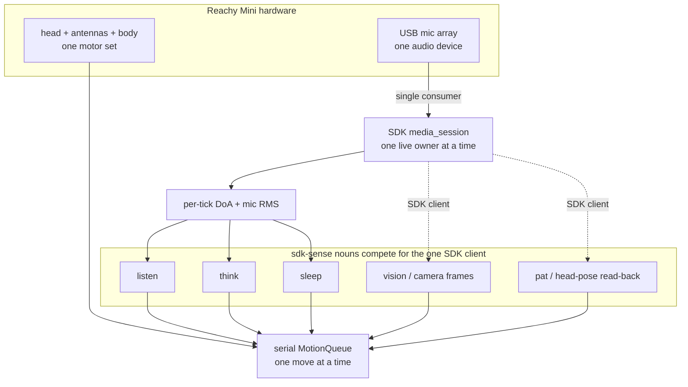
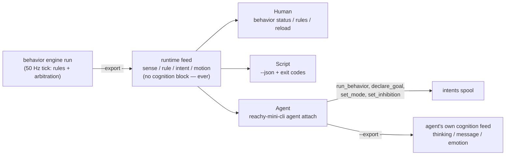

# Operating Reachy Mini

The coherent, end-to-end guide to running a **Reachy Mini** with
`reachy-mini-cli` — what it can do, the one model you must understand before you
compose behaviors (**the single-SDK-owner model**), how to bring the robot up
live, how to verify it, and how to get unstuck.

If you just want the copy-paste bring-up, run `reachy-mini-cli quickstart` (or jump to
[Bring Reachy up live](#bring-reachy-up-live)). If something is silently not
working, jump to [Troubleshooting](#troubleshooting) — the **`~/.asoundrc`
mic-array gotcha** is the most common silent failure.

> **Audience:** human operators bringing the robot up, AI agents driving the
> CLI, and contributors. Everything here is operator-facing; the implementation
> map for contributors is in [`CLAUDE.md`](../CLAUDE.md).

---

## What Reachy Mini can do

Reachy Mini is an expressive desk robot — a movable head (pitch/yaw + height),
two antennas, a rotating body, a USB **mic array** (with on-board direction-of-
arrival), a camera, and a speaker. `reachy-mini-cli` turns each capability into
a **noun** you run from the shell or an agent loop:

- **Hold a daemon** that owns the hardware (`daemon`), and run low-level
  device/app/motion ops against it (`device`, `app`, `move`).
- **Feel alive** when idle — gentle breathing, glances, antenna sway
  (`demo-mode`, `behavior`).
- **Orient to sound** — lean its antennas toward a voice and turn to face it
  (`listen`).
- **Orient to sight** — turn toward motion or light in the camera, no ML
  (`vision`).
- **Speak** — text-to-speech straight to the speaker (`say`).
- **Think out loud** — an LLM cognition loop that talks and moves its body in
  step with its thoughts, and can **export** a live feed of what it is
  thinking / saying / feeling (`think`, `think run --export`).
- **Feel a head pat and lean into it** — proprioceptive touch, no touch sensor
  (`pat`).
- **Fall asleep when left alone and wake when addressed** (`sleep`).

See the [noun map in the README](../README.md#noun-map) for the one-line table,
and `reachy-mini-cli explain <noun>` for the full reference of any noun.

---

## The single-SDK-owner model

**This is the one concept to understand before you run more than one behavior at
a time.** It trips up humans and agents repeatedly, because the CLI happily lets
you launch any two nouns — but the hardware underneath has **two single
resources**, and only one owner each.

### Two single resources



1. **The SDK client — and its single-consumer media session.** On the `sdk`
   transport every noun runs against **one in-process `ReachyMini` client**, and
   the robot serves a single live SDK client at a time. The mic path is the
   strictest case: `listen`, `think`, and `sleep` read live direction-of-arrival
   and loudness by opening a `media_session()` that is **single-consumer** —
   *"obtained exclusively through `SdkTransport.media_session`"*, against the
   *one* `ReachyMini` media subsystem (`reachy/robot/sdk_transport.py`). `vision`
   reads camera frames (`transport.get_frame()` → `media_manager.camera`) and
   `pat` reads the head pose back — both through that same one SDK client (these
   two do *not* open a `media_session()`; they contend at the `ReachyMini`-client
   level, which serializes all SDK access). So **only one `sdk`-sense noun can own
   the robot at a time.**

2. **The head — motion.** Every move (idle wander, sound-orienting turn,
   expression, snuggle, sleep-breathe) flows through **one serial
   `MotionQueue`**, one move at a time, so motion is always smooth and never
   self-conflicts. Two independent motion drivers still *fight over the same
   head*.

> **A third access pattern that does NOT compete for the media session.** The
> `behavior` engine's [pat sense](#the-pat-sense) reads the ACTUAL head pose
> back through a SEPARATE, held `ReachyMini(media_backend='no_media')` client
> (`reachy/robot/state_reader.py`'s `HeldStateReader`) dedicated to state
> reads. It never calls `media_session()` and never touches the mic or
> camera, so it does not contend for the single-consumer media session
> `listen`/`think`/`sleep`/`vision` share — the media session stays free for
> whichever of those actually needs it. It is still one more live SDK
> connection, so the "one `sdk` media owner per robot" rule of thumb below
> still governs motion/media composition; this is narrowly about what the
> state-read client does and does not contend for.

### What this means: the conflict matrix

Because both resources are single-owner, **you cannot run two `sdk`-sense nouns
as separate processes against one robot.** The second one contends for the
single-consumer SDK client and gets starved — a separate `pat` process running
alongside `listen` is throttled to roughly **1 Hz**, far too slow to feel a pat
(`reachy/motion/listen_pat.py`).

The `sdk`-sense nouns are `listen`, `think`, `sleep`, `vision`, and `pat`.

| Combination (both on `sdk`) | Works? | Why |
|---|---|---|
| any two of `listen` / `think` / `sleep` (two processes) | ❌ | Both open `media_session()` → contend for the one SDK client |
| `listen` + `pat` (two processes) | ❌ | Contend → `pat` throttled ~1 Hz. **This is why #43 folds pat into listen** |
| `listen`/`think`/`sleep` + `vision` (two processes) | ❌ | `vision` rides the same one SDK client for camera frames → contend |
| one sense noun + `demo-mode`/`behavior` | ⚠️ | No SDK-client clash (motion-only), but both drive the head — run **one** motion owner |
| one sense noun (`sdk`) + another noun (`http`) | ✅ | The `http` noun polls the daemon's DoA route and opens **no** SDK client |

### How to compose behaviors anyway

You have two correct patterns, and one coordination mechanism:

- **Fold senses into one loop (the #43 pattern).** Rather than run `pat`
  alongside `listen`, head-pat detection runs **inside** the `listen` loop via a
  per-tick `PatHook` — one process, one media session, both behaviors. This is
  the model for combining live senses on `sdk`.
- **Put the secondary noun on `--transport http`.** An `http`-transport noun
  polls the daemon's DoA route instead of opening a media session, so it never
  competes for the SDK client. Use this for a remote control box, or to layer a
  second behavior onto the one local `sdk` owner.
- **The `*_active.flag` files coordinate the shared *head*, not the media
  session.** When nouns are composed, `think`, `pat`, and `sleep` each drop a
  flag file under the state dir (`think_active.flag`, `pat_active.flag`,
  `sleep_active.flag`). The always-alive `listen` idle layer reads them and
  *yields the motion channel* by priority: `sleep` (strongest — yields
  entirely) > `pat` (pauses the idle wander) > `think` (drops to a quiet
  "focused breathe"). These flags solve head contention; they do **not** lift
  the single-media-session limit.

> **Rule of thumb:** one `sdk` media owner per robot. Everything else either
> folds into that loop or runs on `http`.

---

## Install profiles

Two profiles, because the SDK's transitive stack (pycairo / gstreamer /
pyaudio) needs system libraries a bare box or CI lacks — so `reachy-mini` is an
**extra**, not a base dependency (`numpy` is the only base runtime dep).

| Profile | Install | Use it for |
|---|---|---|
| **Real mode (recommended)** | `uv tool install 'reachy-mini-cli[daemon]'` (or `pip install 'reachy-mini-cli[daemon]'`) | A local robot: pulls `reachy-mini`, so the `sdk` transport and `reachy-mini-cli daemon start` work out of the box. |
| **HTTP remote** | `pip install reachy-mini-cli` (no extra) | No local robot — `numpy`-only; talk to a daemon elsewhere with `--transport http` + `REACHY_BASE_URL`. |

The installed command is **`reachy-mini-cli`** (short alias: `reachy`). Running
the `sdk` transport without the extra exits `2` with a hint to install `[sdk]` —
never a traceback. `reachy-cli` remains a transitional alias dist that just
pulls in `reachy-mini-cli`.

---

## Bring Reachy up live

The canonical sequence (also printed by `reachy-mini-cli quickstart`):

```bash
# 1. Install once (CLI + daemon binary + SDK)
uv tool install 'reachy-mini-cli[daemon]'

# 2. Start the daemon — wakes the robot on start
reachy-mini-cli daemon start

# 3. Verify it answers
reachy-mini-cli device status

# 4. Make it do something
reachy-mini-cli listen run            # orient to sound (Ctrl-C to stop)
#   or: reachy-mini-cli demo-mode start    # feel-alive idle loop (background)
#   or: reachy-mini-cli move goto --z 10 --pitch -5 --duration 2

# 5. Put it back down when you're done
reachy-mini-cli daemon stop
```

`reachy-mini-cli daemon start` spawns `reachy-mini-daemon` in the background and polls
its health route until ready (idempotent). It defaults to `--wake-up-on-start`,
so the robot wakes as part of step 2. Forward daemon args after `--`, e.g.
`reachy-mini-cli daemon start -- --sim --no-wake-up-on-start`. The daemon's PID + log
live under `$XDG_STATE_HOME/reachy` (`~/.local/state/reachy`).

### Transports — `sdk` vs `http`

Every robot noun talks to the hardware through a **transport**:

- **`sdk`** — the in-process `reachy_mini` client. The only transport that can
  open a `media_session()` (live mic DoA + RMS) or read the head pose back
  (`head_pose()`). **Default for the sense nouns** (`listen`, `think`, `pat`,
  `sleep`, `vision`). Needs the `[sdk]`/`[daemon]` extra.
- **`http`** — the daemon's REST API, pure stdlib. **Default for `device`,
  `app`, `move`** (and the base `transport.py` default). Point it with
  `--base-url` / `REACHY_BASE_URL` (default `http://localhost:8000`). It can
  poll the daemon's DoA route but cannot open a media session or read the head
  pose.

Select per command with `--transport {sdk,http}` or the `REACHY_TRANSPORT`
env var. If no daemon is reachable, the command exits `2` with a clean
`error:` / `hint:` pair.

> **Default differs by noun.** The sense nouns default to `sdk`; `device` /
> `app` / `move` default to `http`. `REACHY_TRANSPORT` overrides both.

---

## Boot persistence — one presence per reboot

By default nothing comes back after a reboot — you re-run `daemon start` and a
presence noun by hand. To make the robot a **self-healing, boot-surviving
presence**, use the `service` noun. It installs systemd `--user` units so the
robot boots into **exactly one** presence mode and auto-restarts on crash. This
is the single-SDK-owner model expressed across reboots: only one presence owns
the robot, so `service` lets you persist only one mode at a time.

### The two presence modes

| Mode | What boots | Best for |
|---|---|---|
| `demo` | `reachy-mini-cli demo-mode run` — the idle feel-alive loop | A robot that just looks present (breathing, glances, sway) |
| `live` | `reachy-mini-cli listen run --live --transcribe --cognition agent --voice-engine harmonic` — the folded live sense loop | A robot that hears, sees, thinks (via tool-use agent cognition), sleeps, feels pats, and speaks with its own offline voice |

The `live` mode is the [folded live loop](#senses-one-sdk-media-owner-at-a-time):
**one** process running every live sense (hearing + pat + think + vision +
sleep) over the **one** SDK media session — the supported way to run all the
senses at once.

### The workflow

```bash
reachy-mini-cli service install          # write the three systemd --user units (enable nothing)
reachy-mini-cli service enable live      # boot-persist listen run --live
#   or: reachy-mini-cli service enable demo   # boot-persist the idle demo loop instead

reachy-mini-cli service status           # which mode is enabled (or none) + daemon health
reachy-mini-cli service disable          # stop the enabled presence (the daemon stays up)
reachy-mini-cli service uninstall        # remove the unit files
```

- **Exactly one presence is boot-persistent.** Enabling one mode **disables the
  sibling** — `service enable demo` after `service enable live` flips the robot
  to the idle loop and turns the live loop off. You never end up with two
  presences fighting for the robot.
- **It auto-restarts.** Each unit is `Restart=on-failure` with a 5 s back-off, so
  a presence that crashes comes straight back.
- **The daemon is a boot dependency.** `service` writes a `reachy-daemon.service`
  unit and the presence units `Requires=` / `After=` it, so the daemon is always
  up first. `service disable` stops only the presence and **leaves the daemon
  enabled** (other clients of the robot depend on it) — reported as
  `daemon=left-enabled`.
- **`install` vs `enable`.** `install` writes all three unit files and reloads
  systemd **without enabling anything**, so you can stage the units and choose the
  mode separately; `enable {demo|live}` is the all-in-one (write + enable + disable
  the sibling). Every verb supports `--json`.
- **`live` boots into the tool-use agent, voiced harmonically.** The rendered
  `live` unit's `ExecStart` is `listen run --live --transcribe --cognition agent
  --voice-engine harmonic` (see [Agent cognition](#agent-cognition--tool-use-live-mode)
  and [The harmonic voice](#the-harmonic-voice)) — a deliberate choice so the
  robot reasons through tool calls and has its own voice at boot, independent of
  whether the TTS service is reachable. Because `--cognition agent` and
  `--voice-engine harmonic` are explicit flags baked into the unit, setting
  `REACHY_COGNITION=marker` / `REACHY_VOICE_ENGINE=tts` as a unit environment
  override does **not** revert them — an explicit flag always beats the env var.
  To run the boot presence on the marker engine and/or TTS instead, override the
  unit's `ExecStart` with `systemctl --user edit reachy-live.service` (clear it
  with a bare `ExecStart=` line, then set a new one ending `--cognition marker
  --voice-engine tts`, or whichever combination you want) and `systemctl --user
  restart reachy-live.service`; or skip the boot service and run
  `reachy-mini-cli listen run --live --transcribe --cognition marker
  --voice-engine tts` in the foreground instead.

> **Reboot at machine power-on needs linger.** A `systemctl --user` service
> normally starts at **first login**, not at machine boot. For a headless robot
> that should come up before anyone logs in, enable **linger** for the user:
> `loginctl enable-linger $USER`. A true machine-reboot check (power-cycle the
> robot, confirm the presence comes back on its own) is therefore a **manual
> on-robot step** — it is not something the CLI can self-verify.

Unit files live under `$XDG_CONFIG_HOME/systemd/user` (`~/.config/systemd/user`).
A missing `systemctl` on PATH exits `2` with a hint (this needs a Linux systemd
user session); an invalid mode is an exit-1 user error. Run
`reachy-mini-cli explain service` for the full reference.

---

## Verify it's working

A quick liveness checklist after `daemon start`:

```bash
reachy-mini-cli device status            # -> state, version, wireless/lite, sim, IP (exit 0)
reachy-mini-cli device state             # -> live head pose / antennas / body yaw
reachy-mini-cli say run "hello"          # you should hear it (checks TTS + speaker)
reachy-mini-cli move goto --z 10 --pitch -5 --duration 2   # head visibly moves
reachy-mini-cli listen run               # speak near it — antennas lean, then it turns; Ctrl-C
```

What "working" looks like:

- `device status` returns **exit 0** with real fields (not an exit-2 `hint:` to
  start the daemon).
- During `listen run`, the log shows antenna leans on every sound and a
  head→body turn on speech/snap. If the head never reacts to sound, you are
  almost certainly hitting the [`~/.asoundrc` gotcha](#the-asoundrc-mic-array-gotcha)
  below — the SDK opened but found no live mic source.
- `reachy-mini-cli <noun> status --json` (for `demo-mode` / `listen` / `think` / `sleep`)
  reports the background process + health.

---

## The `~/.asoundrc` mic-array gotcha

**The single most common silent failure.** The Reachy Mini mic array enumerates
as a USB audio **card** in ALSA, but PulseAudio/PipeWire may not expose it as a
capture **source**. When that happens the SDK falls back to the default audio
device and `listen` / `think` / `sleep` get **no real sound** — they run, but
the robot never reacts.

**Symptom** (in the daemon log):

```text
No Reachy Mini Audio Source card found / using default audio source
```

**Cause:** the host's PulseAudio/PipeWire has not surfaced the Reachy USB audio
card as an ALSA source, so the SDK cannot capture from the mic array.

**Fix:** the daemon is meant to auto-write an `~/.asoundrc` that pins the card
as `reachymini_audio_src` (its `write_asoundrc_to_home()` step) — but it does
not always fire on first bring-up. Ensure `~/.asoundrc` defines the
`reachymini_audio_src` ALSA device and restart the daemon:

```bash
reachy-mini-cli daemon stop
reachy-mini-cli daemon start
```

**Confirmation** — a healthy capture path logs:

```text
Using ALSA device reachymini_audio_src for capture
```

> The auto-write and the exact log strings live in the **daemon binary**
> (`reachy-mini`), not in `reachy-mini-cli`. The strings above were captured
> from a live bring-up; the exact `write_asoundrc_to_home()` behavior should be
> re-confirmed against the daemon during on-robot verification (see the
> [live-verify follow-up](#status--follow-ups)).

---

## Environment variables

Every variable the CLI reads, in one place. CLI flags override env vars; env
vars override the built-in default.

| Variable | Default | Meaning | Read by |
|---|---|---|---|
| `REACHY_TRANSPORT` | `sdk` for sense nouns; `http` for `device`/`app`/`move` | Selects the transport flavor | `robot/transport.py`, every sense noun |
| `REACHY_BASE_URL` | `http://localhost:8000` | Daemon REST base URL for the `http` transport | `robot/transport.py`, `daemon.py` |
| `REACHY_DAEMON_CMD` | (auto-resolved) | Override the `reachy-mini-daemon` binary/command `daemon start` spawns | `daemon.py` |
| `REACHY_STATE_DIR` | `$XDG_STATE_HOME/reachy` → `~/.local/state/reachy` | Where PID + log files for daemon/`demo-mode`/`listen`/`think`/`sleep` live | `daemon.py` |
| `XDG_STATE_HOME` | `~/.local/state` | Base for the state dir when `REACHY_STATE_DIR` is unset | `daemon.py` |
| `XDG_CONFIG_HOME` | `~/.config` | Base for config (`<…>/reachy/demo-mode.json`) | `demo_config.py` |
| `REACHY_TTS_URL` | `http://localhost:9000` | Magpie-style TTS HTTP endpoint | `speech/tts.py` (`say`, `think`) |
| `REACHY_TTS_VOICE` | `Magpie-Multilingual.EN-US.Mia.Calm` | TTS voice identifier | `speech/tts.py` |
| `REACHY_VOICE_ENGINE` | `tts` for `say`/`think`/`listen --live`; **`harmonic`** for the behavior runtime | Speech backend: `tts` or `harmonic`. The symbolic runtime defaults the other way on purpose — its voice must work with nothing reachable | `speech/voice.py`, `behavior/speech_act.py` |
| `REACHY_SPEECH_TRANSPORT` | `http` | How the behavior runtime's voice reaches the speaker: `http` (upload + play via the daemon) or `sdk` (push PCM in-process). Falls back to `REACHY_TRANSPORT`; `http` is the default because the media-profile SDK client is currently unconstructable on the robot (issue #94) | `behavior/speech_act.py` |
| `REACHY_COGNITION` | `marker` | Folded live cognition engine for `listen --live`: `marker` or `agent` | `cli/_commands/listen.py` |
| `REACHY_HARMONIC_IDENTITY` | `reachy` | Harmonic voice identity signature (root pitch + instrument) | `speech/harmonic.py` |
| `REACHY_HARMONIC_ARTICULATION` | `smooth` | Harmonic rendering style: `discrete` / `speechy` / `smooth` / `alien` | `speech/harmonic.py` |
| `REACHY_OPENAI_URL_BASE` | `http://localhost:8000` | OpenAI-compatible LLM base URL for `think` (legacy: `REACHY_LLM_BASE_URL`) | `speech/llm.py` |
| `REACHY_OPENAI_MODEL_ID` | `default` | LLM model id for `think` — must be a model the endpoint serves (legacy: `REACHY_LLM_MODEL`) | `speech/llm.py` |
| `REACHY_OPENAI_API_KEY` | (unset) | Bearer key for the LLM endpoint, only sent when present (legacy: `REACHY_LLM_API_KEY`) | `speech/llm.py` |
| `REACHY_STT_URL` | `http://localhost:9002` | OpenAI-compatible STT (Parakeet) for `sleep` wake-word | `sleep/wakeword.py` |
| `REACHY_STT_PHRASE` | `hey reachy` | Wake phrase matched against the STT transcript | `sleep/wakeword.py` |
| `REACHY_STT_LANGUAGE` | `en` | STT language hint | `sleep/wakeword.py` |
| `REACHY_STT_TIMEOUT` | `2.0` (seconds) | Per-request STT socket timeout (kept short so a wake check never stalls the loop) | `sleep/wakeword.py` |
| `REACHY_LOG_LEVEL` | `INFO` | Verbosity for every `reachy.*` module logger on `listen`/`think`/`sleep run` (a `--log-level` flag wins over this) | `cli/_logging.py` |
| `REACHY_VISION_MODEL_ID` | `coolthor/gemma-4-12B-it-NVFP4A16` | VLM model id for scene description (`describe_scene` tool + the periodic `SceneHook`); same base URL family as `REACHY_OPENAI_URL_BASE`/`REACHY_OPENAI_API_KEY` | `vision/scene.py` |
| `FORGE_BASE_URL` | `http://localhost:8001/v1` | Coder-model endpoint the `forge` tool dispatches to (the lobes gateway's cortex route) | `forge/client.py` |
| `FORGE_MODEL` | `qwen3` | Coder-model id sent in the forge dispatch request | `forge/client.py` |
| `FORGE_API_KEY` | (unset) | Bearer key for the forge endpoint, sent only when present | `forge/client.py` |

### Agent cognition — tool-use live mode

`listen run --live`'s folded cognition can run one of two engines, picked by
`--cognition {marker,agent}` (env `REACHY_COGNITION`, default `marker`;
`--live`-only — a bare `--cognition` is a clean exit-1 error):

- **`marker`** (default, unchanged) — the established `*emoji*`/`"speech"`
  convention: the LLM's free-text reply is parsed for markers and spoken /
  expressed accordingly.
- **`agent`** — the LLM acts through explicit tool calls instead of text
  parsing. Three tools are published to the model as an OpenAI `tools=` array:
  `speak` (the TTS voice), `harmonics` (the offline melodic voice), and
  `apply_pose` (a catalog-emoji body expression — the full catalog is advertised
  to the model as an enum, and an unknown emoji comes back as an error naming the
  valid keys instead of silently doing nothing). Each `tool_calls` response is
  executed and fed back as a tool result until the model returns plain text with
  no more calls. Both engines ride the exact same folded `ThinkHook` seam,
  `EventBuffer`, and export sinks as `marker` — swapping the flag adds no new
  process and no second media session. `--voice-engine` is inert under `agent`:
  both the TTS and harmonic voices are always registered as separate tools, so
  the model picks per utterance rather than the process picking one engine for
  the whole run.

**The deployed `live` boot unit defaults to `agent`.** `reachy-mini-cli service
enable live` boots `listen run --live --transcribe --cognition agent
--voice-engine harmonic` — hearing words, reasoning via tool calls, and having a
voice are all on out of the box (see
[Boot persistence](#boot-persistence--one-presence-per-reboot)).

**Voice-only usage story** — how an address near the robot becomes a reply,
end to end:

1. You say *"Reachy, …"* near the robot. The mic array's per-tick audio is
   transcribed once the utterance pauses (`--transcribe`'s `TranscribeHook`).
2. The transcript passes the [layered engagement
   gate](#senses-one-sdk-media-owner-at-a-time): a fuzzy name match on
   "reachy"/"robot" (and common mishearings) engages immediately; anything else
   goes through a single LLM classifier judging "is this addressed to me?" —
   ambient chatter is dropped before it ever reaches cognition.
3. An ENGAGE verdict does two things at once: the [3-tier motion
   ladder](#senses-one-sdk-media-owner-at-a-time) fires a deliberate head/body
   turn toward the speaker, and the transcript is appended to the shared
   `EventBuffer` both cognition engines read from.
4. The next agent turn (running on its own background worker, so it never
   blocks the motion loop) snapshots the buffer, calls the LLM with the
   `speak`/`harmonics`/`apply_pose` tools, and executes whatever the model
   calls — a spoken reply, a melodic harmonic phrase, a body pose, or several
   of these in one turn (see [Agent model
   choice](#agent-model-choice--cortex-or-muse) below for which model role this
   targets).
5. Idle presence never stops: the motion loop keeps breathing/glancing
   throughout, and the antenna-lean/turn/pat reactions from the other folded
   senses keep running alongside the agent's replies.

Touch takes the same road, minus the gate: a head pat fires the reflex
lean/nuzzle instantly (no LLM in that path), and the detection *also* lands in
the shared buffer as a `felt a gentle scratch on the head` cue — one cue per
reaction cycle — so the next agent turn can answer being petted (a word of
thanks, the 😊 contentment pose). Pats skip the engagement gate entirely:
touching the robot is inherently addressed to it.

Try it: `reachy-mini-cli service enable live` (boots the agent-mode unit), then
say *"Reachy, hello!"* near the robot and listen for a reply — or iterate faster
in the foreground first:

```bash
reachy-mini-cli listen run --live --transcribe --cognition agent --voice-engine harmonic
# say "Reachy, ..." near the robot — expect a spoken/harmonic reply and/or a
# pose, while idle presence (breathing, glances) continues underneath
```

**The behavior stash** (`reachy/stash/` — not yet a CLI noun or an agent tool) is
a persistent, semantically searchable store of body behaviors for the agent to
fetch and adapt later. A stash record is **declarative data only, never code**:
it names an existing generator template from `reachy.behavior.library.LIBRARY`, a
typed parameter set, the channels it claims, a stop-class, a lifetime, and a
natural-language `explanation` — the text embedded (via the lobes gateway
`/v1/embeddings` route) for semantic search. Anything smelling of code (an extra
field, a non-JSON value, an unknown generator) is refused with a clean error. The
index (records + embedding vectors) persists as one JSON file under
`<state_dir>/stash/index.json` (the same state-dir family as the daemon PID file
and the `think_active`/`sleep_active` flags).

Stash round-trip demo — add a record in one session, semantically fetch and apply
it in a later one, using the package's Python API directly (no stash CLI verb
exists yet):

```bash
# Session 1 — stash a record (embeds via the gateway, persists to disk)
python3 -c '
from reachy.stash.record import StashRecord
from reachy.stash.store import StashStore

record = StashRecord.from_dict({
    "name": "pondering-tilt",
    "explanation": "ease into a thoughtful tilted gaze while pondering a sound",
    "generator": "thoughtful",
    "params": {
        "pitch": {"default": 8.0, "unit": "deg", "help": "upward/forward tilt"},
        "yaw": {"default": 10.0, "unit": "deg", "help": "gaze-aside angle"},
        "roll": {"default": 5.0, "unit": "deg", "help": "head roll"},
        "rise": {"default": 0.6, "unit": "s", "help": "ease-in time"},
    },
    "channels": ["head"],
    "stop_class": "stoppable",
    "lifetime": {"looping": False, "duration": 3.0},
})
StashStore().add(record)
print("stashed:", record.name)
'
```

```bash
# Session 2 (later, a fresh process) — semantic fetch + apply
python3 -c '
from reachy.stash.store import StashStore
from reachy.stash.apply import apply_record
from reachy.motion.queue import MotionQueue

hit = StashStore().search("a gentle thoughtful head tilt", k=1)[0]
print("fetched:", hit.record.name, "score:", hit.score)

queue = MotionQueue()
actions = apply_record(hit, queue)
print(len(actions), "keyframes enqueued")
'
```

The second process never saw the first's in-memory record — it only reads the
persisted `<state_dir>/stash/index.json` and re-embeds the query text for the
cosine search, which is the round trip this demo verifies. On the running robot,
`apply_record` would instead take the live loop's own `MotionQueue` (the one
`ExpressionProducer` already drives) so the fetched gesture plays on the robot;
a throwaway `MotionQueue()` above is enough to verify fetch → plan → enqueue
without disturbing a running loop.

### Agent model choice — cortex or muse

The LLM endpoint behind `REACHY_OPENAI_*` is a **lobes** gateway that serves
several model **roles** at the same base URL — only `REACHY_OPENAI_MODEL_ID`
picks the role; `REACHY_OPENAI_URL_BASE` does not change. The box's boot config
lives in one file:

```text
~/.config/environment.d/10-reachy-llm.conf
```

Day-to-day live cognition (the `*emoji*`/`"speech"` marker convention `think` /
`say` / marker-mode `listen --live` use) is currently pinned to the **`senses`**
role — a Gemma model (`coolthor/gemma-4-12B-it-NVFP4A16`, proxied to a peer box)
tuned for reacting to raw perception; that pin is unaffected by anything below.

**Agent tool-use** (an LLM turn that calls `speak` / `harmonics` / `apply_pose`
as tools instead of the marker convention — `--cognition agent`) has two
verified model choices instead:

- **`cortex`** (`sakamakismile/Qwen3.6-27B-Text-NVFP4-MTP`) — served locally by
  the gateway, no proxy hop. The **default / verified fallback**: reliably
  returns `tool_calls` (parsed server-side by the `qwen3_coder` parser) and
  reliably follows up with real assistant text once tool results are appended.
- **`muse`** (`nvidia/Gemma-4-31B-IT-NVFP4`) — proxied to peer `thor`. As of
  agentculture/lobes-cli#139's partial fix it is also tool-capable (verified
  2026-07-17: a chat round trip returns `finish_reason=tool_calls`), so it is a
  genuine second option for agent tool-use. Its audio-in leg is still absent
  server-side (`400` "no audio tower", tracked in the same issue) — irrelevant
  to agent tool-use, which is a chat-only round trip (text sense cues in, tool
  calls out); only a future audio-native use of muse would need that issue
  resolved.

```bash
REACHY_OPENAI_URL_BASE=http://localhost:8001                         # unchanged — same gateway
REACHY_OPENAI_MODEL_ID=sakamakismile/Qwen3.6-27B-Text-NVFP4-MTP       # cortex — default/fallback
# or:
REACHY_OPENAI_MODEL_ID=nvidia/Gemma-4-31B-IT-NVFP4                    # muse — proxied from thor
```

Edit `10-reachy-llm.conf`'s `REACHY_OPENAI_MODEL_ID` line to switch (a
`loginctl` re-login or a reboot picks up `environment.d` changes); the URL base
line does not need to change either direction. **Switching is pure
environment.d config — no code change.** Whichever role is active, the client
always sends `chat_template_kwargs: {"enable_thinking": false}` on every
request (`speech/llm.py`'s `_build_request`) — thinking-mode output is never
requested from any role.

**This choice only matters for agent tool-use.** `think` / `say` / marker-mode
`listen --live` keep using whatever role `REACHY_OPENAI_MODEL_ID` currently
names (`senses` today) — their marker-based cognition works against any role
and has no opinion on which one is configured. Nothing about `think`'s or
`say`'s defaults changes when you switch; only the agent tool-use path cares
which role is verified for `tool_calls`.

`tests/test_agent_turn_cortex_integration.py`'s gateway-gated integration test
runs the identical tool round trip against both `cortex` and `muse` live
(parametrized; each case skips independently when its model is unreachable) —
see that module's docstring for the live-verified behaviour difference between
the two at `temperature=0.0`.

---

## Event-based senses pipeline

`listen run --live` doesn't just fold `think`/`vision`/`sleep` into one loop
([the single-SDK-owner model](#the-single-sdk-owner-model)) — every perception
that loop makes now lands as a structured **event**: touch already did
(issues #66/67/68), and this pass adds whole-sentence hearing, sight, faces,
and a scene description, all landing in the same shared `EventBuffer` the
folded cognition engine reads, with every pipeline stage logged in one
grep-able grammar. It also gives the agent a way to grow its own reactions at
runtime (the **forge** loop, below). None of this is a new noun — it all lives
inside `listen run --live`.

### What changed and why

| Sense / concern | Before | After |
|---|---|---|
| Speech capture | Accumulation began only on the tick the SDK's ~5 Hz DoA speech flag first read `True` (`listen_transcribe.py`, pre-fix: `if sample.speech and sample.audio is not None:`) — every word spoken before that tick was gone for good | A rolling ~10 s ring buffer is fed every non-muted tick, *before* the speech-flag gate; on the flag's rising edge the onset is *measured* (an RMS scan) and the emitted clip starts `pre_roll` (2.0 s default) before it |
| Vision → cognition | `EventBuffer.feed_vision` existed (since the `think` body-expression work) but had **zero production callers** — cognition never heard what the robot saw ([issue #32](https://github.com/agentculture/reachy-mini-cli/issues/32)) | `VisionHook` calls it on every motion/light decision, coalesced to one cue per episode |
| Faces | No face detection/recognition code existed anywhere in the repo (a genuine port, not a wiring job) | `reachy/vision/face.py` (OpenCV YuNet + SFace) + a folded `FaceHook` feed named-face cues, cooldown-gated |
| Pipeline observability | No `logging.basicConfig`/handler existed anywhere in the codebase — every `logger.info` trace (engagement decisions, pat autopsy, dispatch traces) was silently dropped by Python's WARNING-only "last resort" handler, so a live session was undebuggable from the journal | `reachy/cli/_logging.py` attaches one stderr handler at `listen`/`think`/`sleep run` entry; the `[SENSE …]` grammar below makes every stage — and every drop — checkable in the journal |
| Behavior stash | Built (`reachy/stash/`) but wired to nothing — no CLI verb, no agent tool | **Unchanged by this pipeline.** It stays a separate, declarative-only self-extension path (see [the behavior stash](#agent-cognition--tool-use-live-mode) above); the `forge` tool below is a deliberately different, generated-code path — the two philosophies are not merged |

The camera path itself needed a separate repair before any of the vision/face/
scene work could ship — see [the camera-path repair](#the-camera-path-repair-sdk--19)
below.

### Hearing the whole sentence: pre-roll capture

Under `--transcribe`, `TranscribeHook` (`reachy/motion/listen_transcribe.py`)
now keeps a rolling ring buffer of the raw mic chunks — fed on **every**
non-self-muted tick, *before* the speech-flag gate — so the words spoken while
the SDK's ~5 Hz DoA speech flag is still catching up are not lost:

1. Every tick's chunk is pushed onto a ~10 s ring (trimmed by total samples,
   one cheap append per tick — no per-tick concatenation).
2. On the flag's **rising edge**, the onset is *measured*, not assumed: a scan
   of the buffered audio in 10 ms RMS windows finds the first window whose RMS
   clears a fixed silence threshold (`0.02`, float PCM).
3. The utterance is seeded starting at `onset − pre_roll` (default **2.0 s**,
   clamped to the ring's start), so the leading words the lagging flag missed
   are still in the clip.
4. Endpointing is unchanged: the whole utterance transcribes in one POST on a
   pause (`silence_hold_s`) or at `max_utterance_s`; the ring is cleared with
   every flushed/discarded utterance so a previous utterance (or the robot's
   own voice) never bleeds into the next one's lead-in.

This is a direct port of `reachy_nova`'s `SpeechEventDetector` design. The ring
horizon, pre-roll, onset window, and threshold are constructor defaults on
`TranscribeHook` (`ring_seconds=10.0`, `pre_roll_s=2.0`, `onset_window_s=0.01`,
`onset_threshold=0.02`) — there is currently no `--pre-roll` CLI flag; tune
them in code if a deployment needs different values. The self-mute window is
still checked first, so the robot never pre-rolls or transcribes its own
voice.

### The `[SENSE]` log grammar — and how to grep it

Every stage of the sense pipeline — capture, onset, a cue landing in the
`EventBuffer`, a cognition turn, a tool dispatch, a face re-announce, a scene
describe, a forge lifecycle transition — now emits exactly one fixed,
parseable line on a dedicated `reachy.sense` logger (`reachy/senselog.py`):

```text
[SENSE stage=<stage> source=<source> event=<event>] <detail>
```

For example:

```text
[SENSE stage=capture source=speech event=3f2a9c1e] utterance start pre_roll=1.83s buffered=160000
[SENSE stage=cue source=vision event=9b1e2a04] motion on the right
[SENSE stage=turn source=agent event=7c4410aa] cue_count=2
[SENSE stage=action source=speak event=1a90ffcc] tool call dispatched
[SENSE stage=reannounce source=face event=44dd21b0] dropped reason=cooldown
[SENSE stage=forge source=wave-hello event=2e771f9c] staged
```

A **dropped** event uses the same shape via `senselog.drop(...)` and always
names the reason — it is never a silent no-op. Reasons seen in this codebase
today include `self-mute`, `min-utterance`, `cooldown` (face re-announce),
`vlm-unreachable` (scene), `audio-muted` (a muted TTS/harmonic tool call), and
`tool-error`, plus a forge validator's own joined rejection reasons.

**Turning the logging on** is a separate fix in its own right: before this
pass, nothing in the codebase ever called `logging.basicConfig` or attached a
handler, so every `logger.info` trace — including the `[SENSE]` lines above —
was silently swallowed by Python's WARNING-only default. `reachy/cli/_logging.py`'s
`install_logging` now attaches exactly **one** `stderr` `StreamHandler` to the
`"reachy"` logger (the common ancestor every `reachy.*` module logger
propagates to) at `listen run` / `think run` / `sleep run` entry:

- **`--log-level LEVEL`** (any of `listen run` / `think run` / `sleep run`) or
  the **`REACHY_LOG_LEVEL`** env var selects the verbosity; the flag wins over
  the env var, which wins over the built-in default (`INFO`).
- The handler always targets **stderr**, never stdout, so `listen run --live
  --export -`'s stdout stays a pure JSONL feed — logs and the export feed can
  never mix, in either direction.
- Calling `install_logging` more than once (e.g. a defensive call at more than
  one entry point) reuses the same handler — never a duplicate line.

Grep the pipeline live, on the deployed `reachy-live.service`:

```bash
# tail every sense-pipeline line as it happens
journalctl --user -u reachy-live.service -f | grep -F '[SENSE'

# just the last 10 minutes' worth of cues reaching cognition
journalctl --user -u reachy-live.service --since "10 min ago" | grep 'stage=cue'

# every drop, with its reason, since boot
journalctl --user -u reachy-live.service -b | grep -F '[SENSE' | grep 'dropped reason='

# run it in the foreground with more (DEBUG) verbosity instead of the journal
reachy-mini-cli listen run --live --log-level DEBUG
```

### Vision, faces, and scene become events

Three folded hooks turn what the camera sees into cues in the same shared
`EventBuffer` the transcript, DoA, and touch cues already land in — the agent
reads all of them from one buffer at the start of its next turn:

- **`VisionHook` (motion + light → `feed_vision`).** The existing motion/light
  orienting hook now *also* calls `EventBuffer.feed_vision(direction,
  brightness_delta)` on every decision. Because the pixel detectors can decide
  on *every* tick while a subject keeps moving, a naive feed would flood
  cognition with one cue per tick for a single continuous event — so it
  **coalesces**: at most one cue per episode, where a new episode starts only
  after a quiet gap (`DEFAULT_COALESCE_GAP = 2.0 s`) since the last cue, or
  when the reported direction/brightness shifts by more than a `0.4`
  band (a genuine swing is reported immediately, even inside the gap).
- **`FaceHook` (YuNet + SFace → `feed_face`).** Face recognition needs the
  `[vision]` extra (below). It runs its own detection on a background
  worker (bounded to `detect_interval`, default 0.5 s) and shares
  `VisionHook`'s **one** frame grabber via a *non-consuming peek*
  (`VisionHook.latest_frame`) — it never opens a second camera grabber
  thread. A permanent-tier match to a *named* face feeds `EventBuffer.feed_face(name)`
  at most once per **30 s** per name (`DEFAULT_REANNOUNCE_COOLDOWN`), so a
  face that lingers in frame doesn't spam "saw Ada" every detection cycle.
  Unknown/unnamed faces never produce a name cue.
  - **Enrolling a face:** there is deliberately no `reachy face` CLI noun.
    `uv run python scripts/face_enroll.py --name Ada` opens the one live media
    session, watches for up to `--duration` seconds (default 15) for a face,
    embeds it, and enrolls it into the `FaceStore`'s permanent tier — after
    which the folded `FaceHook` recognizes that person live and feeds `saw
    Ada` cues. On first run the ~37 MB YuNet+SFace model pair auto-downloads
    under `state_dir()/models/` (a one-time, network-needing cost).
- **`SceneHook` (periodic VLM describe → `feed_scene`).** A background worker
  captures the shared frame and asks a vision-language model to describe it,
  on a default 30 s cadence (matching `reachy_nova`'s fallback), feeding
  `EventBuffer.feed_scene(text)`. The **same** describe path
  (`reachy.vision.scene.describe_frame`) also backs an on-demand
  `describe_scene` agent tool — advertised only under `--cognition agent` —
  so the periodic hook and the on-demand tool are two consumers of one
  implementation, not two. The model id is `REACHY_VISION_MODEL_ID`
  (default: the lobes gateway's `senses` role model,
  `coolthor/gemma-4-12B-it-NVFP4A16` — see [Agent model
  choice](#agent-model-choice--cortex-or-muse) above for the same gateway
  family). A scene-describe failure (unreachable/slow/malformed VLM) logs
  exactly **one** loud drop per failure *episode* — not one every 30 s — and
  never stalls the tick loop; the latch clears on the next success.

All three ride **last** in the live hook chain (after `sleep`/`pat`/`think`,
and — under `--transcribe` — the transcribe hook): they compete for nothing
the idle-priority flags arbitrate, so their ordering is purely "whatever is
left after the higher-priority senses have run this tick."

### Installing the `[vision]` extra

Face recognition and scene description need OpenCV; the pixel-only `vision`
noun (motion/light orienting) does not:

```bash
pip install 'reachy-mini-cli[vision]'      # pulls opencv-python-headless
# or, from a checkout:
uv sync --extra vision
```

Without it, `listen run --live` still comes up and runs everything else —
`FaceHook` and `SceneHook` are each simply **skipped**, with one logged
warning naming the fix:

```text
listen --live: face recognition needs the [vision] extra (opencv); skipping FaceHook (install: pip install 'reachy-mini-cli[vision]')
listen --live: scene description needs the [vision] extra (opencv); skipping SceneHook (install: pip install 'reachy-mini-cli[vision]')
```

`[vision]` is not a base dependency — the same lazy-extra pattern as
`[sdk]`/`[daemon]`/`[cpu]`/`[gpu]` (see [Install profiles](#install-profiles)):
a bare `pip install reachy-mini-cli` never pulls in OpenCV, and the bare-HTTP
remote profile has no camera to run it against anyway.

### The camera-path repair (SDK ≥ 1.9)

None of the vision/face/scene work above could ship until the camera frame
path itself was fixed. The daemon **always** owns the physical camera
(`reachy-mini`'s `GstMediaServer`); on the installed SDK (≥1.9) the in-process
client's LOCAL backend (`GStreamerCamera`) reads frames over **the daemon's
local IPC endpoint** — it does not open `/dev/video0` itself. So **the daemon
must be running** for any vision, face, or scene sense to see anything;
`media.camera` gates availability and `media.get_frame()` returns the frame
(or `None` when none is ready this instant).

Two things were wrong before the repair, both now fixed:

- **A version skew silently broke the media path.** `reachy-mini` (SDK) and
  `reachy-mini-daemon` are now both pinned to `>=1.9.0,<1.10` in the
  `[sdk]`/`[daemon]` extras. A mismatched pair (e.g. SDK 1.7.3 against a
  1.9.0 daemon) warns at client open and then serves camera frames as `None`
  forever, while everything else (motion, DoA) keeps working — exactly what
  made this bug hard to spot without a targeted live probe.
- **The repo's camera seam was a guess that didn't match the SDK.** An earlier
  `is_local_camera_available()` / `media_manager.camera` seam named APIs that
  never existed on the installed SDK. `reachy/robot/sdk_transport.py` now
  uses only the surface that is really there: `media.camera is not None` for
  availability, `media.get_frame()` for the read, and `acquire_media()` to
  re-acquire the pipeline if the daemon had released it for direct access.

Verify the repaired path live with a bounded soak (never runs away even on a
hung `get_frame()` — a `SIGALRM` hard-caps it):

```bash
uv run python scripts/camera_soak.py                  # 30 s soak, ~30 Hz poll
uv run python scripts/camera_soak.py --duration 10 --json
```

It reports frames-total / frames-`None` / frame shapes+dtypes / effective FPS
through the **same** one held `MediaSession` the live `listen` loop uses (not
the throwaway per-frame path); a `frames_ok == 0` result prints a targeted
hint (daemon running? SDK/daemon versions aligned? `connection_mode
localhost_only`?).

### The forge loop — the robot writes its own reaction seams

Under `--cognition agent` only (the marker engine has no tool registry, so it
has no `forge` tool), the agent can hand a natural-language goal to a coder
model and — if what comes back is safe — gain a new callable tool with **no
restart**:

1. The agent calls the `forge` tool with a `goal` (and, to refine an existing
   forged skill, its `name` as `improve`). The tool call returns immediately;
   the whole round trip runs on a background thread.
2. `ForgeClient.dispatch` POSTs an OpenAI-compatible chat-completions request
   to `FORGE_BASE_URL` / `FORGE_MODEL` (default: the lobes gateway's cortex
   route, `http://localhost:8001/v1`, model `qwen3`; `FORGE_API_KEY` if the
   endpoint needs one) asking for exactly two fenced blocks — ```SKILL.md```
   (YAML frontmatter `name:`/`description:`) and ```executor.py``` (a single
   `def execute(params, ctx):`).
3. The reply is parsed and written to `<state_dir>/forge/staged/<name>/`,
   then run through an **AST-only, fail-closed validator**
   (`reachy/forge/validator.py`) that never imports or executes a byte of the
   generated code: an import allow-list (`numpy`, `math`, `time`, `typing`,
   `dataclasses`), a forbidden-name list (`exec`, `eval`, `os`, `subprocess`,
   `open`, `__import__`, …), no dunder attribute access, `ctx.<attr>`
   restricted to `speak` / `harmonics` / `express` / `state_get` /
   `state_update`, a 200-line cap, and a required top-level
   `execute(params, ctx)`.
4. On a pass, `forge/staged` fires — the **only** point that ever happens, and
   strictly after validation. With **no human gate** (a deliberate product
   decision, matching `reachy_nova`), the artifact **auto-activates**: it
   re-validates, is imported via `importlib.util.spec_from_file_location`
   (never registered in `sys.modules`, so one forged skill can never shadow
   another), is wrapped in a crash-catching handler, and is **hot-registered**
   into the live `ToolRegistry`. Because the agent engine reads its tool list
   fresh on every round of every turn (never snapshotted per session), the
   new tool is callable on the **next turn** — no restart, no deferred-until-
   restart caveat.
5. The `ctx` a forged `execute(params, ctx)` receives is deliberately narrow —
   `speak`, `harmonics`, `express`, `state_get`, `state_update`, each a thin
   delegation to the *same* seams the built-in `speak`/`harmonics`/`apply_pose`
   tools use. No engine, buffer, or transport object is ever reachable from
   generated code.
6. Any failure — an unreachable endpoint, a timeout, a missing/empty fence, an
   invalid name, a failed stage write, a validator rejection, or the
   validator itself being unavailable — resolves to a **loud** rejection: a
   `logging.warning`, a `forge/rejected` `[SENSE]` line naming the reason(s),
   and the artifact quarantined under
   `<state_dir>/forge/staged/.rejected/<name>/`. It never raises out to the
   caller and never silently drops.
7. At process start, `reload_active()` re-registers everything already under
   `<state_dir>/forge/active/`, so a forged skill survives a `listen --live`
   restart.

```bash
FORGE_BASE_URL=http://localhost:8001/v1 FORGE_MODEL=qwen3 \
  reachy-mini-cli listen run --live --cognition agent --voice-engine harmonic
# ask the robot (through --transcribe, or an agent script driving cognition)
# to forge a new skill; a validated skill is usable on the agent's very next
# turn — watch `journalctl --user -u reachy-live.service | grep stage=forge`
# for the staged -> activated lifecycle, or `dropped reason=` for a rejection
```

---

## The symbolic runtime

Every noun covered so far either needs a human at the keyboard or an LLM
endpoint to feel alive. The **symbolic runtime** is the third option: a
deterministic, rules-driven presence that runs the robot with **zero LLM
calls** — and that an external AI agent can *attach to* rather than replace.
It is built from three pieces already in this repo: the `behavior` engine (the
50 Hz tick loop), a declarative `rules.toml` (react/inhibit rules + modes),
and the `agent` noun (an external attach client acting through an intents
spool). This chapter walks all three end to end, for the three kinds of
client that read this repo: a **human** at the shell, a **script** driving
`--json` + exit codes, and an **AI agent** attached over the runtime's own
event feed.

### What it is — the deterministic, AI-agnostic presence

`reachy-mini-cli behavior engine run` (see the `behavior` noun above) already
drives a persistent 50 Hz loop: every tick it drains a command spool, decides
one **owner per channel** (`head` / `antennas` / `body_yaw`) by the
passive/stoppable/unstoppable/stopping contention model (`reachy-mini-cli
explain behavior` has the full class-priority table), composes a complete
pose, and streams it. `feel-alive` seeds the loop as a passive base layer, so
an idle robot keeps breathing on any channel nothing else claims.

The **tick seam** (`reachy.behavior.engine.TickContext`, handed to
`engine.run(tick_seam=...)`) is the one integration point every rider shares —
the rules evaluator, the intents driver, the goto lane, and the export feed
all hook in here without the engine importing any of them. Each tick a rider
gets: `ctx.now`/`ctx.tick` (the injected clock + counter), `ctx.sense` (this
tick's perception snapshot), `ctx.ownership` (who currently owns each
channel), `ctx.emit(event)` (publish a structured event — the same events the
runtime feed below serializes), and `ctx.admit(behavior)` /
`ctx.evict(name)` (add/remove from the active set). `TickBus` composes
several riders (drivers that act, consumers that observe) onto that one seam;
`reachy.behavior.rule_engine.compose_rule_seam` is the constructor `behavior
engine run` uses to wire a loaded `RulesConfig` in.

Two more things worth naming:

- **Arbitration** (`reachy.behavior.arbitration.arbitrate`) runs every tick,
  independent of rules: given the live behaviors in admission order, it picks
  one owner per channel by `(class priority, recency)`. Rules don't bypass
  this — a react rule's admitted behavior still has to win arbitration like
  anything else; an `unstoppable` incumbent still beats it.
- **The heartbeat** is the engine's own periodic `state.json` publish — every
  tick the active set changes, or otherwise every `compose_hz / 2` ticks
  (roughly twice a second at the default 50 Hz) — which is what
  `reachy-mini-cli behavior status` reads. It is a *publish* cadence, not a
  perception cadence: the tick loop itself still runs at the full
  `--compose-hz`.

None of this needs a network call or an LLM. `RulesConfig`, the rule
evaluator, and the arbitration core are pure, stdlib-only functions of
(rules, perception, clock) — that is the whole basis for the [zero-token
rationale](#the-zero-token-rationale) below. An AI agent is optional and
external: `reachy-mini-cli agent attach` (the `agent` noun) reads the
runtime's own event feed and acts through the SAME command spool
`behavior run`/`stop` already use (a separate, namespaced corner of it — see
[the agent walkthrough](#agent--attach-over-the-runtime-feed-and-the-intent-spool)
below) — it never edits a unit file, never restarts the loop, and never opens
the robot's SDK itself. Detaching the agent changes nothing about the loop:
ticks and rules keep running either way.

### The rules.toml walkthrough

`behavior engine run` optionally loads a declarative rules file **once at
boot** — `reachy.behavior.rules.load_rules` / `RulesConfig.from_dict` is the
single validation gate (mirrors `reachy.stash.record.StashRecord.from_dict`):
every field is checked against a fixed declarative schema, and anything
smelling of code (an unknown field, a non-JSON value, an unknown
behavior/mode name) is refused with a specific, actionable message — there is
no `fn`/`code`/`exec` escape hatch anywhere in this file format.

**Where it lives — two layers.** Rules are read from a shipped layer and from
your own overlay, and the overlay **overrides** the shipped layer rather than
replacing it:

| Layer | Location | Who owns it |
|---|---|---|
| shipped defaults | `reachy/behavior/default_rules.toml`, inside the installed package | the release — read-only, replaced on every upgrade |
| box-local overlay | `<state_dir>/behavior/rules.toml` (`reachy.behavior.rules.default_rules_path()`) — `$XDG_STATE_HOME/reachy/behavior/rules.toml`, i.e. `~/.local/state/reachy/behavior/rules.toml` by default, or under `$REACHY_STATE_DIR` if set | you — never written by an install or an upgrade |

That split is what makes an upgrade safe in both directions: your tuned
overlay is never overwritten, and rules newly shipped in a release still reach
an already-deployed robot. Precedence is per rule `id`:

- an `id` in **both** layers → your entry wins **wholesale** (never a
  field-by-field blend), keeping the shipped rule's ordering position;
- an `id` only in the **shipped** layer → in force, so an upgrade adds it;
- an `id` only in **your overlay** → in force, untouched;
- an entry carrying **`enabled = false`** → a tombstone: it disables the
  shipped rule of that `id`. `id` is the only field it needs, so you can copy
  a shipped stanza and flip one line. A tombstone naming an `id` that no
  longer exists is inert, not an error.

A MISSING overlay is not an error: it resolves to the shipped layer alone ("no
local rules configured yet") — which is how a robot with no config of yours at
all still reacts to being touched, to sound, and to being spoken to. See
[what the release ships](#what-the-release-ships-by-default) below for the
three rules that gives you.

#### What the release ships by default

`reachy/behavior/default_rules.toml` carries **three** react rules. They run on
every robot with no configuration from you, so they are deliberately few and
calm rather than a demo reel:

| id | fires on | does | bounded by |
|---|---|---|---|
| `pat-acknowledge` | `pat` — a proprioceptive touch | `pet-reaction` — settle into the petting, then signal release | self-completing, finite backstop |
| `look-toward-sound` | `rms_ratio >= 5` — mic energy 5x the room's own rolling background | `orient-to-sound` — the graded antenna/head/body ladder | `duration_s = 12`, `cooldown_s = 2` |
| `greet-when-addressed` | `transcript` — an utterance that cleared the engagement gate | `speak` head-bob, and says *"I'm here."* | `duration_s = 1.6`, `cooldown_s = 12` |

Three things worth knowing about that set:

- **None of them keys on bare `speech`** — that flag reads true 45.8 % of the
  time in a quiet room with nobody speaking. `pat` is a physical measurement,
  `rms_ratio` is measured energy handed to a behavior that corroborates it
  *again* with its own dwell and latch guards, and `transcript` has already
  cleared the layered engagement gate. A rule carries exactly one predicate, so
  the corroboration has to live inside the field it keys on.
- **Loudness is measured against the room, not against a number.** `rms_ratio`
  is this tick's mic energy divided by a rolling median of the room's own
  background. It has to be: measured over 24 h on one deployed robot, the still-
  room background drifts **~25x** — p50 `0.004` by day, `0.0207` at night,
  `0.034` with the runtime streaming — so the old absolute `rms >= 0.02` sat
  *under* the night background (99.1 % of empty-room samples cleared it) while
  any value above the night state would have deafened the daytime robot. A
  ratio means the same thing in every room.
- **The antenna lean is cheap; the head turn is earned.** Clearing `rms_ratio`
  buys **tier 1**, an antenna lean, with the head untouched. **Tier 2** — the
  head/body turn — additionally needs sound that is LOUD relative to the room
  (`rms_ratio_loud`, 15x) or ONGOING (`sustain_s`, 1.5 s). That split is not
  taste: in an ordinary room the old rule fired 203 times in 8 minutes, and in
  the same session the pat sense recorded **zero** detections in 5 minutes,
  because the pat sense suspends while another behavior owns the head. A head
  that keeps turning cannot feel a pat.

  A tier-2 promotion names which criterion earned it, so the journal answers
  *why* the robot turned:

  ```bash
  journalctl --user -u reachy-runtime -f | grep 'event=tier2'
  # [SENSE stage=orient source=doa event=tier2] promoted reason=sustained ratio=8.1x sustained=1.52s loud_at=15.0x
  ```

- **Hearing uses the same estimate, with a looser threshold.** Utterance
  capture starts at **3x** the rolling background rather than 5x: a missed
  utterance is gone forever, while a wasted capture costs one STT request that
  comes back empty — so hearing should start on less evidence than turning.
  The shipped absolute `0.02` survives as a *floor* under that ratio, so a
  quiet room's capture behaviour is exactly what it always was. Before this, a
  night-time robot held the capture gate permanently open and filled its
  journal with `utterance start` → `dropped reason=stt-empty`: it was recording
  its own hiss and posting it to the STT.
- **`look-toward-sound` admits far more often than the robot actually moves.**
  With no credible bearing `orient-to-sound` abstains, so `feel-alive` keeps
  breathing through it and the head stays put. Admission is cheap; turning is
  what is gated.
- **They are yours to override.** Each `id` above is the handle: put an entry
  of the same `id` in your overlay to replace it wholesale, or `enabled = false`
  to tombstone it. `greet-when-addressed` is a separate rule from the other two
  precisely so you can mute the robot without losing its pat reaction:

  ```toml
  [[react]]
  id = "greet-when-addressed"
  enabled = false
  ```

Each shipped rule announces itself in the journal, so confirming one on a real
robot is a grep:

```bash
journalctl --user -u reachy-runtime -f | grep 'stage=rule'
# [SENSE stage=rule source=pat event=pat-acknowledge] fired kind=react run=pet-reaction
# [SENSE stage=rule source=rms event=look-toward-sound] fired kind=react run=orient-to-sound
# [SENSE stage=rule source=transcript event=greet-when-addressed] fired kind=react run=speak say="I'm here."
```

**A complete example** — react rules keyed on speech, on loudness, and on
"quiet since boot"; one inhibit rule; and two named modes (the sense fields
are exactly `doa`/`speech`/`rms`/`pat`/`face` — the live perception surface;
there is deliberately no battery/power field anywhere in this schema, because
the robot's state surface is joints + pose only):

```toml
active_mode = "calm"

[[react]]
id = "orient-to-speech"
# NOT `speech` — that flag reads true 45.8% of the time in a quiet room with
# nobody speaking, so a rule on it fires on a coin flip. `transcript` is an
# utterance that already cleared the engagement gate. `behavior rules check`
# warns on the bare-`speech` form.
when = { field = "transcript", op = "is_true" }
run = "gaze-hold"
params = { yaw = 20.0, pitch = 5.0 }
cooldown_s = 3.0
hysteresis = 0.5

[[react]]
id = "loud-nod"
when = { field = "rms", op = "gt", value = 0.05 }
run = "nod"

[[react]]
id = "wake-sway"
when = { field = "doa", op = "absent_for", value = 0 }
run = "antenna-sway"
cooldown_s = 30.0

[[inhibit]]
id = "quiet-while-patted"
when = { field = "pat", op = "is_true" }
disable = ["feel-alive", "antenna-sway"]
cooldown_s = 2.0

[modes.calm]
energy = 0.5

[modes.playful]
energy = 1.5
```

Every rule (react or inhibit) carries `cooldown_s` (minimum seconds between
two firings, default 5.0) and `hysteresis` (an anti-flap re-arm guard: after a
rule fires, its predicate must read `False` continuously for at least
`hysteresis` seconds before it may fire again; `0.0` means cooldown alone
governs). A predicate's `op` is one of the ordered comparators
(`lt`/`gt`/`ge`/`le`, numeric `value` required), equality (`eq`/`ne`, any
scalar `value`), boolean presence (`is_true`/`is_false`, no `value`), or
`absent_for` (a non-negative seconds `value`: "this field has read
absent/`None` continuously for at least this long"). `[modes.<name>]` is a
flat, purely declarative `name -> number` bag; `active_mode` selects which one
applies (defining modes with no `active_mode` set, or naming an undefined
mode, are both schema errors).

**Reload semantics.** `reachy-mini-cli behavior reload` drops a command into a
*separate* reload spool (`reload_dir()`, distinct from the engine's main
`add`/`stop` command spool — `engine.py` itself is never taught a new op) that
the running engine's `ReloadDriver` drains at a deterministic point **between
ticks**, never mid-composition. `RulesLoader.reload()` keeps the **last-good**
config on any failure: a candidate that fails to parse or validate never
clobbers a previously-good running config — it only records why the candidate
was rejected. A successful reload swaps in immediately, with no restart, and
reports `{"ok": true, "path": ..., "react": <n>, "inhibit": <m>}`.

**Boot resilience.** A PRESENT but malformed overlay at boot is rejected
*without crashing the process*. It logs exactly one
`[SENSE stage=rule source=rules event=boot] dropped reason=...` line (via
`reachy.senselog`) naming every problem the validator found, plus a
WARNING-level line from the loader itself — and then **degrades only as far as
it must**. You broke your file; the shipped rules are still perfectly valid, so
taking those away too would punish one typo twice:

- **the shipped rules stay in force** — the loader's fallback floor is the
  shipped layer, so a robot with a fumbled overlay still acknowledges a pat,
  still turns toward sound, and still answers when addressed. Only your own
  edits are lost;
- **bare base presence** (`feel-alive` only, no rule seam at all) is the floor
  of *last* resort — reached only when there is genuinely nothing else to run.

This holds for every way an overlay can be malformed: unparseable TOML, an
unknown field, an unknown behavior name, or a react rule that would admit an
unbounded looping behavior. Pointing `behavior engine run` at a rules file that
names an unknown behavior prints, with no logging configuration at all:

```text
rules reload: keeping last-good config for <state_dir>/behavior/rules.toml (react[0].run: unknown behavior 'not-a-real-behavior')
[behavior] engine live: 50 Hz via http + base layer + shipped rules (your overlay was rejected); Ctrl-C to stop
```

The banner names the rejection rather than saying a plain `+ rules`, because
"the shipped rules are running" and "your file loaded" are different facts and
you are the one person who needs to know which happened. Only when there is
nothing left at all does it read `(rules rejected — base presence only)`.

The process keeps running (exit 0 on a clean stop) — an operator's typo in
`rules.toml` can never trip a systemd `Restart=on-failure` crash loop. Like
`listen run`/`think run`/`sleep run`, `behavior engine run` calls
`reachy.cli._logging.install_logging` at entry (level from `--log-level` /
`REACHY_LOG_LEVEL`, default `INFO`), so the underlying
`[SENSE stage=rule source=rules event=boot]` line — and every per-tick rule
fire/suppress line — is visible on stderr by default.

> **Status — which predicates fire live.** The rule evaluator is tested
> against every `SENSE_FIELDS` predicate (`reachy.behavior.rule_engine`,
> `tests/test_behavior_rule_engine.py`), and `behavior engine run` feeds it a
> live sense source: a `DoaPoller` over this transport's daemon DoA route, so
> `doa` and `speech` predicates react to the real robot (proven end-to-end in
> `tests/test_behavior_engine_composition.py`), and `absent_for` works from
> tick one. `pat` is live too now (see [the pat sense](#the-pat-sense)
> below): a held, media-free SDK client reads the actual head pose back every
> tick and feeds `Sense.pat_event` directly in this standalone process — no
> `listen --live` needed. The `rms`/`face` fields still have **no live
> provider in this standalone process** — those readings come from the SDK
> media session the `listen --live` loop owns, and the single-SDK-owner model
> keeps them there for now. Rules naming them validate, render, and reload
> cleanly, but only fire where a provider feeds the field; the provider seams
> (`reachy.behavior.sense.SenseProviders`) are the designed attach point when
> that composition lands.

### The pat sense

The boot presence (`reachy-runtime.service`, the 50 Hz behavior engine) now
**feels pats**. There is no touch sensor: the engine compares the head pose it
**commanded** this tick against the **actual** pose read back through a held,
media-free SDK client (`reachy/robot/state_reader.py`), feeds the deviation to
the same `PatDetector` the listen loop used (scratch = downward pitch press,
side_pat = sideways yaw nudge, two levels), and publishes the detection as the
`pat` sense field rules can test:

```toml
when = { field = "pat", op = "is_true" }
```

Key operator facts:

- **Before-state evidence (`6eab58e`).** The symbolic runtime exposed only the
  one-tick legacy `pat` tuple, the deployed box-local `pat-acknowledge` rule ran
  bounded `thoughtful`. The old pure `feel-alive` emitted a continuously changing
  command. It detected pats only during rare still moments, then played a
  fixed direction-blind gesture. The rollback fixture below intentionally
  restores that prior rule while leaving the corrected detector/runtime code in
  place.
- **Pettable cadence.** The stateful `feel-alive` base now moves for a jittered
  8–12 seconds, settles smoothly, and holds the complete commanded pose exactly
  constant for four seconds. The existing half-second gate therefore leaves at
  least 3.5 seconds in each hold where Reachy is both alive and honestly
  pettable; no separate attention shortcut is inferred.
- **Complete-pose sensing boundary.** Movement on any of the six head axes,
  `body_yaw`, or either antenna blocks sampling before actual pose is read.
  Every motion or ownership edge clears stale press pairing and re-seeds the
  conditioning filters; any owner becomes sense-safe only after its complete
  commanded pose has stayed constant for 0.5 seconds. The runtime
  does not infer contact during arbitrary motion.
- **Persistent, compatible state.** The runtime feed keeps legacy `pat` exactly
  `[touch_type, level]` and adds event-stable `pat_state` beside it. That object
  carries availability, contact, touch type, discrete level, signed robot-frame
  yaw, lifecycle phase, phase-start time, and last-fresh-press time. It has no
  per-tick derived age, so a stable hold does not flood the feed. Older raw
  sense events without the key still parse, and unknown state keys are ignored.
- **Direction and intensity are deliberately narrow.** Signed yaw produces
  opposite bounded head/body leans for labelled side pats only. A scratch gets
  a distinct non-directional pitch pose. Intensity means discrete level plus
  fresh-press recency, not calibrated force. There is no front/back directional
  claim.
- **Dog-like lifecycle.** `pet-reaction` is one stoppable engine behavior owning
  head, antennas, and body yaw together. It settles into the hand, holds its
  chosen complete pose so sensing can reopen, reaches contentment after four
  seconds of credible contact, warns by eight, and performs one coordinated
  done gesture (head/body wiggle plus antenna reorientation) no later than 12
  seconds. Observed release begins within one second of the last fresh press;
  the behavior self-completes, releases every channel, and observes the
  persistent five-second cooldown. An independent finite lifetime is the final
  safety backstop.
- **Unavailable is not release.** Command blocking, a reader returning `None`,
  and a reader failure publish blocked/unavailable state rather than observed
  no-contact. They never advance contentment or enough and get only bounded
  reacquisition grace before safe completion. Without the `[sdk]` extra, the
  runtime remains healthy and DoA-capable while `pat_state` reports unavailable.
- **One motion owner and scoped composition.** This symbolic reaction streams
  through normal engine arbitration; it does not start a second `MotionQueue`
  or enqueue the legacy pat planner. This change
  does not add RMS or face providers, does not add issue #78 transport work,
  and makes no arbitrary-motion sensing promise.

The rule remains box-local data. Neither fixture below is installed as a
repository default. Each is a minimal complete `rules.toml`; if the box carries
other rules, merge the shown `pat-acknowledge` stanza into that file instead of
replacing unrelated entries. In either case, validate before the single live
reload.

#### Activate pet reaction

From a repository checkout, copy the validated candidate to the resolved
box-local path, check it, then apply exactly one reload between engine ticks:

```bash
RULES_PATH="$(reachy-mini-cli behavior rules --json | python3 -c 'import json,sys;print(json.load(sys.stdin)["path"])')"
install -d "$(dirname "$RULES_PATH")"
install -m 0644 docs/fixtures/behavior-rules/pat-pet-reaction.toml "$RULES_PATH"
reachy-mini-cli behavior rules check --json
reachy-mini-cli behavior reload --json
```

The successful result names one react rule. Confirm `behavior status --json`
and the runtime feed show rule `pat-acknowledge`, behavior `pet-reaction`, and
the parallel `pat_state` transitions before treating activation as complete.

#### Roll back to thoughtful

Restore the prior bounded response with the same validate-then-one-reload path;
the engine process is not restarted:

```bash
RULES_PATH="$(reachy-mini-cli behavior rules --json | python3 -c 'import json,sys;print(json.load(sys.stdin)["path"])')"
install -d "$(dirname "$RULES_PATH")"
install -m 0644 docs/fixtures/behavior-rules/pat-thoughtful-rollback.toml "$RULES_PATH"
reachy-mini-cli behavior rules check --json
reachy-mini-cli behavior reload --json
```

Confirm the result names one react rule and the rendered rule now maps
`pat-acknowledge` to `thoughtful`. A rejected candidate keeps the last-good live
configuration; correct the file and submit a new reload rather than restarting.

### Bounded reactions: no more permanent holds

Background incident: a react rule `speech → nod` once admitted the looping
`nod` behavior with library defaults, and the head oscillated until manually
stopped. That class of failure is now structurally impossible.

**React rules.** A rule targeting a looping-default library entry
(`nod`, `shake`, `speak`, `antenna-sway`, `feel-alive`, `orient-to-sound`)
**must** carry `duration_s = <seconds>`. A rules file without it is refused at load/reload
with a clear error naming the rule and the fix. Bounded one-shot targets
(`gaze-hold` 5 s, `thoughtful` 3 s, `body-turn-hold` 5 s, and the self-completing
`pet-reaction` with its finite outer backstop) need nothing — they already have
a fixed lifetime.

```toml
[[react]]
id = "speech-nod"
when = { field = "speech", op = "is_true" }
run = "nod"
duration_s = 8
cooldown_s = 3.0
```

**Agent intents.** The same guard covers agent-submitted `run_behavior` intents
through the spool: a payload naming a looping-default entry without an
explicit bounded lifetime (`"duration": N`) is refused with an error result.
Standing `declare_goal` intents are intentionally exempt — they are the
documented indefinite-intent surface.

```json
{"type": "run_behavior", "behavior": "nod", "duration": 8}
```

A bounded looping admission (e.g. `duration_s = 8` on `nod`) loops for 8
seconds then releases its channel automatically.

### Orienting — `orient-to-sound` turns toward what it hears

The runtime has always *sensed* sound direction (`doa`, `speech`) and could
*react* to it discretely with a rule. `orient-to-sound` is the missing other
half: a behavior that turns a live bearing into a **sustained** gaze target and
keeps it there, updating as the sound moves.

It is a standing goal, so the way to switch it on is the standing-intent
surface:

```json
{"op": "declare_goal", "goal": "orient-to-sound"}
```

or, bounded, from a rule (it is a looping-default entry, so `duration_s` is
required — see [bounded reactions](#bounded-reactions-no-more-permanent-holds)):

```toml
[[react]]
id = "look-at-the-voice"
when = { field = "transcript", op = "is_true" }
run = "orient-to-sound"
duration_s = 12
cooldown_s = 2.0
```

**The reaction is graded, not a switch.** Three tiers, strongest last:

| It hears | It does |
|---|---|
| live sound, no bearing worth turning to | the **near-side antenna** leans toward it; the head does not move |
| speech from a bearing that holds still | a **bounded head-only nudge** (max 20°), never a body rotation |
| an utterance addressed to the robot (`transcript`) | a **deliberate head turn**, escalating to a body rotation past 30° with the head re-centring onto the residual |

**It will not swivel at nothing.** This is the load-bearing design constraint,
and it comes from measurement rather than taste: on the deployed robot, 120
samples over a minute in a *quiet room with nobody speaking* read
`speech_detected` true 46 % of the time, with the bearing wandering across
essentially the full 0–3.12 rad range. A goal keyed on that bare flag would
turn the robot at nothing about half the time, in an uncorrelated direction.
So the head only moves when the flag is corroborated by **sound energy**
(the same loudness floor `listen`'s snap detector used) **and** a bearing that
has held still for `dwell_s`; the deliberate turn additionally requires
*words* that already cleared the engagement gate.

The same measurement is enforced on the rules side: `behavior rules check`
**warns** on any rule keyed on bare `speech` and names the 45.8 % figure plus
the fields that do corroborate (`transcript`, `rms`, `pat`, `face`). It stays a
warning rather than a refusal on purpose — rules are loaded by the
boot-persistent runtime, so refusing one would turn an upgrade into a robot
whose presence will not start. No *shipped* rule may key on it, and a test
enforces that.

**And a frozen bearing is refused outright.** "Steady" and "frozen" are
different questions, and the dwell test above only answers the first — a wedged
DoA feed is *maximally* steady, so dwell would vote yes because of the fault and
park the robot in a stuck stare pointed at a bearing that stopped meaning
anything. (`rms` comes from the mic, `doa` from the daemon's HTTP route, so one
genuinely can wedge while the other stays live.) So a bearing that is
bit-identical for `latch_after_s` (default 8 s) vetoes every tier until it moves
again. Two caveats worth stating plainly: on the daemon build actually measured,
the angle changes constantly (35 distinct values in a minute), so this guard
**never fires there** — it defends a wedged pipeline, not a quiet room, and
`rms` is what keeps a quiet room still. And because the guard needs time to
observe "no change", a wedged feed can still hold the head for up to
`latch_after_s` before the veto engages; the default is biased that way
deliberately, since a false latch would silence a working sense.

Both edges are greppable in the journal:

```bash
journalctl --user -u reachy-runtime -f | grep 'stage=orient'
# [SENSE stage=orient source=doa event=tier] NONE->SPEECH bearing=1.082rad
# [SENSE stage=orient source=doa event=latch] dropped reason=latched-doa bearing=1.082rad frozen_for=8.0s
```

**It yields like anything else.** `orient-to-sound` is an ordinary `stoppable`
channel owner: a pat reaction admitted while it is turning takes the head,
antennas and body immediately, and any `stopping`/`unstoppable` behavior
outranks it outright. With no sound it **abstains** rather than freezing, so
`feel-alive` keeps breathing through it, and after `recenter_after` seconds of
silence the committed heading eases back to front before it lets go.

Every knob (`gain`, `max_yaw`, `deadband`, `hold`, `head_only_band`,
`rms_ratio`, `rms_ratio_loud`, `sustain_s`, `dwell_s`, …) is a behavior
parameter — retune it from the rule or the goal payload, no code change:

```bash
reachy-mini-cli behavior list --json   # every orient-to-sound param, unit and default
```

The three sound-admission knobs are additionally settable from the environment,
for a box you tune without editing files (a systemd drop-in, the way the pat
sense is already tuned): `REACHY_ORIENT_RMS_RATIO`,
`REACHY_ORIENT_RMS_RATIO_LOUD`, `REACHY_ORIENT_SUSTAIN_S`. A `params` entry in a
rules file always wins over the environment — a rules file is a version-
controlled statement about this robot, an exported variable is not. The
estimator behind them has two knobs of its own, both composition-time:
`REACHY_RMS_BACKGROUND_S` (the rolling window, default 10 s) and
`REACHY_RMS_SILENCE_FLOOR` (a denominator clamp that only ever bites on a muted
mic).

### Speech — the `say` field gives a rule a voice

A react rule can also **speak**. Add `say = "..."` and the robot says those
words aloud when the rule fires:

```toml
[[react]]
id = "greet-on-name"
when = { field = "transcript", op = "is_true" }
run = "speak"
duration_s = 2.0
cooldown_s = 6.0
say = "hello, I'm right here"
```

`run` is what the robot **does**; `say` is what it **says**. They are the two
halves of one reaction, and the library's `speak` entry is the natural partner
— `speak` has always been a head *bob* with no sound (the mouth-movement
analogue), so pairing it with `say` is what "the robot is talking" looks like.
Either half works alone: `run = "nod"` with a `say` nods while it talks, and a
rule with no `say` is silent exactly as before.

Rules of thumb:

- `say` is **react-only** (an inhibit rule has nothing to speak) and is plain
  data — a string in a TOML file, never a template or a path to code.
- It is capped at **500 characters**, refused fail-closed rather than
  truncated, the same posture as `goto`'s axis bounds.
- Give a speaking rule a real `cooldown_s`. Speech occupies the room for
  seconds; the default 5.0 s is a sensible floor.

**The voice is offline by default.** Speech is synthesized in-process by the
harmonic voice (`reachy.speech.harmonic`, backed by the base dependency
`harmonics-cli`) — no TTS container, no network hop, no model download. A
robot with a dead LAN, or a fresh box that has never reached anything, still
has a voice. Set `REACHY_VOICE_ENGINE=tts` to use the external Chatterbox
endpoint instead (see [the harmonic voice](#the-harmonic-voice) for the
identity and articulation knobs, which apply here unchanged).

**Playback goes through the daemon by default.** Audio is uploaded to the
daemon and played there (`REACHY_SPEECH_TRANSPORT=http`, the default) rather
than through an in-process SDK media session. That is deliberate: on the
deployed robot a media-profile SDK client currently cannot be constructed at
all (`ConnectionRefusedError`, issue #94) while the daemon's HTTP API answers
normally, and the daemon route needs no `[sdk]` extra. Set
`REACHY_SPEECH_TRANSPORT=sdk` to push PCM through the SDK instead — one
variable, no code change.

**Nothing slow happens on the engine tick.** Synthesis and playback both run
on a background worker; the tick thread only hands over the text. A wedged or
unreachable backend therefore costs you silence, never a stalled loop — the
utterance is dropped with a named reason, and a persistently dead sink latches
off for 30 s before retrying rather than being re-dialled every utterance.

**The robot does not answer itself.** While a clip is playing (plus a short
margin) the transcript sense is muted, so the robot never hears its own voice,
transcribes it, and replies to it.

Grep what the voice did:

```bash
journalctl --user -u reachy-behavior -f | grep 'stage=speech'
# [SENSE stage=speech source=say event=utt7] spoke voice=harmonic chars=24 duration_s=1.31
# [SENSE stage=speech source=say event=utt8] dropped reason=queue-full
```

### The `goto` verb — a spool-submitted, engine-arbitrated move

`reachy-mini-cli behavior goto` drives the same smooth minjerk `goto`
planner `move goto` uses, but as a **one-shot behavior the engine
arbitrates** instead of a direct daemon call — it composes cleanly with
rules and anything else running instead of fighting them for a channel:

```bash
reachy-mini-cli behavior goto --yaw 10 --pitch -5 --duration 2 --label look-left
```

Only the channel flags you pass end up in the payload
(`--x`/`--y`/`--z`/`--roll`/`--pitch`/`--yaw` for the head,
`--antennas RIGHT LEFT`, `--body-yaw`) — a bare `behavior goto` naming none
of them is refused client-side, before ever touching the spool.
`--duration` defaults to 1 s and is capped at 10 s; `--interpolation`
defaults to `minjerk` (also `linear`/`ease`/`cartoon`).

**Submit → confirm/degrade** — the same async contract every `behavior`
verb that talks to the running engine uses: the CLI writes the goto into
the **intents spool**, the exact path a live tool-use agent's
`run_behavior` would write into, and waits up to `--await-timeout` (default
1.0 s) for the engine's next tick to confirm:

- **admitted** — reports the goto's id, the channels it claimed, and its
  duration;
- **rejected** — the engine's own fail-closed validation (`reachy.behavior.
  goto_intent`) refuses an out-of-range axis, an unknown field, a runaway
  duration, or a goto naming no channel at all — **refuses, never clamps**,
  so a wild value is a bug to surface, not silently correct — reported as a
  clean exit-1, the same as any other CLI validation error;
- **no confirmation in time** — reports `submitted: <id>` and exits 0; the
  command is still on disk, so a later-started engine still applies it.

A submitted goto interpolates from the robot's LIVE composed pose (whatever
channel some other behavior already holds off-neutral), not from neutral —
the engine now carries its own composed pose on the tick seam
(`reachy.behavior.pose_feed.LastPoseHolder`), so the goto's minjerk start
point is always live instead of snapping to zero at `t=0`.

### Human — behavior verbs end to end

```bash
reachy-mini-cli daemon start                              # something for the engine to drive

# find + populate the rules file the engine will load at boot (the example above)
RULES_PATH=$(reachy-mini-cli behavior rules --json | python3 -c 'import json,sys;print(json.load(sys.stdin)["path"])')
mkdir -p "$(dirname "$RULES_PATH")"
cat > "$RULES_PATH" <<'EOF'
active_mode = "calm"

[[react]]
id = "orient-to-speech"
# NOT `speech` — that flag reads true 45.8% of the time in a quiet room with
# nobody speaking, so a rule on it fires on a coin flip. `transcript` is an
# utterance that already cleared the engagement gate. `behavior rules check`
# warns on the bare-`speech` form.
when = { field = "transcript", op = "is_true" }
run = "gaze-hold"
params = { yaw = 20.0, pitch = 5.0 }
cooldown_s = 3.0
hysteresis = 0.5

[[react]]
id = "loud-nod"
when = { field = "rms", op = "gt", value = 0.05 }
run = "nod"

[[react]]
id = "wake-sway"
when = { field = "doa", op = "absent_for", value = 0 }
run = "antenna-sway"
cooldown_s = 30.0

[[inhibit]]
id = "quiet-while-patted"
when = { field = "pat", op = "is_true" }
disable = ["feel-alive", "antenna-sway"]
cooldown_s = 2.0

[modes.calm]
energy = 0.5

[modes.playful]
energy = 1.5
EOF

reachy-mini-cli behavior rules check                       # lint it (never a hard error on content)
reachy-mini-cli behavior rules                              # render the loaded react/inhibit/modes

reachy-mini-cli behavior engine start                       # bring the 50 Hz loop up (background)
reachy-mini-cli behavior status                              # active behaviors + ownership + rules health

# edit the file (e.g. bump loud-nod's threshold), then push it into the
# ALREADY-RUNNING engine — no restart:
reachy-mini-cli behavior reload

reachy-mini-cli behavior run gaze-hold --set yaw=15 --once   # a one-off, alongside the rules
reachy-mini-cli behavior stop all                            # stop everything but the idle base
reachy-mini-cli behavior engine stop                          # eases the robot to neutral
```

`behavior status`'s `rules` block reports the file's health without touching
a running engine (`{"path", "exists", "ok", "react", "inhibit", "modes"}`, and
`"error"` when the last load was rejected) — an operator can always tell
whether the presence they're watching is running with rules or on bare
`feel-alive`.

### Script — `--json`, exit codes, and the runtime feed

A script cares about two things beyond what the human sees above: a
machine-readable result on every verb, and a way to *observe* the runtime
without polling. Both are already wired.

```bash
#!/usr/bin/env bash
set -euo pipefail

reachy-mini-cli daemon start --json >/dev/null

# rules check never fails on a CONTENT problem (only an unreadable path is a
# hard exit-2) — read its "ok" field explicitly instead of trusting $?.
ok=$(reachy-mini-cli behavior rules check --json | python3 -c 'import json,sys;print(json.load(sys.stdin)["ok"])')
if [ "$ok" != "True" ]; then
  echo "rules.toml rejected — see 'reachy-mini-cli behavior rules check' for reasons" >&2
  exit 1
fi

# an ACTUAL user error does exit non-zero, with a JSON {code,message,remediation}
# object on stderr (never stdout — results and errors never mix). Capture $? right
# after the command, not inside a '! cmd; then' branch (that would report the
# NEGATED status instead):
set +e
reachy-mini-cli behavior run not-a-real-behavior --json 2>err.json
code=$?
set -e
echo "exit=$code"; cat err.json
# exit=1
# {"code": 1, "message": "unknown behavior 'not-a-real-behavior'", "remediation": "list them with 'reachy behavior list' (have: feel-alive, gaze-hold, nod, shake, speak, thoughtful, antenna-sway, body-turn-hold)"}

# bring the engine up in the FOREGROUND, tapping its own runtime feed to a file
# ('engine start' is the tracked background form and has no --export; only the
# foreground 'engine run' streams the feed).
reachy-mini-cli behavior engine run --export - > runtime.jsonl &
engine_pid=$!
sleep 1   # let tick 1 land

# drive the SAME running engine through the spool — pass --no-ensure-engine,
# since this process was started directly (no supervisor PID file) rather than
# via 'behavior engine start', which is what auto-start normally checks for.
reachy-mini-cli behavior run gaze-hold --set yaw=15 --once --no-ensure-engine --json
reachy-mini-cli behavior status --json

kill "$engine_pid"; wait "$engine_pid" 2>/dev/null || true
```

A captured `runtime.jsonl` line looks like this (one compact JSON object per
line, `t`/`ts`/`tick` always first — see
[the wire format](export-schema.md#wire-format-1)):

```json
{"t":"rule","ts":1752345678.9,"tick":1,"action":"fire","rule":"wake-sway","kind":"react","field":"doa","op":"absent_for","reason":"fired","behavior":"antenna-sway","disable":[]}
{"t":"sense","ts":1752345678.9,"tick":1,"doa":null,"speech":false,"rms":null,"pat":null,"face":null,"frame_available":false,"pat_state":{"availability":"unavailable","contact":false,"touch_type":null,"level":null,"yaw_deg":null,"phase":"idle","phase_started_at":null,"last_press_at":null}}
```

### Agent — attach over the runtime feed and the intent spool

`reachy-mini-cli agent attach` is the external AI-agent client. It never
spawns the runtime and never opens the robot's SDK — it only reads the
runtime's own event feed and writes into the intents spool the same way
`behavior run`/`stop` write into the main one:

```bash
reachy-mini-cli behavior engine run --export - > runtime.jsonl &   # the runtime (terminal 1)
reachy-mini-cli agent attach --feed runtime.jsonl --export -       # the agent  (terminal 2)
```

Three seams, all real and independently useful:

- **INPUT** — `--feed <path|->` tails the runtime's JSONL feed (a
  `sense`/`rule`/`intent`/`motion` line). Each event is mapped to a short
  first-person perception cue (`"speech from the left"`,
  `"a behavior rule fired (wake-sway): now doing antenna-sway"`,
  `"felt a gentle scratch on the head"`, ...) and buffered for the agent's
  next turn — the same cue vocabulary the folded `listen --live` cognition
  path already uses.
- **COGNITION** — a tool-use engine (`AgentTurnEngine`) wired with the **four
  intent tools** (`reachy.speech.intent_tools.register_intent_tools`):
  `run_behavior` (one-time admission), `declare_goal` (a STANDING goal the
  engine keeps re-admitting every tick with no further call),
  `set_mode` (swap the active rules mode), and `set_inhibition` (block a set
  of behaviors from admission). Each call is validated against the real
  behavior/mode catalog *before* anything is written (an unknown name comes
  back as an error tool-result naming the valid keys), then submitted as an
  atomic, durable command into the intents spool
  (`<state_dir>/behavior/intents/commands/`) and awaited up to
  `--await-timeout` seconds (default 1.0) for the engine's confirmation. The
  built-in `speak`/`harmonics`/`apply_pose` tools are present too, but wired
  **publish-only** — they still emit `message`/`emotion` blocks to the
  agent's own feed, but never touch the robot, matching the single-SDK-owner
  rule that the *runtime* loop is the only thing that owns the robot.
- **OUTPUT** — `--export -` / `--export-blocks` publish the agent's **own**
  `thinking`/`message`/`emotion` feed, through the exact same exporter
  `think run --export -` uses (see [the two-feed
  contract](#the-two-feed-contract) below).

```bash
reachy-mini-cli agent attach \
  --feed runtime.jsonl \
  --await-timeout 1.0 \
  --max-turns 5 --max-events 200 \
  --export -
```

(`--spool-dir DIR` overrides the intents-spool root, mainly for test
isolation — the default already resolves to the same state dir every other
bookkeeping file lives under, so a normal attach needs no override.)

> **Status — the loop closes into live admission.** The whole chain is wired:
> `reachy.behavior.intents.IntentDriver` rides `behavior engine run`'s own
> `TickBus` (see `reachy/cli/_commands/behavior.py::cmd_engine_run`), so an
> intent tool call written to the spool is drained by the running engine,
> applied against the live rule engine (mode intents included), and answered
> with an applied result — `{"ok": true, ...}` — rather than a timeout
> (proven end-to-end in `tests/test_behavior_engine_composition.py`, with the
> per-piece behavior in `tests/test_behavior_intents.py` and
> `tests/test_agent.py`). With no engine running, the same call still degrades
> gracefully to `{"ok": null, "submitted": "<id>", "note": "engine did not
> confirm in time — is the behavior engine running?"}` — never a crash or a
> hang.

### The two-feed contract

Two separate, non-overlapping JSONL contracts describe the SAME robot from
two angles, and they are never mixed on one stream (full wire format:
[`docs/export-schema.md`](export-schema.md)):



- **The runtime feed** (`behavior engine run --export -`) is the
  deterministic loop's OWN events: [perception snapshots
  (`sense`)](export-schema.md#sense--perception-snapshot), [rule
  fire/suppress decisions
  (`rule`)](export-schema.md#rule--a-rule-engine-decision), [sustained
  intents (`intent`)](export-schema.md#intent--a-sustained-symbolic-goal),
  and [motion admissions/evictions
  (`motion`)](export-schema.md#motion--a-behavior-admissioneviction-or-goto).
  **No block type in this schema can represent an LLM call** — there is no
  `thinking`/`message`/`emotion` type here at all.
- **The cognition feed** (`think run --export -`, `listen run --live
  --export -`, and — new here — `agent attach --export -`) is an LLM turn's
  own `thinking`/`message`/`emotion` stream (full contract:
  [Block Types](export-schema.md#block-types)). An attached agent publishes
  its cognition through **this** family, never the runtime one — it does not
  write into the runtime feed, and the runtime feed never carries a cognition
  block (this is the `symbolic-runtime-70` spec's decision c27, and it is
  also what makes the [zero-token rationale](#the-zero-token-rationale)
  below directly provable from the wire format rather than from log-reading).

A human, a script, and an attached AI agent can therefore all observe the
same robot at the same time, from two angles that never collide: "what did
the deterministic runtime do" (the runtime feed) versus "what is the agent
thinking" (the cognition feed) — see also [`docs/export-schema.md`'s Runtime
Event Feed
section](export-schema.md#runtime-event-feed-behavior-engine-run---export--)
for the field-by-field contract every consumer (this repo's `agent` noun, or
a wholly external one) can build against with no Python import required.

### External AI legs stay optional plug-ins

Nothing in the symbolic runtime needs a network call. `behavior`, `rules`,
`reload`, and the rule evaluator are pure stdlib (`tomllib` + dataclasses);
the `agent` noun's runtime-feed reading and intent-tool spool writes are pure
stdlib too — only its COGNITION step (the LLM turn) reaches out. The
lobes/model-gear legs this repo *also* knows how to reach — the LLM
(`REACHY_OPENAI_*`, for `think`/agent cognition), TTS (`REACHY_TTS_URL`, for
`say`/`think`/agent `speak`), STT (`REACHY_STT_URL`, wake-word/transcription),
scene embeddings, the VLM (`REACHY_VISION_MODEL_ID`), and the `forge`
self-extension loop (`FORGE_BASE_URL`) — all remain available, but nothing in
the *runtime* depends on any of them. They are optional plug-ins an attached
agent reaches for when it wants to speak or reason, layered *on top of* a
presence that already works without them.

This is proven, not asserted: `tests/test_offline_lane.py` is a dedicated
"success list" that exercises **boot** (`behavior engine run` composing with
a rules file), **breathe** (the `feel-alive` base layer), **orient-to-sound**
(`ListenProducer`), **pat** (detect → react), **sleep/wake**, and **rules**
(a rule flipping channel ownership) end to end with **every** service
endpoint pointed at an unreachable address:

```bash
uv run pytest -m offline -v
```

The module's own `_offline_guard` fixture (`tests/conftest.py`) additionally
patches `socket.create_connection`/`socket.socket().connect` to hard-fail with
`AssertionError: offline lane: network call attempted` for the duration of any
`@pytest.mark.offline` test — so a hidden network dependency introduced later
in one of these paths is a loud CI failure, never a silent pass or a hang.

### The zero-token rationale

Sustained presence — the robot breathing, orienting, reacting to a rule —
spends **zero LLM tokens** as long as it is running on the deterministic
runtime alone. Only an agent-initiated turn (an attached `agent attach`
process actually calling the LLM to reason about what it perceived) spends
any. This is a structural property of the wire format, not a behavioral
promise that could quietly regress: [the runtime feed's schema has no
block type that can represent an LLM call](#the-two-feed-contract) — so
"this run made zero LLM calls" is provable by inspecting the feed's `t`
values alone, with no log-grepping and no trust required in what the process
"claims" to be doing.

**Verification recipe** — run the engine with a rules file, capture its
runtime feed, and prove both halves at once (no LLM calls made, and the rules
did something):

```bash
reachy-mini-cli daemon start
RULES_PATH=$(reachy-mini-cli behavior rules --json | python3 -c 'import json,sys;print(json.load(sys.stdin)["path"])')
mkdir -p "$(dirname "$RULES_PATH")"
cat > "$RULES_PATH" <<'EOF'
[[react]]
id = "wake-sway"
when = { field = "doa", op = "absent_for", value = 0 }
run = "antenna-sway"
cooldown_s = 30.0
EOF

reachy-mini-cli behavior engine run --export - --max-ticks 50 > runtime.jsonl
```

```bash
python3 -c '
import json
types = set()
with open("runtime.jsonl") as f:
    for line in f:
        line = line.strip()
        if not line:
            continue
        types.add(json.loads(line)["t"])
assert types <= {"sense", "rule", "intent", "motion"}, f"an LLM-shaped block leaked in: {types}"
assert "rule" in types, "the rules file never fired"
print("zero-token proof holds — block types seen:", sorted(types))
'
```

The exported feed is the always-available proof precisely because it needs no
logging configuration: `reachy.senselog` also emits one INFO-level
`[SENSE stage=rule ...]` line per fire — and, since #99, per suppression
*episode* (a gated streak logs one entry line, one line per mid-streak reason
change, and one `suppressed N ticks` summary at release, instead of one line
per gated tick at the ~23 Hz tick rate) — the same
grep-able grammar `listen`/`think`/`sleep run` use, but — see the [boot
resilience](#the-rulestoml-walkthrough) note above — `behavior engine run`
does not yet wire a logging handler at entry the way those three do, so that
INFO line is not visible on stderr without the caller configuring Python
logging itself. The runtime feed's type-set check above has no such
dependency: it is the CLI's actual documented output, always there, and
already sufficient on its own. The moment an attached agent calls the LLM to
decide what to say, that (and only that) is where tokens start being spent —
a `thinking` block lands on the agent's *own* cognition feed, never on the
runtime feed the rules-only proof above just checked.

---

## Troubleshooting

The CLI never leaks a Python traceback — every failure is a structured
`error:` / `hint:` pair with an **exit code**:

| Exit code | Meaning |
|---|---|
| `0` | Success |
| `1` | User-input error (bad flag, missing arg, unknown path) |
| `2` | Environment / setup error (tool not installed, no daemon, file unreadable) |
| `3+` | Reserved |

(`reachy/cli/_errors.py`, `reachy/cli/_output.py`.)

| Symptom (the actual `error:` line) | Cause | Fix |
|---|---|---|
| `error: the reachy_mini SDK is not installed` (exit 2) | You ran an `sdk`-transport noun on a bare install | `pip install 'reachy-mini-cli[sdk]'` (or `[daemon]`), or use `--transport http` |
| `error: cannot reach the Reachy daemon at http://localhost:8000 (…)` (exit 2) | No daemon reachable on the `http` transport | `reachy-mini-cli daemon start`, or set `REACHY_BASE_URL` / `--base-url` to a running daemon |
| `error: 'reachy-mini-daemon' not found on PATH` (exit 2) | The `[daemon]` extra (which ships the daemon binary) isn't installed | `pip install 'reachy-mini-cli[daemon]'`, or point `--daemon-cmd` / `REACHY_DAEMON_CMD` at the binary |
| `listen`/`think`/`sleep` run but the robot never reacts to sound | `No Reachy Mini Audio Source card found` — mic not exposed as an ALSA source | The [`~/.asoundrc` gotcha](#the-asoundrc-mic-array-gotcha): pin `reachymini_audio_src`, restart the daemon |
| A second sense noun is sluggish / `pat` feels dead next to `listen` | Two `sdk`-sense processes contending for the single-consumer SDK client (throttled ~1 Hz) | Run **one** `sdk` sense owner; fold the second in (#43 `PatHook`) or run it on `--transport http`. See [the conflict matrix](#what-this-means-the-conflict-matrix) |
| `--no-audio-wake` / `--wake pat` exits `2` on `http` | Pat-wake needs the head-pose read-back, which is `sdk`-only | Use the `sdk` transport for pat-based wake |
| `device state` / `head_pose`-based ops fail on `http` | The `http` transport cannot read the head pose back | Use the `sdk` transport for pose read-back |

---

## Noun reference (technical layer)

Each noun's capability, the sense it reads, where its motion goes, and which
transports apply. Run `reachy-mini-cli explain <noun>` for the full flag reference, and
see [`CLAUDE.md`](../CLAUDE.md#architecture-the-agent-first-cli) for the
implementation map.

### Daemon & low-level ops

| Noun | Does | Sense in | Motion out | Transport |
|---|---|---|---|---|
| `daemon` | start/stop/status the local `reachy-mini-daemon` OS process (PID/log under the state dir, health-poll) | — | — | none (manages the process) |
| `device` | daemon + live robot state (`status`, `state`) | — | — | `http` (default) |
| `app` | list / start / stop daemon apps | — | — | `http` |
| `move` | one-shot `goto` / `wake` / `sleep` animations | — | direct daemon move | `http` (default) |

### Idle presence

| Noun | Does | Sense in | Motion out | Transport |
|---|---|---|---|---|
| `demo-mode` | always-on feel-alive idle loop (breathe, glances, antenna sway); config at `demo-mode.json`; optional systemd `--user` unit | — | continuous idle stream | `sdk`/`http` (motion-only) |
| `behavior` | a 50 Hz engine that composes named behaviors per channel (`head`/`antennas`/`body_yaw`) over a passive feel-alive base | — | 50 Hz composited motion | `sdk`/`http` |

### Senses (one `sdk` media owner at a time)

Because only one `sdk` media owner can run at a time, the supported way to run
**all** the senses at once is `reachy-mini-cli listen run --live`: it folds
`think` + `vision` + `sleep` + face recognition + periodic scene description
into `listen`'s single loop (alongside the head-pat hook), so every live sense
rides the **one** SDK media session and the **one** motion queue in **one**
process — arbitrated by the `sleep > pat > think` priority flags (vision,
face, and scene ride last, sharing vision's one frame grabber). This is the
loop the [`live` boot presence](#boot-persistence--one-presence-per-reboot)
runs (`service enable live`). Bare `listen run` (no `--live`) is the
sound-orient + pat loop only; `--live` is `sdk`-only. See
[Event-based senses pipeline](#event-based-senses-pipeline) below for the
pre-roll hearing fix, the `[SENSE]` log grammar, how vision/face/scene reach
cognition, and the `forge` self-extension loop.

Add **`--transcribe`** (`listen run --live --transcribe`, `sdk`-only) and live
cognition *hears the words*: nearby speech is transcribed via the external STT
service (model-gear / Parakeet at `REACHY_STT_URL`, default `localhost:9002`) and
fed into the think loop, so the robot reacts to *what* was said rather than only
that a sound arrived from a direction. Off by default (when off, behavior and the
mic read are unchanged); a self-mute window after each spoken clip stops the robot
transcribing its own voice, and an unreachable STT degrades to "no words" without
stalling the loop. It is *not* a dialogue/turn-taking assistant and *not* the
wake-word path — words are one more perception. The deployed `live` boot unit runs
with `--transcribe` on, so the on-robot presence hears words by default; STT stays
external (no on-box model bundled). It also defaults to the tool-use
`--cognition agent` engine over the fetched words — see
[Agent cognition](#agent-cognition--tool-use-live-mode) above.

The engagement gate that decides which utterances reach cognition is **layered,
cheapest-first**: (1) a **fuzzy name fast-path** recognises "reachy"/"robot" and
common STT mishearings ("richie", "reachie") with an initial-letter guard that
prevents false triggers from unrelated words like "speech" — matched utterances
engage immediately with no LLM call; (2) for everything else, a **single-shot LLM
classifier** (`reachy/speech/engagement.py`) judges "is this addressed to me, given
recent conversation?" — the key question is *addressed-to-the-robot*, not *could I
help*; (3) if the classifier times out or errors, a **DEGRADE fallback** silently
reverts to the original coherent-sentence-in-window heuristic so the hearing loop
never stalls. Set `REACHY_ENGAGE_HEURISTIC=1` to bypass the LLM gate entirely and
run the pure heuristic (useful when the LLM endpoint is unavailable).

Motion reaction under `--transcribe` follows a **3-tier ladder** keyed by what was
perceived: ambient **noise** → Tier-1 antenna lean only; detected **speech** → a
bounded head-only orienting nudge toward the source; an **engaged** utterance (gate
decided it is addressed to the robot) → a deliberate head/body turn toward the
speaker's DoA, clamped to a minimum duration so it never trips the SDK `goto`
planner. The robot thus faces the person who spoke to it while staying still for
ambient conversation.

| Noun | Does | Sense in | Motion out | Transport |
|---|---|---|---|---|
| `listen` | two-tier sound orienting: antenna lean (Tier 1) + head→body turn on speech/snap (Tier 2); hosts the always-alive idle layer + the #43 `PatHook`; `--live` folds in think + vision + sleep + face + scene | mic DoA + RMS (`media_session`) | serial MotionQueue (minjerk `goto`) | `sdk` default; `http` polls daemon DoA |
| `vision` | turn toward motion (frame-diff) or light (brightness centroid); pure pixel math, no ML/GPU | camera frames (`get_frame()`) | serial MotionQueue | `sdk` default; `http` = metadata only (`vision specs`) |
| `think` | LLM cognition loop: speaks `"quoted"` text + drives `*emoji*` expressions; sentence-streamed; can `--export` a JSONL feed | mic DoA + RMS (`media_session`) | expression moves on the MotionQueue | `sdk` default; `http` polls daemon DoA |
| `pat` | feel a head pat (commanded-vs-actual pose deviation) and lean into it (lean→nuzzle→settle) | head-pose read-back (SDK client) | snuggle gesture on the MotionQueue | `sdk` only (pose read-back); `demo` needs no robot |
| `sleep` | decay ALERT→DROWSY→ASLEEP when idle, wake on speech/snap/wake-word/pat | mic DoA + RMS (`media_session`); head pose for pat-wake | drowsy fade / sleep-breathe / wake gesture | `sdk` default; `http` for non-pose ops |

### Voice

| Noun | Does | Sense in | Motion out | Transport |
|---|---|---|---|---|
| `say` | dumb TTS pipe: text → TTS → speaker (boundary-clean, no LLM/senses) | — | — (audio out) | `sdk` default playback; `http` via daemon `/media/play` |

### The harmonic voice

Every spoken sentence can be voiced two ways: **`tts`** (external Chatterbox
HTTP synthesis, the default) or **`harmonic`** — a second, non-speech voice
that renders the sentence in-process as a short melody instead of spoken
words. Harmonic is not text-to-speech: it turns *meaning* into a
word-tracking note contour, played in Reachy's own identity signature (root
pitch, instrument, articulation), through the same playback leg TTS already
uses.

Why it exists: TTS depends on an external HTTP service (`REACHY_TTS_URL`) —
if that service is wedged or unreachable, live cognition degrades to silence
(`audio_optional`, #53) and the robot has no voice at all. The harmonic voice
is fully offline and deterministic (the same text always renders the same
PCM), so it never depends on a reachable TTS endpoint, and it gives the robot
a recognizable non-speech identity distinct from any TTS voice.

Select it with `--voice-engine {tts,harmonic}` on `say run`, `think run`,
`think demo`, and `listen run --live` (the flag is a clean exit-1 error on a
bare `listen run` without `--live`), or set it process-wide with
`REACHY_VOICE_ENGINE=harmonic`. Tune the voice with
`REACHY_HARMONIC_IDENTITY` (default `reachy`) and
`REACHY_HARMONIC_ARTICULATION` (`discrete` / `speechy` / `smooth` — default —
/ `alien`).

```bash
reachy-mini-cli say run "hello" --voice-engine harmonic       # one audible motif, offline
reachy-mini-cli think demo --voice-engine harmonic            # scripted stream, harmonic voice, no LLM
REACHY_VOICE_ENGINE=harmonic reachy-mini-cli listen run --live --transcribe
```

A nicety: the LLM's `*emphasis*` markers (which TTS speech simply drops)
become musical stress under the harmonic voice — an emphasized word gets a
distinct melodic accent, so the emphasis you write still comes through, just
as sound instead of vocal stress.

`say run`'s TTS-only flags (`--voice`, `--speed`, `--tts-url`) are accepted
but ignored under `--voice-engine harmonic` — the help text says so; there is
no hard error. `think status --json` reports the running loop's active
`voice_engine`, and the `think` / `listen --live` startup banners name it too,
so you can tell which voice a running loop uses without reading unit files.

### Boot persistence

| Noun | Does | Sense in | Motion out | Transport |
|---|---|---|---|---|
| `service` | boot-persist exactly one presence (`demo` or `live`) via systemd `--user`; enabling one disables the sibling; daemon is a boot dependency | — | — | none (talks to `systemctl --user`, not the robot) |

See [Boot persistence — one presence per reboot](#boot-persistence--one-presence-per-reboot)
for the operator workflow.

### Symbolic runtime (agent attach)

| Noun | Does | Sense in | Motion out | Transport |
|---|---|---|---|---|
| `agent` | attach an external AI agent over the runtime's event feed; acts through the four intent tools (`run_behavior`/`declare_goal`/`set_mode`/`set_inhibition`) via the intents spool; publishes its own cognition feed | the `behavior engine run --export -` feed (`--feed`) | intent-spool commands, not the robot directly | none (feeds + intent spool, not the robot) |

`behavior` (above, under [Idle presence](#idle-presence)) is the deterministic
50 Hz engine `agent` attaches to. See [The symbolic
runtime](#the-symbolic-runtime) for the rules.toml schema, the three
end-to-end client walkthroughs, and the zero-token rationale.

### Agent-first introspection (no robot needed)

`whoami`, `quickstart`, `learn`, `explain <path>`, `overview`, `doctor`, `cli` —
identity, self-teaching, and docs. These work on any install profile with no
robot attached.

---

## Export feed & the external renderer

This section covers the **cognition feed** — an LLM turn's own
`thinking`/`message`/`emotion` stream. There is a second, separate feed: the
deterministic **runtime feed** (`sense`/`rule`/`intent`/`motion`, produced by
`behavior engine run --export -`, no LLM block type at all) — see [The
symbolic runtime](#the-symbolic-runtime)'s [two-feed
contract](#the-two-feed-contract) for how the two relate and never mix.

`think run --export -` streams a live **newline-delimited JSON** (NDJSON) feed
to stdout — one object per line, each with a block-type discriminator `t`
(`thinking` / `message` / `emotion`) and a unix timestamp `ts`. Select a subset
with `--export-blocks` (e.g. `--export-blocks message,emotion`). The exporter is
a passive, broken-pipe-safe tap on the cognition loop: a disconnecting consumer
never blocks or kills `think`.

The full wire-format contract is in [`docs/export-schema.md`](export-schema.md).

```bash
reachy-mini-cli think run --export -                              # all three block types
reachy-mini-cli think run --export - --export-blocks message,emotion
reachy-mini-cli think run --export - | <your renderer>           # the renderer stays out of this repo
```

**The renderer lives out of repo by design.** This is the export decoupling
boundary: `reachy-mini-cli` emits a documented JSONL contract and nothing more;
the consumer that turns it into a display is a *separate* program. The reference
consumer is the **`reterminal` Claude Code skill**
(`~/.claude/skills/reterminal/scripts/reachy-export-bridge.py`), which folds the
feed onto a Seeed reTerminal E e-paper panel. Keeping it out of this repo is
intentional — the contract is the API, the renderer is a swappable client.

---

## Status & follow-ups

This guide is verified against the code as of this writing. The on-robot
**live bring-up verification** — confirming every command in
[Bring Reachy up live](#bring-reachy-up-live) and the exact daemon `~/.asoundrc`
log strings end-to-end on real hardware — is tracked as a separate follow-up
(it intentionally does not block the docs).

- Implementation map for contributors: [`CLAUDE.md`](../CLAUDE.md)
- [The symbolic runtime](#the-symbolic-runtime) — the deterministic,
  zero-LLM-token presence (`behavior` + `rules.toml` + `agent attach`); its
  [Status callouts](#agent--attach-over-the-runtime-feed-and-the-intent-spool)
  record what fires live: DoA/speech sense, [the pat sense](#the-pat-sense),
  the intents-spool drainer, and [a live goto submission
  path](#the-goto-verb--a-spool-submitted-engine-arbitrated-move) are all
  wired into `behavior engine run`'s tick bus; `rms`/`face` providers remain
  follow-up composition
- Per-noun flag reference: `reachy-mini-cli explain <noun>`
- Export wire format: [`docs/export-schema.md`](export-schema.md)
- SDK-transport rationale: [`docs/adr-0001-sdk-transport-extra.md`](adr-0001-sdk-transport-extra.md)
